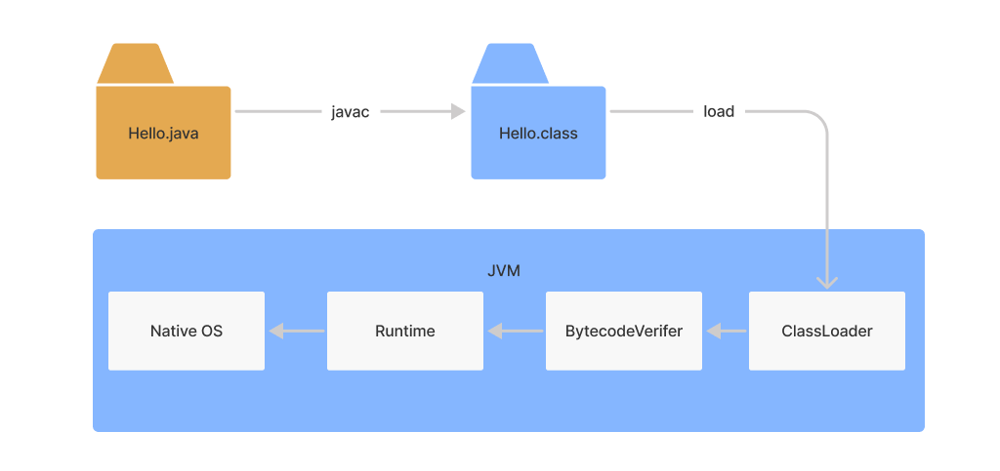

# Java 平台

Java 本身是一种面向对象的语言，最显著的特性有两个方面，一是所谓的“书写一次，到处运行”（Write once, run anywhere），能够非常容易地获得跨平台能力；另外就是内存管理或者叫垃圾收集（GC, Garbage Collection），Java 内存的分配和回收是 JVM 来决定的，大部分情况下，程序员不需要自己操心内存的分配和回收。

## JVM、JRE、JDK

关于 Java 平台，我们日常会接触到 JVM（Java Virtual Machine ），JRE（Java Runtime Environment）和 JDK（Java Development Kit），其中：

- JVM 是一个跨语言的平台，只要编程语言能够被编译成 class 文件，就能够在 JVM 上运行，享受 JVM 带来的跨平台的好处；

- JRE，即 Java 运行环境，包含了 JVM 和 Java 类库，以及一些模块等；
- JDK 可以看作是 JRE 的一个超集，提供了更多工具，比如解释器（java）、编译器（javac）、Java 归档（jar）、文档生成器（javadoc）等工具。

上述关于 JVM，JRE，JDK 之间的关系可以使用下面图简单表示：

```
-------------------------
JDK  JRE + 开发工具       |
-------------------------
JRE  JVM + core lib |
---------------------
JVM |
-----
```

关于三者在运行 Java 程序的交互关系如下图所示：



- 我们利用 JDK （调用 Java API）开发 Java 程序，编译（javac）成字节码或者打包程序（JAR）；
- 然后可以用 JRE 则启动一个 JVM 实例（java），加载、验证、执行 Java 字节码以及依赖库，运行 Java 程序；
- JVM 将程序和依赖库的 Java 字节码解析（解释 + 即时编译（`JIT`））并变成本地代码执行，产生结果。

> 即时编译（JIT, Just In Time）：
>
> - 即时编译是⽤来提升应⽤运⾏效率的技术 ；
> - 代码会先在JVM上解释执⾏，之后反复执⾏的热点代码会被即时翻译成为机器码，直接运⾏在底层硬件上 。

## 关于跨平台

为什么要跨平台？

因为我们希望所编写的代码和程序，在源代码级别或者编译后，可以运行在多种不同的系统平台上，而不需要为了各个平台的不同点而去实现两套源代码，这就是跨平台的能力，跨平台极大地节省了开发和维护成本。

对于解释型语言都是跨平台的，同一份脚本代码，可以由不同平台上的解释器解释执行，平台间的差异由不同平台上的解释器去解决。这样的话代码很通用，但是需要解释和翻译，效率较低。

对于编译型语言，存在两种级别的跨平台： 源码跨平台和二进制跨平台：

- 源码跨平台（C++）：同一份代码，需要被不同平台的编译器编译成相应的二进制文件，然后再去分发和执行，不同平台间的差异由编译器去解决。编译产生的文件是直接针对平台的可执行指令，运行效率很高。但是在不同平台上编译复杂软件，依赖配置可能会产生很多环境方面问题，导致开发和维护的成本较高。
- 二进制跨平台（Java 字节码）：同一份代码，先编译成一份通用的二进制文件，然后分发到不同平台，由虚拟机运行时来加载和执行，这样就会综合另外两种跨平台语言的优势，方便快捷地运行于各种平台，虽然运行效率可能比起本地编译类型语言要稍低一点。 

## 关于运行时和虚拟机

**运行时提供了程序运行的基本环境**，对于 Java 语言来讲，JVM 在启动时负责加载所有运行时的核心库等资源，然后再加载我们的应用程序字节码，才能让应用程序字节码运行在 JVM 这个容器里。

但也有一些语言是没有虚拟机的，编译打包时就把依赖的核心库和其他特性支持，一起静态打包或动态链接到程序中，比如 Golang 和 Rust，C# 等，这样运行时就和程序指令组合在一起，成为了一个完整的应用程序，好处就是不需要虚拟机环境，坏处是编译后的二进制文件没法直接跨平台了。

## 关于内存管理

内存管理就是内存的生命周期管理，包括内存的申请、整理压缩、回收等操作。

我们在使用 Java 编写代码时是不需要程序员自己管理内存的，内存的管理也交给了 JVM 来负责。简单来讲，JVM 在我们创建 Java 对象的时候去分配新内存，并使用 GC 算法，根据对象的存活时间，在对象不使用之后，自动执行对象的内存回收操作。

## 总结

以上笔记总结自：

- [第1讲 | 谈谈你对Java平台的理解？ (geekbang.org)](https://time.geekbang.org/column/article/6845)

- [JVM 核心技术 32 讲- CSDN](https://gitchat.csdn.net/column/5de76cc38d374b7721a15cec)