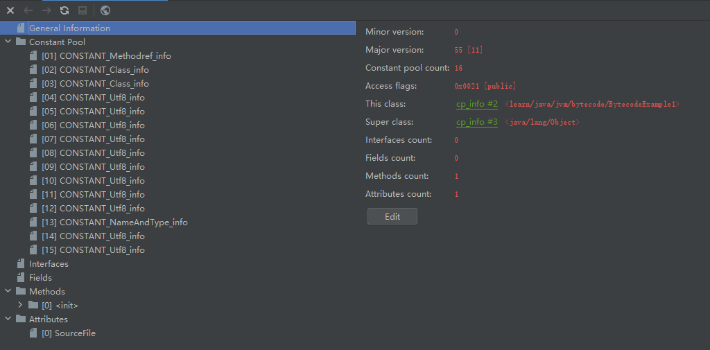
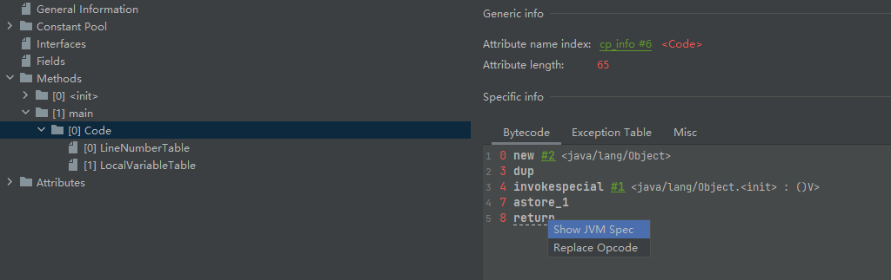

# 字节码

我们编写的 Java 源代码（`.java`）需要被编译成 class 文件（`.class`）后才能够被 JVM 加载执行，class 文件是一种以字节为单位的二进制流文件， 各个数据项按顺序紧密的从前向后排列， 相邻的项之间没有间隙， 这样可以使得 class 文件非常紧凑， 体积轻巧， 可以被 JVM 快速的加载至内存， 并且占据较少的内存空间（方便于网络的传输）。

## Class 文件结构

比如我们用 Java（Java 11） 编写了以下代码：

```java
public class BytecodeExample1 {
}
```

其以十六进制展示为：

```
cafe babe 0000 0037 0010 0a00 0300 0d07
000e 0700 0f01 0006 3c69 6e69 743e 0100
0328 2956 0100 0443 6f64 6501 000f 4c69
6e65 4e75 6d62 6572 5461 626c 6501 0012
4c6f 6361 6c56 6172 6961 626c 6554 6162
6c65 0100 0474 6869 7301 002a 4c6c 6561
726e 2f6a 6176 612f 6a76 6d2f 6279 7465
636f 6465 2f42 7974 6543 6f64 6545 7861
6d70 6c65 313b 0100 0a53 6f75 7263 6546
696c 6501 0015 4279 7465 436f 6465 4578
616d 706c 6531 2e6a 6176 610c 0004 0005
0100 286c 6561 726e 2f6a 6176 612f 6a76
6d2f 6279 7465 636f 6465 2f42 7974 6543
6f64 6545 7861 6d70 6c65 3101 0010 6a61
7661 2f6c 616e 672f 4f62 6a65 6374 0021
0002 0003 0000 0000 0001 0001 0004 0005
0001 0006 0000 002f 0001 0001 0000 0005
2ab7 0001 b100 0000 0200 0700 0000 0600
0100 0000 0600 0800 0000 0c00 0100 0000
0500 0900 0a00 0000 0100 0b00 0000 0200
0c
```

class 文件中的信息是一项一项紧密排列的，文件中每项数据都有它的固定长度可能为 1、2、4、8 个字节，分别用 u1, u2, u4, u8 表示，可以把 u1, u2, u3, u4 看做 class 文件数据项的“类型” 。当我们知晓了每项数据的含义和长度后，便可以按照每项的固定长度阅读 class 十六进制文件。

那么 class 文件有哪些数据项呢？

### Magic Number

魔数：u4（4个字节），用 16 进制表示为 CAFE BABE，是个固定的数字，从上面的十六进制文件可以看出，魔数出现在 class 文件的开头。

### Minor Version

小版本号：u2（2 个字节），紧接着魔数。

### Major Version

大版本号：u2（2 个字节），紧接着小版本号，如上述的 0037，转换为十进制为 55，表示 Java 版本为 11。

### constant_pool_count

常量池数量：u2（2 个字节），即 class 文件常量池最多允许 65535 个常量，紧接着大版本号存放，如上述文件的 0010，表示该 class 文件有 16 个常量。

### constant_pool

常量池（cp_info），常量池中常量的个数为 `constant_pool_count - 1`，从 1 号开始，0 号位置预留，如果 class 文件中的其他地方引用了索引为 0 的常量池项， 则表名它不引用任何常量池项。

常量有以下 17 中类型：

| 标志值（Tag） | 类型                             | 描述                    | 其它属性                                                     |
| ------------- | :------------------------------- | :---------------------- | ------------------------------------------------------------ |
| 1             | CONSTANT_Utf8_info               | UTF-8编码的字符串字面量 | length：UTF-8 字符串占用的字节数<br/>bytes：长度为 length 的字符串 |
| 3             | CONSTANT_Integer_info            | 整型字面量              | bytes：4 个字节，Big-endian 存储 int 值                      |
| 4             | CONSTANT_Float_info              | 浮点型字面量            | bytes：4 个字节，Big-endian 存储 float 值                    |
| 5             | CONSTANT_Long_info               | 长整型字面量            | bytes：8 个字节，Big-endian 存储 long 值                     |
| 6             | CONSTANT_Double_info             | 双精度浮点型字面量      | bytes：8 个字节，Big-endian 存储 double 值                   |
| 7             | CONSTANT_Class_info              | 类或接口的符号引用      | index：2 个字节，指向类全限定性名的索引                      |
| 8             | CONSTANT_String_info             | 字符串类型字面量        | index：2 个字节，指向字符串字面量索引                        |
| 9             | CONSTANT_Fieldref_info           | 字段的符号引用          | index：2 个字节，指向声明字段的类或接口符号引用的索引<br/>index：2 个字节，指向字段或方法的符号引用的索引 |
| 10            | CONSTANT_Methodref_info          | 类中方法的符号引用      | index：2 个字节，指向声明方法的类或接口符号引用的索引<br/>index：2 个字节，指向字段或方法的符号引用的索引 |
| 11            | CONSTANT_InterfaceMethodref_info | 接口中方法的符号引用    | index：2 个字节，指向声明接口方法的类或接口符号引用的索引<br/>index：2 个字节，指向字段或方法的符号引用的索引 |
| 12            | CONSTANT_NameAndType_info        | 字段或方法的符号引用    | index：2 个字节，指向该字段或方法名称常量项的索引<br/>index：2 个字节，指向字段或方法的符号引用常量项的索引 |
| 15            | CONSTANT_MethodHandle_info       | 表示方法句柄            | reference_kind：1 个字节，1~9 之间的一个值，决定了方法句柄类型<br/>reference_index：2 个字节，对常量池的有效索引 |
| 16            | CONSTANT_MethodType_info         | 表示方法类型            | descriptor_index：2 个字节，指向方法描述符                   |
| 17            | CONSTANT_InvokeDynamic_info      | 表示一个动态方法调用点  | bootstrap_method_attr_index：2 个字节，当前 Class 文件中引导<br/>方法表 bootstrap_methods[] 数组的有效索引<br/>name_and_type_index：2 个字节，指向字段或方法的符号引用的索引 |

每种常量类型第一个字节为标志值（tag，上述表格的第一列），这个标志值表明了这个常量池中的 info 项的类型是什么，如上述十六进制文件中紧接着常量池数量的 `0a00`，`0a` 就表示常量项的 tag 为 10，对应表格中的 `CONSTANT_Methodref_info`。

```
Note:
字节顺序？
字节顺序，顾名思义就是字节的顺序，指的是多字节的数据在内存中的存放顺序。在几乎所有的机器上，多字节对象都被存储为连续的字节序列。例如：如果 C/C++ 中的一个 int 型变量 a 的起始地址是 &a = 0x100，那么 a 的四个字节将被存储在存储器的 0x100, 0x101, 0x102, 0x103 位置。

大端序（Big Endian） 与 小端序（Little Endian）？
大端序是指一个多字节的数字对象，低地址端存放数字的高位，小端序则指低地址端存放数字的底位。
```

### access_flags

access_flags 存放了当前类的访问权限，可能的值为：

- ACC_PUBLIC：0x0001，是否为 public；
- ACC_FINAL：0x0010，是否为 final；
- ACC_SUPER：0x0020，该标志一定存在；
- ACC_INTERFACE：0x0200，是否是接口；
- ACC_ABSTRACT：0x0400，是否是抽象类；
- ACC_SYNTHETIC：0x1000，编译器自动生成；
- ACC_ANNOTATTION：0x2000，是否是注解；
- ACC_ENUM：0x4000，是否是枚举。

### this_class

this_class 保存了当前类的全局限定名在常量池里的索引。

### super_class

super_calss 存放了当前类的父类的全局限定名在常量池里的索引。

### interfaces_count

interfaces_count 指的是当前类实现的接口数目。

### interfaces

interfaces[] 是包含 interfaces_count 个接口的全局限定名的索引的数组。

### fields_count

fields_count 是类变量和实例变量的字段的数量总和。

### fieds

fileds[] 是包含字段详细信息的列表，其包含的内容如下所示：

- access_flags(u2)

  - ACC_PUBLIC：0x0001
  - ACC_PRIVATE：0x0002
  - ACC_PROTECTED：0x0004
  - ACC_STATIC：0x0008
  - ACC_FINAL：0x0010
  - ACC_VOLATILE：0x0040

  - ACC_TRANSIENT：0x0080
  - ACC_SYNHETIC：0x1000
  - ACC_ENUM：0x4000

- name_index(u2)

- decriptor_index(u2)

  - B：byte
  - C：char
  - D：double
  - F：float
  - I：int
  - J：long
  - S：short
  - Z：boolean
  - V：void
  - L：Object，例如 Ljava/lang/String
  - [：数组，一维数组 [B，二维数组 [[B

- attributes_count

- attributes

### methods_count

methods_count 是该类或者接口显示定义的方法的数量。

### methods

method[] 是包含方法信息的一个详细列表。

- access_flags

  - ACC_PUBLIC：0x0001
  - ACC_PRIVATE：0x0002
  - ACC_PROTECTED：0x0004
  - ACC_STATIC：0x0008
  - ACC_FINAL：0x0010
  - ACC_SYNCHRONIZED：0x0020
  - ACC_BRIDGE：0x0040，编译器产生的桥接方法

  - ACC_VARARGS：0x0080
  - ACC_ABSTRACT：0x0400
  - ACC_STRICTFP：0x0800
  - ACC_SYNTHETIC：0x1000

- name_index

- descriptor_index

  先参数列表，放在小括号内部，后返回值，如：

  ```
  void m() -> ()V
  String toString() -> ()Ljanva/lang/String;
  long pos(int[] attr1, int attr2, long length) -> ([IIJ)J
  ```

- attributes_count

- attribute

### attributes_count

attributes_count 存放了 attributes 列表中包含的 attribute_info 的数量。

### attributes

class 文件的最后一部分是属性，它描述了该类或者接口所定义的一些属性信息。

- 既有预定义属性，也可以自定义，JVM 自动忽略不认识的属性；
- Code 方法表，该方法编译成字节码指令（操作码）
  - attribute_name_index(u2)
  - attribute_length(u4)
  - max_stack(u2)
  - max_locals(u2)
  - code_lenght(u4)
  - code
  - expection_table_length(u2)
  - expection_table
  - attribute_count(u2)
  - attributes
- InnerClass：内部类；
- LineNumberTable：Java 源码的行号和字节码的对应关系；
- LocalVariableTable：方法局部变量表；
- SourceFile：源文件名称。

## 字节码（Bytecode）查看

通过查看 class 文件的十六进制格式，我们确实发现 class 文件是一种十分紧凑的结构，而且它用良好全面的设计展示了类的全部信息。但是通过查看 class 文件 16 进制编码的方式查看 class 文件很累人，我们可以借助一些工具来帮助我们查看 class 文件结构。

### javap

首先我们可以使用 javap 来查看一个 class 文件的结构，javap 是 JDK 是提供的一个工具，其支持的选项有：

```
javap -help

用法: javap <options> <classes>
其中, 可能的选项包括:
  -help  --help  -?        输出此用法消息
  -version                 版本信息
  -v  -verbose             输出附加信息
  -l                       输出行号和本地变量表
  -public                  仅显示公共类和成员
  -protected               显示受保护的/公共类和成员
  -package                 显示程序包/受保护的/公共类
                           和成员 (默认)
  -p  -private             显示所有类和成员
  -c                       对代码进行反汇编
  -s                       输出内部类型签名
  -sysinfo                 显示正在处理的类的
                           系统信息 (路径, 大小, 日期, MD5 散列)
  -constants               显示最终常量
  -classpath <path>        指定查找用户类文件的位置
  -cp <path>               指定查找用户类文件的位置
  -bootclasspath <path>    覆盖引导类文件的位置
```

比如对于下面 Java 类：

```java
public class BytecodeExample1 {
}
```

我们使用 javap 命令查看的结果如下所示：

```shell
javap -v ByteCodeExample1.class
```

```
Classfile /F:/LearnProjects/learn/programing-language/java/jvm/examples/target/classes/learn/java/jvm/bytecode/BytecodeExample1.class
  Last modified 2021-11-5; size 321 bytes
  MD5 checksum c1c2ac1a5da2da32da0bd2a85c8e34ed
  Compiled from "BytecodeExample1.java"
public class learn.java.jvm.bytecode.BytecodeExample1
  minor version: 0
  major version: 55
  flags: ACC_PUBLIC, ACC_SUPER
Constant pool:
   #1 = Methodref          #3.#13         // java/lang/Object."<init>":()V
   #2 = Class              #14            // learn/java/jvm/bytecode/BytecodeExample1
   #3 = Class              #15            // java/lang/Object
   #4 = Utf8               <init>
   #5 = Utf8               ()V
   #6 = Utf8               Code
   #7 = Utf8               LineNumberTable
   #8 = Utf8               LocalVariableTable
   #9 = Utf8               this
  #10 = Utf8               Llearn/java/jvm/bytecode/BytecodeExample1;
  #11 = Utf8               SourceFile
  #12 = Utf8               BytecodeExample1.java
  #13 = NameAndType        #4:#5          // "<init>":()V
  #14 = Utf8               learn/java/jvm/bytecode/BytecodeExample1
  #15 = Utf8               java/lang/Object
{
  public learn.java.jvm.bytecode.BytecodeExample1();
    descriptor: ()V
    flags: ACC_PUBLIC
    Code:
      stack=1, locals=1, args_size=1
         0: aload_0
         1: invokespecial #1                  // Method java/lang/Object."<init>":()V
         4: return
      LineNumberTable:
        line 6: 0
      LocalVariableTable:
        Start  Length  Slot  Name   Signature
            0       5     0  this   Llearn/java/jvm/bytecode/BytecodeExample1;
}
SourceFile: "BytecodeExample1.java"
```

使用 javap 我们能够比较容易地查看 class 文件信息，如版本号，常量池，方法等信息。

### jclasslib

除了使用 Java 自带的工具 javap 外，我们还可以借助一些第三方工具查看 class 文件信息，这里我使用的是 IDEA 的一个插件 `jclasslib`。

当我们安装好 `jclasslib` 后，选中我们想要查看的 `.class` 文件，点击 View -> Show Bytecode With Jclasslib，我们变可以查询 class 文件信息，比如对于上述 Java 文件，使用 `jclasslib` 查询的 class 文件信息如下所示：



## Opcode（助记符）

Opcode 可以看作 Java 的汇编语言，一种操作码（指令），或者叫做助记符号。Opcode 于字节码方法的 Code 区，表示了方法的执行逻辑，如下述代码：

```java
public class BytecodeExample2 {

    public static void main(String[] args) {
        Object o = new Object();
    }
}
```

我们在 main 方法中创建了一个 Object 对象，那么创建一个 Object 对象的操作码是怎么样的呢？

借助于上述提到的工具，我们可以看到：

```
0 new #2 <java/lang/Object>
3 dup
4 invokespecial #1 <java/lang/Object.<init> : ()V>
7 astore_1
8 return
```

我们可以看到一些类似于 new dup 等一些操作码，这些操作码分别代表什么含义呢？关于这个，我们可以在 [List of Java bytecode instructions - Wikipedia](https://en.wikipedia.org/wiki/List_of_Java_bytecode_instructions) 查看更多关于 Opcode 的信息；或者借助于 jclasslib，我们可以点击指令选择 `Show JVM Spec` 跳转到 oracle 官方文档查看指令的更多信息，如下图所示：



### Opcode 运行

我们来看一个有更多细节的例子，来了解 Java 中的一个方法是如何通过 Opcode 执行的，代码如下所示：

```java
public class BytecodeExample3 {

    public void foo() {
        int a = 1;
        int b = 2;

        int c = a;
        a = b;
        b = c;
    }
}
```

上述方法，声明并初始化了两个局部遍历 a，b，借助局部变量 c，将 a 和 b 的值进行交换，其操作码如下所示：

```
 0 iconst_1   将 int 常量 1 push 到栈顶中                      
 1 istore_1   将栈顶的 int 元素出栈，并将其存放在局部变量 1 号槽位中     int a = 1;
 2 iconst_2   将 int 常量 2 push 到栈顶中    
 3 istore_2   将栈顶的 int 元素出栈，并将其存放在局部变量 2 号槽位中     int b = 2;
 4 iload_1    获取局部变量表 1 号槽位的 int 值，并压入栈顶
 5 istore_3   将栈顶的 int 元素出栈，并将其存放在局部变量 3 号槽位中     int c = a;
 6 iload_2    获取局部变量表 2 号槽位的 int 值，并压入栈顶
 7 istore_1   将栈顶的 int 元素出栈，并将其存放在局部变量 1 号槽位中     a = b;
 8 iload_3    获取局部变量表 3 号槽位的 int 值，并压入栈顶
 9 istore_2   将栈顶的 int 元素出栈，并将其存放在局部变量 2 号槽位中     b = c;
10 return     方法结束返回
```

### 常见的 Opcode

下面列举常见的操作码（指令）：

- `<clinit>`：类初始化，初始化静态变量、静态代码块；
- `<init>`：对象初始化，初始化成员变量，非静态与语句块，执行构造方法中的逻辑；
- store_x：将栈顶值出栈，并存储在槽位为 x 的局部变量表中；
- load_x：将局部变量表槽位为 x 的值压栈；
- dup：复制栈顶元素；
- invoke
  - invokeStatic：调用静态方法；
  - invokeVirtual：调用可能被重写的方法；
  - invokeSpecial：可以直接定位的方法，不需要多态的方法，如构造方法、私有方法；
  - invokeInterface：调用接口或抽象类的方法；
  - invokeDynamic：动态产生的 class，会用到的指令，如 lambda 表达式、反射、动态语言 scala，kotlin、CGLib ASM。
- ......

## 总结

我们编写的 Java 源代码需要被编译成 class 文件后才能够被 JVM 加载执行，class 文件内部设计的十分紧凑，使用固定长度的数据项和固定的组织顺序来依次排列。在我们知晓了 class 文件的组织方式以及数据项类型后，我们可以查看 class 文件的十六进制格式来阅读字节码，同时也有一些额外的工具可以帮助我们来查看字节码，比如  JDK 自带的 `javap` 和 IDEA 插件 `jclasslib`。有时候我们在排查问题是，如果更加源代码发现不了问题，可以借助字节码查看更多细节，所以了解 Java 字节码是有必要的。

此外我们还提到了 Opcode，其位于字节码方法的 Code 区，其可以看作 Java 的汇编指令，组成了方法中的逻辑，结合局部变量表和栈结构，使得 JVM 拥有了计算能力。

### 参考链接

- [Java字节码文件详解 | Windy's Journal](https://windysha.github.io/2018/01/18/深入理解JVM之Java字节码（-class）文件详解/)
- [Java字节码 - 维基百科，自由的百科全书 (wikipedia.org)](https://zh.wikipedia.org/wiki/Java字节码)

- [美团技术团队 - 字节码增强技术探索](https://tech.meituan.com/2019/09/05/java-bytecode-enhancement.html) 

