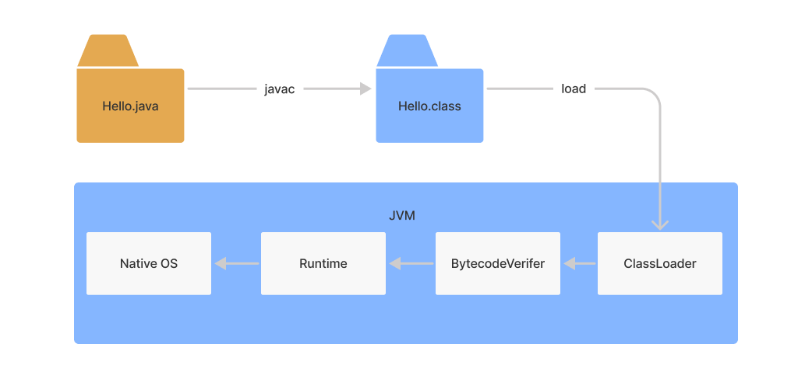

# 字节码增强技术

字节码增强技术就是一类对现有字节码进行修改或者动态生成全新字节码文件的技术。我们知道 Java 代码运行，编译到被类加载器加载执行会经过以下几个阶段：



字节码增强技术可以发生在上述流程的某个阶段，比如某些字节码增强技术，在编译期间对字节码进行增强，有的则可以在代码运行期间对字节码进行增强。不管增强发生在那个阶段，利用字节码增强技术，我们可以对 Java 代码的扩展延申至编码过程之外，在编译器或运行期间织入额外的运行逻辑。

比如我们在编码期间编写了一个类：

```java
public class Base {

    private static final Logger log = LoggerFactory.getLogger(Base.class);

    public void process() {
        doSomething();
    }

    private void doSomething() {
        try {
            log.info("process ...");
            TimeUnit.SECONDS.sleep(1);
        } catch (InterruptedException e) {
            log.error("Interrupted ", e);
        }
    }
}
```

我们想对上述的 process 方法进行扩展，比如打印 `doSomething` 方法调用执行的时间，如果不使用字节码增强技术，我们修改如下修改 process 方法便可以达到我们的目的：

```java
public void process() {
    long start = System.currentTimeMillis();
    doSomething();
    long end = System.currentTimeMillis();
    log.info("Duration: {}", end - start);
}
```

接下来我们看如何利用一些字节码增强技术来实现。

## ASM

官网：[ASM (ow2.io)](https://asm.ow2.io/index.html)

对于需要手动操纵字节码的需求，可以使用 ASM，它可以直接生产 `.class` 字节码文件，也可以在类被加载入 JVM 之前动态修改类行为，ASM 操作字节码的简要流程如下所示：

```
原字节码（.class） --读取--> ClassReader -> Visitor 处理字节码 -> ClassWriter --生成--> 新的字节码
```

ASM 的应用场景有AOP（Cglib 就是基于 ASM 实现）、热部署、修改其他 jar 包中的类等。当然，涉及到如此底层的步骤，实现起来也比较麻烦。

### ASM API

ASM Core API 有以下几个关键类：

- ClassReader：用于读取已经编译好的 `.class` 文件；
- ClassVisitor：如上所述，CoreAPI 根据字节码从上到下依次处理，对于字节码文件中不同的区域有不同的 Visitor，比如用于访问方法的 MethodVisitor、用于访问类变量的 FieldVisitor、用于访问注解的 AnnotationVisitor 等。为了实现AOP，重点要使用的是MethodVisitor
- ClassWriter：用于重新构建编译后的类，如修改类名、属性以及方法，也可以生成新的类的字节码文件。

### ASM 字节码增强

- 引入 ASM 依赖：

  ```xml
  <dependency>
      <groupId>org.ow2.asm</groupId>
      <artifactId>asm</artifactId>
      <version>9.2</version>
  </dependency>
  <dependency>
      <groupId>org.ow2.asm</groupId>
      <artifactId>asm-util</artifactId>
      <version>9.2</version>
  </dependency>
  ```

- 编写 ClassVisitor 类，因为我们需要对方法进行增强，所以我们需要编写 MethodVisitor 方法，来访问方法的字节码，并对其进行增强，代码如下所示：

  ```java
  public class BaseClassVisitor extends ClassVisitor {
  
      private static final String PROCESS_METHOD_NAME = "process";
  
      public BaseClassVisitor(ClassVisitor cv) {
          super(Opcodes.ASM5, cv);
      }
  
      @Override
      public void visit(int version, int access, String name, String signature, String superName, String[] interfaces) {
          cv.visit(version, access, name, signature, superName, interfaces);
      }
  
      @Override
      public MethodVisitor visitMethod(int access, String name, String desc, String signature, String[] exceptions) {
          MethodVisitor mv = cv.visitMethod(access, name, desc, signature, exceptions);
          // 排除 process 以外的方法
          if (Objects.equals(name, PROCESS_METHOD_NAME) && mv != null) {
              mv = new ProcessMethodVisitor(mv);
          }
          return mv;
      }
  
      static class ProcessMethodVisitor extends MethodVisitor implements Opcodes {
  
          public ProcessMethodVisitor(MethodVisitor mv) {
              super(Opcodes.ASM5, mv);
          }
  
          @Override
          public void visitCode() {
              super.visitCode();
  
              mv.visitMethodInsn(INVOKESTATIC, "java/lang/System", "currentTimeMillis", "()J", false);
              mv.visitVarInsn(LSTORE, 1);
              Label var1 = new Label();
              mv.visitLabel(var1);
              // 织入代码行数
              mv.visitLineNumber(16, var1);
          }
  
          @Override
          public void visitInsn(int opcode) {
              mv.visitMethodInsn(INVOKESTATIC, "java/lang/System", "currentTimeMillis", "()J", false);
              mv.visitVarInsn(LSTORE, 3);
              Label var3 = new Label();
              mv.visitLabel(var3);
              mv.visitLineNumber(18, var3);
  
              mv.visitFieldInsn(GETSTATIC, "learn/java/jvm/bytecode/enhancer/Base", "log", "Lorg/slf4j/Logger;");
              mv.visitLdcInsn("Duration: {}");
              mv.visitVarInsn(LLOAD, 3);
              mv.visitVarInsn(LLOAD, 1);
              mv.visitInsn(LSUB);
              mv.visitMethodInsn(INVOKESTATIC, "java/lang/Long", "valueOf", "(J)Ljava/lang/Long;", false);
              mv.visitMethodInsn(INVOKEINTERFACE, "org/slf4j/Logger", "info", "(Ljava/lang/String;Ljava/lang/Object;)V", true);
              mv.visitInsn(opcode);
          }
      }
  }
  ```

  增强逻辑就是在原代码的 `doSomething` 方法调用前后利用字节码增强技术，添加关于获取方法调用时间间隔的代码，主要在内部类 `ProcessMethodVisitor` 中的 `visitCode()` 和 `visitInsn()` 中实现；

   `visitCode()`  表示开始访问方法的 Code 区，在这里添加的逻辑会出现在方法开头；

   `visitInsn()` 表示访问无参数操作指令，上述的代码会添加的逻辑 `return` 指令之前，即会出现在方法结尾。

- 我们使用 `ClassVistor` 类实现了我们字节码的增强逻辑，接下来我们需要将我们的增强逻辑作用到生成的 class 文件上，为此我们还需要编写字节码生成类，主要逻辑就是使用 ClassReader 读取原 class 文件，再用 ClassVisitor 增强 class 文件，最后使用 ClassWriter 将增强的字节码写入 class 文件中，代码如上所示：

  ```java
  @Slf4j
  public class Generator {
  
      public static void main(String[] args) throws IOException {
          String className = "learn/java/jvm/bytecode/enhancer/Base";
          String pathName = "target/classes/learn/java/jvm/bytecode/enhancer/Base.class";
  
          ClassReader classReader = new ClassReader(className);
          ClassWriter classWriter = new ClassWriter(ClassWriter.COMPUTE_MAXS);
  
          ClassVisitor classVisitor = new BaseClassVisitor(classWriter);
          classReader.accept(classVisitor, ClassReader.SKIP_DEBUG);
          byte[] data = classWriter.toByteArray();
  
          // 写入增强后的文件
          Files.write(Paths.get(pathName), data);
          log.info("generated");
      }
  }
  ```

- 在执行 Generator  方法之后，编译的后 class 文件（反编译后）是这样的：

  ```java
  public class Base {
      private static final Logger log = LoggerFactory.getLogger(Base.class);
  
      public Base() {
      }
  
      public void process() {
          long var1 = System.currentTimeMillis();
          this.doSomething();
          long var3 = System.currentTimeMillis();
          log.info("Duration: {}", var3 - var1);
      }
  
      private void doSomething() {
          try {
              log.info("process ...");
              TimeUnit.SECONDS.sleep(1L);
          } catch (InterruptedException var2) {
              log.error("Interrupted ", var2);
          }
  
      }
  }
  ```

  此时我们执行执行 Base 类的 process 方法时，就会打印出 `doSomething` 方法的执行时间，如：

  ```java
  @Slf4j
  public class BytecodeEnhanceTest {
  
      @Test
      public void testEnhanceWithAsm() {
          // 执行前需执行需重新 build 工程并执行 Generator 织入增强字节码
          log.info("After enhance");
          Base base = new Base();
          base.process();
      }
  }
  ```

### ASM 工具

在使用 ASM 来增强字节码时，最主要的一个环节就是编写 ClassVistor，利用 ASM 提供的 API 直接面向助记符进行字节码增强 ，不熟悉字节码操作集合的话。这一步是很困难的，我们可以借助 IDEA 插件 [ASM Bytecode Viewer](https://plugins.jetbrains.com/plugin/10302-asm-bytecode-viewer)，这个插件可以查看这个类对应的 ASM 写法，我们可以提前编写好我们增强后的代码，在利用这个插件，将生成后的代码复制到我们编写的 visitor 中即可。

## Javassist

官网：[Javassist by jboss-javassist](https://www.javassist.org/)

ASM 是面向字节码指令的增强技术，编写的体验就像是在用命令式代码编写汇编程序一样，比较晦涩，字节码的框架 Javassist 则强调在源代码层面对字节码进行增强。

利用 Javassist 实现字节码增强时，可以直接使用 java 编码的形式，而不需要了解虚拟机指令，就能动态改变类的结构或者动态生成类。关于 Javassist 的 API，其中最重要的是 CtClass、CtMethod、CtField、ClassPool 这四个类：

- CtCalss（compile-time class）：编译时类信息，它是一个 class 文件在代码中的抽象表现形式，可以通过一个类的全限定名来获取一个 CtClass 对象，用来表示这个类文件；
- CtMethod：编译时方法信息；
- CtField：编译时属性信息；
- ClassPool：ClassPool 是一张保存 CtClass 信息的 HashTable，key 为类名，value 为类名对应的 CtClass 对象，当我们需要对某个类进行修改时，就是通过`pool.getCtClass(“className”)` 方法从 pool 中获取到相应的 CtClass。

同样地，我们利用 Javassist 对上述代码进行增强，打印 `doSomething` 方法的执行时间，首先我们需要引入 Javassist  maven 依赖：

```xml
<dependency>
    <groupId>org.javassist</groupId>
    <artifactId>javassist</artifactId>
    <version>3.27.0-GA</version>
</dependency>
```

然后我们编写字节码增强代码，如下所示：

```java
public class JavassistEnhancer {

    public static Base createEnhancedBase() throws Exception {
        String className = "learn.java.jvm.bytecode.enhancer.Base";
        String methodName = "process";
        String directoryName = "target/classes/";

        ClassPool classPool = ClassPool.getDefault();
        CtClass ctClass = classPool.get(className);
        CtMethod ctMethod = ctClass.getDeclaredMethod(methodName);

        ctMethod.addLocalVariable("start", CtClass.longType);
        ctMethod.insertBefore("start = System.currentTimeMillis();");
        ctMethod.addLocalVariable("end", CtClass.longType);
        ctMethod.insertAfter("end = System.currentTimeMillis();");
        ctMethod.insertAfter("log.info(\"Duration: {}\", \"\" + (end - start));");
        Class<?> c = ctClass.toClass();
        ctClass.writeFile(directoryName);
        return (Base) c.getConstructor().newInstance();
    }
}
```

因为 Javassist 也是在编译期间对字节码增强，所以整体流程和 ASM 类似，也是先读取原 Class，然后增强 Class，最后将增强后的 Class 写入到指定目录下；不同的是，Javassist 面向源码进行增强，所以我们在对自己码增强时会比 ASM 面向字节码指令更加容易。

下面是测试类：

```java
@Slf4j
public class BytecodeEnhanceTest {
    
    @Test
    public void testEnhanceWithJavassist() throws Exception {
        // 执行前需执行需重新 build 工程
        log.info("After enhance");
        Base enhancedBase = JavassistEnhancer.createEnhancedBase();
        enhancedBase.process();
    }
}
```

## AspectJ

官网：[The AspectJ Project | The Eclipse Foundation](https://www.eclipse.org/aspectj/)

AspectJ 作为 AOP 编程的完全解决方案，提供了三种织入时机，分别为：

1. compile-time：编译期织入，在编译的时候一步到位，直接编译出包含织入代码的 `.class` 文件；
2. post-compile：编译后织入，增强已经编译出来的类，如我们要增强依赖的 jar 包中的某个类的某个方法；
3. load-time：在 JVM 进行类加载的时候进行织入。

同样地，在使用 AspectJ 之前，我们需要映入相关依赖：

```xml

```

然后编写拦截配置：

```java
@Aspect
public class BaseProcessMethodAspect {

    private static final Logger log = LoggerFactory.getLogger(BaseProcessMethodAspect.class);

    @Pointcut("execution(* learn.java.jvm.bytecode.enhancer.Base.process(..))")
    public void pointcut() {
    }

    @Around("pointcut()")
    public Object around(ProceedingJoinPoint joinPoint) throws Throwable {
        long start = System.currentTimeMillis();
        Object proceed = joinPoint.proceed();
        long end = System.currentTimeMillis();
        log.info("Duration: {}", end - start);
        return proceed;
    }
}
```

这里采取编译期织入的方式对字节码进行增强，为此我们还需要添加以下插件 [Mojo's AspectJ Maven Plugin – Introduction (mojohaus.org)](https://www.mojohaus.org/aspectj-maven-plugin/)：

```xml
<build>
    <plugins>
        <plugin>
            <groupId>org.codehaus.mojo</groupId>
            <artifactId>aspectj-maven-plugin</artifactId>
            <version>1.14.0</version>
            <configuration>
                <complianceLevel>11</complianceLevel>
                <source>11</source>
                <target>11</target>
                <showWeaveInfo>true</showWeaveInfo>
                <verbose>true</verbose>
                <Xlint>ignore</Xlint>
                <encoding>UTF-8</encoding>
            </configuration>
            <executions>
                <execution>
                    <goals>
                        <!-- use this goal to weave all your main classes -->
                        <goal>compile</goal>
                        <!-- use this goal to weave all your test classes -->
                        <goal>test-compile</goal>
                    </goals>
                </execution>
            </executions>
        </plugin>
    </plugins>
</build>
```

然后我们选择 IDEA 编译器为 Ajc，具体位置在步骤为：

```
Settings -> Build,Execution,Deployment -> Compiler -> Java Compiler -> Use compiler -> Ajc
```

接着我们重新编译，并进行测试，测试代码如下所示：

```java
public class BytecodeEnhanceTest {

    private static final Logger log = LoggerFactory.getLogger(Generator.class);

    @Test
    public void testEnhanceWithAspectJ() {
        // 执行前需要重新编译
        Base base = new Base();
        log.info("After enhance");
        base.process();
    }
}
```

> 注意：如果我们还使用了 lombok，此时由于 AspectJ 在编译期间享受不到 lombok 带来的增强，比如我们使用了 @Slf4j 类似的注解，代码里的 log 变量 AspectJ 在编译期间不能被识别。
>
> 此时编译时会有以下警告和错误：
>
> ```
> [WARNING] You aren't using a compiler supported by lombok, so lombok will not work and has been disabled.
> Your processor is: org.aspectj.org.eclipse.jdt.internal.compiler.apt.dispatch.BatchProcessingEnvImpl
> Lombok supports: OpenJDK javac, ECJ
> 	<unknown source file>:<no line information>
> [ERROR] log cannot be resolved
> 	F:\LearnProjects\learn\programing-language\java\jvm\examples\src\main\java\learn\java\jvm\bytecode\enhancer\asm\Generator.java:33
> log.info("generated");
> ```

## Byte Buddy

官网：[Byte Buddy - runtime code generation for the Java virtual machine](https://bytebuddy.net/)

Byte Buddy 是一种代码生成和操作库，用于在 Java 应用程序的运行时创建和修改Java类，而无需编译器的帮助。除了与 Java 类库一起运送的代码生成实用程序之外，Byte Buddy 允许创建任意类，并且不限于实现创建运行时代理的接口。此外，Byte Buddy 使用 Java 代理或构建期间，为手动更改类，提供方便 API。

引入依赖：

```xml
<dependency>
    <groupId>net.bytebuddy</groupId>
    <artifactId>byte-buddy</artifactId>
    <version>1.10.19</version>
</dependency>
```

增强类：

```java
/**
 * Base 字节码增强代理类，基于 ByteBuddy
 */
public class ByteBuddyEnhancer {

    public static Base createEnhancedBase() throws Exception {
        final String methodName = "process";
        return new ByteBuddy()
                .subclass(Base.class)
                .method(named(methodName))
                .intercept(MethodDelegation.to(new TimingInterceptor()))
                .make()
                .load(Base.class.getClassLoader())
                .getLoaded()
                .getConstructor()
                .newInstance();
    }

    /**
     * 需要用 public 修饰符
     */
    public static class TimingInterceptor {

        private static final Logger log = LoggerFactory.getLogger(TimingInterceptor.class);

        public Object enhance(@Origin Method method, @SuperCall Callable<?> callable) throws Exception {
            long start = System.currentTimeMillis();
            Object call = callable.call();
            long end = System.currentTimeMillis();
            log.info("Duration: {}", end - start);
            return call;
        }
    }
}
```

测试类：

```java
public class BytecodeEnhanceTest {

    private static final Logger log = LoggerFactory.getLogger(Generator.class);

    @Test
    public void testEnhanceWithByteBuddy() throws Exception {
        log.info("After enhance");
        Base enhancedBase = ByteBuddyEnhancer.createEnhancedBase();
        enhancedBase.process();
    }
}
```

## `CGLIB` 动态代理

wiki：[github.com](https://github.com/cglib/cglib/wiki)

`CGLIB` 是一个强大的、高性能的**代码生成包**，它广泛被许多 `AOP` 框架使用，为他们**提供方法的拦截**。

引入依赖：

```xml
<dependency>
    <groupId>cglib</groupId>
    <artifactId>cglib</artifactId>
    <version>3.3.0</version>
</dependency>
```

编写增强类：

```java
public class CglibEnhancer {

    static Enhancer enhancer;

    static {
        enhancer = new Enhancer();
        enhancer.setSuperclass(Base.class);
        enhancer.setCallback(new TimingInterceptor());
    }

    public static Base createEnhancedBase() {
        return (Base) enhancer.create();
    }

    static class TimingInterceptor implements MethodInterceptor {

        private static final Logger log = LoggerFactory.getLogger(TimingInterceptor.class);

        @Override
        public Object intercept(Object obj, Method method, Object[] args, MethodProxy proxy) throws Throwable {
            long start = System.currentTimeMillis();
            Object proceed = proxy.invokeSuper(obj, args);
            long end = System.currentTimeMillis();
            log.info("Duration: {}", end - start);
            return proceed;
        }
    }
}
```

测试类：

```java
public class BytecodeEnhanceTest {

    private static final Logger log = LoggerFactory.getLogger(Generator.class);

    @Test
    public void testEnhanceWithCglib() {
        log.info("After enhance");
        Base enhancedBase = CglibEnhancer.createEnhancedBase();
        enhancedBase.process();
    }
}
```

## JDK 动态代理

因为 JDK 动态代理需要对接口进行增强，这里我们定义了一个 `IBase` 接口：

```java
public interface IBase {

     void process();
}
```

编写增强类：

```java
public class JdkEnhancer {

    public static IBase createEnhancedBase() {
        return (IBase) Proxy.newProxyInstance(IBase.class.getClassLoader(), new Class[]{IBase.class},
                new TimingInterceptor());
    }

    static class TimingInterceptor implements InvocationHandler {

        private static final Logger log = LoggerFactory.getLogger(TimingInterceptor.class);

        private final Base delegate = new Base();

        @Override
        public Object invoke(Object proxy, Method method, Object[] args) throws Throwable {
            long start = System.currentTimeMillis();
            delegate.process();
            long end = System.currentTimeMillis();
            log.info("Duration: {}", end - start);
            return null;
        }
    }
}
```

测试类：

```java
public class BytecodeEnhanceTest {

    private static final Logger log = LoggerFactory.getLogger(Generator.class);

    @Test
    public void testEnhanceWithJdk() {
        log.info("After enhance");
        IBase enhancedBase = JdkEnhancer.createEnhancedBase();
        enhancedBase.process();
    }
}
```

### 参考链接

- [美团技术团队 - 字节码增强技术探索](https://tech.meituan.com/2019/09/05/java-bytecode-enhancement.html) 
- [Baeldung.A Guide to Java Bytecode Manipulation with ASM](https://www.baeldung.com/java-asm)
- [Baeldung.Introduction to Javassist](https://www.baeldung.com/javassist)
- [Javadoop.AspectJ 使用介绍](https://www.javadoop.com/post/aspectj)