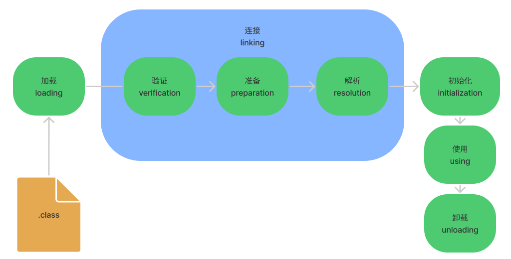

# 类加载

我们编写的代码被编译成 class 文件后，Java 虚拟机负责 class 文件加载到内存，并对数据进行校验、准备、解析和初始化，最终形成可以被虚拟机直接使用的 Java 类型（Class 对象），这一过程被称作虚拟机的类加载机制。

## 类加载过程

类加载过程可以简单的使用下图来表示：



如上图所示，类加载过程可以简要的分为三个阶段：

- 加载
- 连接
  - 验证
  - 准备
  - 解析
- 初始化

### 加载

加载这个过程主要完成三件事情：

- 通过一个类的全限定名来获取定义此类的二进制字节流。
- 将这个字节流所代表的静态存储结构转化为方法区的运行时数据结构。
- 在内存中生成一个代表这个类的 Class 对象，作为方法区这个类的各种数据的访问入口。

《Java 虚拟机规范》对这三点要求其实并不是特别具体，留给虚拟机实现与Java应用的灵活度都是相当大的。仅类的获取方式就会有很多种：

- 从 ZIP 压缩包中读取，这很常见，最终成为日后 JAR、EAR、WAR 格式的基础。
- 从网络中获取，这种场景最典型的应用就是 Web Applet。
- 运行时计算生成，这种场景使用得最多的就是动态代理技术，比如 Java 动态代理、`GGLIB` 等。
- 由其他文件生成，典型场景是 JSP 应用，由 JSP 文件生成对应的 Class 文件。
- 从数据库中读取，这种场景相对少见些，例如有些中间件服务器（如 SAP Netweaver）可以选择 把程序安装到数据库中来完成程序代码在集群间的分发。
- 可以从加密文件中获取，这是典型的防 Class 文件被反编译的保护措施，通过加载时解密 Class 文件来保障程序运行逻辑不被窥探。

相对于类加载过程的其他阶段，加载过程中是程序员最可控的环境。加载阶段既可以使用Java虚拟机里内置的引导类加 载器来完成，也可以由用户自定义的类加载器去完成，开发人员通过定义自己的类加载器去控制字节 流的获取方式（重写一个类加载器的 `findClass()` 或 `loadClass()` 方法），实现根据自己的想法来赋予应用 程序获取运行代码的动态性。

对于数组类而言，情况就有所不同，数组类本身不通过类加载器创建，它是由 Java 虚拟机直接在内存中动态构造出来的。但数组类与类加载器仍然有很密切的关系，因为数组类的元素类型（Element Type，指的是数组去掉所有维度的类型）最终还是要靠类加载器来完成加载，一个数组类创建过程遵循以下规则：

- 如果数组的组件类型（Component Type，指的是数组去掉一个维度的类型，注意和前面的元素类型区分开来）是引用类型，那就递归采用本节中定义的加载过程去加载这个组件类型，该数组将被标识在加载该组件类型的类加载器的类名称空间上；
- 如果数组的组件类型不是引用类型（例如 int[] 数组的组件类型为 int），Java 虚拟机将会把该数组标记为与引导类加载器关联。
- 数组类的可访问性与它的组件类型的可访问性一致，如果组件类型不是引用类型，它的数组类的可访问性将默认为 public，可被所有的类和接口访问到。

加载阶段结束后，Java 虚拟机会将所设定的格式存储在方法区之中，类型数据妥善安置在方法区之后，会在 Java 堆内存中实例化一个 Class 类的对象。

加载阶段与连接阶段的部分动作（如一部分字节码文件格式验证动作）是交叉进行的，加载阶段尚未完成，连接阶段可能已经开始。但这两个阶段的开始时间和结束时间一定遵循着先后顺序。

### 验证

验证是连接阶段的第一步，这一步主要是为了沿着 Class 文件字节流的正确性，保证这些信息被当作代码运行后不会危害虚拟机自身的安全。

验证主要为了确保被加载的类的正确性，包括文件格式验证、元数据验证、字节码验证、符号引用验证。

> 注：验证阶段是非常重要的，但不是强制的，它对程序运行期没有影响，如果所引用的类经过反复验证，那么可以考虑采用 `-Xverifynone` 参数来关闭大部分的类验证措施，以缩短虚拟机类加载的时间。

### 准备

准备阶段是正式为类中定义的变量（即静态变量，被 static 修饰的变量）分配内存并设置类变量初始零值的阶段。

从概念上讲，这些变量所使用的内存都应当在方法区中进行分配，但必须注意到方法区本身是一个逻辑上的区域，在 JDK 7 及之前，HotSpot 使用永久代来实现方法区时，实现是完全符合这种逻辑概念的；**而在 JDK 8 及之后，类变量则会随着 Class 对象一起存放在 Java 堆中**，这时候“类变量在方法区就完全是一种对逻辑概念的表述了。

>关于准备阶段，有几点需要注意：
>
>- 准备阶段的变量的内存分配只包括静态变量不包括实例变量，实例变量的内存和对象一起分配在堆内存中；
>
>- 准备阶段只会给静态变量赋初始零值，而不是声明的字面量；
>
>  ```java
>  public static int value = 123;
>  ```
>
>  比如上述的 value 变量在准备阶段后值为 0，而不是 123。
>
>- 但也有特殊情况，如果类字段 的字段属性表中存在 Constant Value 属性，那在准备阶段变量值就会被初始化为 Constant Value 属性所指定的初始值。
>
>  ```java
>  public static final int value = 123;
>  ```
>
>  准备阶段后 value 的值为 123。

比如下面这个例子：

```java
public class ClassLoadingProcedure {

    public static void main(String[] args) {
        // 2
        log.info("{}", Foo.count);
        // 3
        log.info("{}", Bar.count);
    }
}

class Foo {

    public static Foo foo = new Foo();
    /**
     * count 的值由 0 -> 1 -> 2
     */
    public static int count = 2;

    private Foo() {
        count++;
    }
}

class Bar {
    /**
     * count 的值由 0 -> 2 -> 3
     */
    public static int count = 2;
    public static Bar bar = new Bar();

    private Bar() {
        count++;
    }
}
```

### 解析

解析阶段是虚拟机将常量池内的符号引用替换为直接引用的过程。

- 符号引用（Symbolic References）：符号引用以一组符号来描述所引用的目标，符号可以是任何形式的字面量，只要使用时能无歧义地定位到目标即可。符号引用与虚拟机实现的内存布局无关，引用的目标并不一定是已经加载到虚拟机内存当中的内容。
- 直接引用（Direct References）：直接引用是可以直接指向目标的指针、相对偏移量或者是一个能间接定位到目标的句柄。直接引用是和虚拟机实现的内存布局直接相关的，同一个符号引用在不同虚拟机实例上翻译出来的直接引用一般不会相同。如果有了直接引用，那引用的目标必定已经在虚拟机的内存中存在。

### 初始化

类的初始化阶段是类加载过程的最后一个步骤，之前介绍的几个类加载的动作里，除了在加载阶段用户应用程序可以通过自定义类加载器的方式局部参与外，其余动作都完全由 Java 虚拟机来主导控 制。直到初始化阶段，Java 虚拟机才真正开始执行类中编写的 Java 程序代码，将主导权移交给应用程序。

进行准备阶段时，变量已经赋过一次系统要求的初始零值，而在初始化阶段，则会根据程序员通过程序编码制定的主观计划去初始化类变量和其他资源。

我们也可以从另外一种更直接的形式来表 达：初始化阶段就是执行类构造器 `<clinit>` 方法的过程。`<clinit>`  并不是程序员在 Java 代码中直接编写的方法，它是 `Javac` 编译器的自动生成物。

`<clinit>` 方法是由编译器自动收集类中的所有类变量的赋值动作和静态语句块中的语句合并产生的，编译器收集的顺序是由语句在源文件中出现的顺序决定的。

`<clinit>` 可以理解为静态变量赋值操作的集合体。

父类的 `<clinit>`  方法先执行，也就意味着父类中定义的静态语句块要优先于子类的变量赋值操作。


接口中不能使用静态语句块，但仍然有变量初始化的赋值操作，因此接口与类一样都会生成 `<clinit>` 方法，和类不同的是，接口不会执行父类的 `<clinit>` 方法。接口的实现类也不会执行接口的 `<clinit>` 方法。

Java 虚拟机必须保证一个类的()方法在多线程环境中被正确地加锁同步，如果多个线程同时去初始化一个类，那么只会有其中一个线程去执行这个类的 `<clinit>` 方法。

#### 初始化的时机（主动引用）

关于在什么情况下需要开始类加载过程的第一个阶段加载，《Java 虚拟机规范》中并没有进行强制约束，这点可以交给虚拟机的具体实现来自由把握。但是对于初始化阶段，《Java 虚拟机规范》 则是严格规定了有且只有六种情况必须立即对类进行初始化（而加载、验证、准备自然需要在此之前开始）。

因此可以把类初始化时机认为是类的加载时机。

- 遇到 `new`、`getstatic`、`putstatic` 或 `invokestatic` 这四条字节码指令时，如果类没有进行初始化，则需要先对其进行初始化，生成这四条指令的最常见的场景是：
  - 使用 new 关键字实例化对象的时候；
  - 读取或设置一个静态字段（静态常量，并用字面量显示赋值的除外）的时候；

  - 调用一个类型的静态方法的时候；
- 使用 `java.lang.reflect` 包的方法对类进行反射调用的时候；
- 当初始化类的时候，如果发现其父类还没有进行过初始化，则需要先触发其父类的初始化；
- 当虚拟机启动时，用户需要指定一个要执行的主类（包含 main  方法的那个类），虚拟机会先初始化这个主类。
- 当使用 `JDK` 7 新加入的动态语言支持时，如果一个 `java.lang.invoke.MethodHandle` 实例最后的解析结果为 `REF_getStatic`、`REF_putStatic`、`REF_invokeStatic`、`REF_newInvokeSpecial` 四种类型的方法句 柄，并且这个方法句柄对应的类没有进行过初始化，则需要先触发其初始化。
- 当一个接口中定义了 `JDK` 8 新加入的默认方法（被 default 关键字修饰的接口方法）时，如果有这个接口的实现类发生了初始化，那该接口要在其之前被初始化。

#### 不会触发初始化（被动引用）

- **通过子类引用父类的静态字段，只会触发父类的初始化，而不会触发子类的初始化**；

  ```java
  class SuperClass {
  
      public static int value = 1;
  
      static {
          System.out.println("super class init...");
      }
  }
  
  class Subclass extends SuperClass {
  
      static {
          System.out.println("sub class init...");
      }
  }
  ```

  ```java
  // 通过子类调用父类静态变量，不会触发子类的初始化，会初始化父类
  static void notInitialization() {
      System.out.println(Subclass.value);
  }
  ```

- **定义对象数组，不会触发该类的初始化**；

  ```java
  // 通过数组来定义引用类，不会触发此类的初始化
  static void notInitialization() {
      SuperClass[] superClasses = new SuperClass[1];
      System.out.println(superClasses);
  }
  ```

- 调用静态常量，且该常量使用字面量进行赋值，其本质上并没有直接引用定义常量的类，不会触发初始化；

  ```java
  class ConstClass {
  
      public static final String HELLO = "hello";
  
      static {
          System.out.println("const class init...");
      }
  }
  ```

  ```java
  // 常量在编译阶段就放入常量池，使用时不会触发引用类的初始化
  static void notInitialization3() {
      System.out.println(ConstClass.HELLO);
  }
  ```

- 通过类名获取 Class 对象（字面常量方式），不会触发类的初始化；

  > 通过 `Class.forName(String className)`  会触发类的初始化。
  >
  > 我们也可以再调用该方法时指定是否需要初始化，方法如下所示：
  >
  > ```
  > public static Class<?> forName(String name, boolean initialize, ClassLoader loader) {
  > 	// ...
  > }
  > ```

- 外部类在加载时不会加载内部类，自然也不会初始化。

  ```java
  class Outclass {
  
      static class InnerClass {
  
          static {
              System.out.println("inner class init...");
          }
      }
  }
  ```

  ```java
  // 外部类加载时不会加载内部类
  static void notInitialization5() {
      System.out.println(new Outclass());
  }
  ```

#### 初始化顺序

关于初始化顺序：

- 没有调用构造方法时（静态变量初始化），初始化顺序如下：

  父类静态变量->子类静态变量->父类静态代码块->子类静态代码，且每部分的初始化顺序和代码编写顺序保持一致。

- 若调用构造方法加载类时，初始化顺序如下：

  父类静态变量->子类静态变量->父类静态代码块->子类静态代码->父类变量->父类代码块->父类构造器->子类变量->子类代码块->子类构造器，且每部分的初始化顺序和代码编写顺序保持一致。

比如以下代码：

```java
public class ClassInitializingSequence {

    public static void main(String[] args) {
        /**
         * 调用了子类构造方法，输出结果：
         *
         * 1.1.Parent's static attribute1.
         * 1.2.Parent's static attribute2.
         * 2.Parent's static code block.
         * 3.1.Child's static attribute1.
         * 3.2.Child's static attribute2.
         * 4.Child's static code block.
         * 5.Parent's attribute.
         * 6.Parent's code block.
         * 7.Parent's constructor.
         * 8.Child's attribute.
         * 9.Child's code block.
         * 10.Child's constructor.
         */
        Child child = new Child();

        /**
         * 调用了子类的静态属性，输出结果：
         *
         * 1.1.Parent's static attribute1.
         * 1.2.Parent's static attribute2.
         * 2.Parent's static code block.
         * 3.1.Child's static attribute1.
         * 3.2.Child's static attribute2.
         * 4.Child's static code block.
         */
        // Consumer childConsumer = Child.staticConsumer2;

        /**
         * 调用了父类的静态属性，输出结果：
         *
         * 1.1.Parent's static attribute1.
         * 1.2.Parent's static attribute2.
         * 2.Parent's static code block.
         */
        // Consumer parentConsumer = Parent.staticConsumer1;

        /**
         * 调用了外部类的静态属性，输出结果：
         *
         * Outer class's static attribute.
         */
        // Consumer outerConsumer = Outer.outerConsumer;

        /**
         * 调用了外部了的静态属性，输出结果：
         *
         * Inner class's static attribute.
         */
        // Consumer innerConsumer = Outer.Inner.innerConsumer;
    }
}

class Parent {

    static Consumer staticConsumer1 = new Consumer("1.1.Parent's static attribute1.");
    static Consumer staticConsumer2 = new Consumer("1.2.Parent's static attribute2.");
    Consumer consumer = new Consumer("5.Parent's attribute.");

    static {
        System.out.println("2.Parent's static code block.");
    }

    {
        System.out.println("6.Parent's code block.");
    }

    Parent() {
        System.out.println("7.Parent's constructor.");
    }
}

class Child extends Parent {

    static Consumer staticConsumer1 = new Consumer("3.1.Child's static attribute1.");
    static Consumer staticConsumer2 = new Consumer("3.2.Child's static attribute2.");
    Consumer consumer = new Consumer("8.Child's attribute.");

    static {
        System.out.println("4.Child's static code block.");
    }

    {
        System.out.println("9.Child's code block.");
    }

    Child() {
        System.out.println("10.Child's constructor.");
    }
}

class Outer {

    static Consumer outerConsumer = new Consumer("Outer class's static attribute.");

    static class Inner {

        static Consumer innerConsumer = new Consumer("Inner class's static attribute.");
    }
}

class Consumer {

    Consumer(String s) {
        System.out.println(s);
    }
}
```

从上述代码的打印结果可知，类的初始化有以下特征：

- 对于静态和非静态，先进行静态部分初始化，且只有当调用了构造方法后才会对非静态的属性进行初始化；

- 对于静态代属性和静态代码块，先初始化静态属性；

- 对于成员属性，类代码块，构造函数，先初始化成员属性，再初始化类代码块，最后才是构造函数；

- 对于同一级别的初始化顺序和代码编写一致，即从上到下依次执行，如对于类的多个静态属性，先对最上方的属性进行初始化；

- 对于父类和子类

  - 调用了子类的静态变量，加载子类前会加载父类，先进行父类的静态初始化，再进行子类的静态部分初始化；若调用了构造方法，先对父类的非静态部分进行初始化，再对子类的非静态部分进行初始化；
  - 调用了父类的静态变量，不会去加载子类；

- 对于外部类和内部类

  - 调用了内部类的静态属性，不会去加载外部类；

  - 调用了外部类的静态属性，不会去加载内部类，利用这一特性，可以实现单例的延迟初始化，如下所示：

    ```java
    /**
     * 使用静态内部类延迟初始化单例
     *
     * 静态内部类，外部类被加载时，不会加载{@link SingletonHolder}，只有{@link StaticInnerClassSingleton#getInstance()}
     * 被调用时，才会被加载并创建instance，这样便做到了延迟加载
     */
    public class StaticInnerClassSingleton {
    
        private StaticInnerClassSingleton() {
        }
    
        public static StaticInnerClassSingleton getInstance() {
            return SingletonHolder.instance;
        }
    
        /**
         * 当 StaticInnerClassSingleton 被加载时，SingletonHolder不会被加载
         */
        public static class SingletonHolder {
            private static StaticInnerClassSingleton instance = new StaticInnerClassSingleton();
        }
    }
    ```

#### 指令重排对象初始化的影响

对象初始化（new 一个对象）的过程中也分为两步，先分配空间并给成员变量赋值默认值，再赋初始值。

一个双重检测的单例模式代码如下所示：

```java
/**
  * 双重检测的单例模式。
  */
public class DoubleCheckSingleton {

    /**
     * 因为指令重排序，可能会导致对象被 new 出来，然后赋值给 instance ，还没来得及执行构造函数中的代码逻辑，就被另一个线程使用
     * 了，这时候另外的线程就会使用到类半初始化的属性值，这显然是不符合我们预期的，使用 volatile 关键字是为了禁止指令重排。
     */
    private volatile static DoubleCheckSingleton instance;

    private DoubleCheckSingleton() {
    }

    public static DoubleCheckSingleton getInstance() {
        if (instance == null) {
            synchronized (DoubleCheckSingleton.class) {
                if (instance == null) {
                    instance = new DoubleCheckSingleton();
                }
            }
        }
        return instance;
    }
}
```

new 一个对象所执行的操作码如下所示：

```
// Object o = new Object();

0 new #2 <java/lang/Object>
3 dup
4 invokespecial #1 <java/lang/Object.<init>>
7 astore_1
8 return
```

分析指令重排对 `DoubleCheckSingleton` 带来的影响：

new 一个对象会经过以上几个步骤，其中 4 为开辟一块内存，先分配空间并给成员变量赋值默认值；7 为给成员变量赋初始值。那么对于上述单例代码而言，若不使用 volatile，指令重排可能导致 7 比 4 先执行，那么可能在并发条件下，有的线程拿到了创建好但还未来得及初始化的对象。

## 总结

Java 中的类加载就是将 class 文件加载到方法区，并且在堆内存中生成 class 对象，期间也会对 class 文件信息进行验证，准备、解析和初始化工作，以保证后续我们能够正确的使用该类。

熟悉类的加载过程很有必要，比如我们可以知道 Java 中的静态变量不是直接初始化成我们编码时声明的值，而是有一个在方法区分配内存，初始化零值的过程。此外我们还讨论了类的初始化时机和顺序，熟悉了这些也有助于降低我们在编写代码时的心智负担。

### 参考连接

- [JVM类生命周期概述-CSDN博客](https://blog.csdn.net/justloveyou_/article/details/72466105)

- [关于JVM类加载机制，看这一篇就够了 - 掘金 (juejin.cn)](https://juejin.cn/post/6865572557329072141)