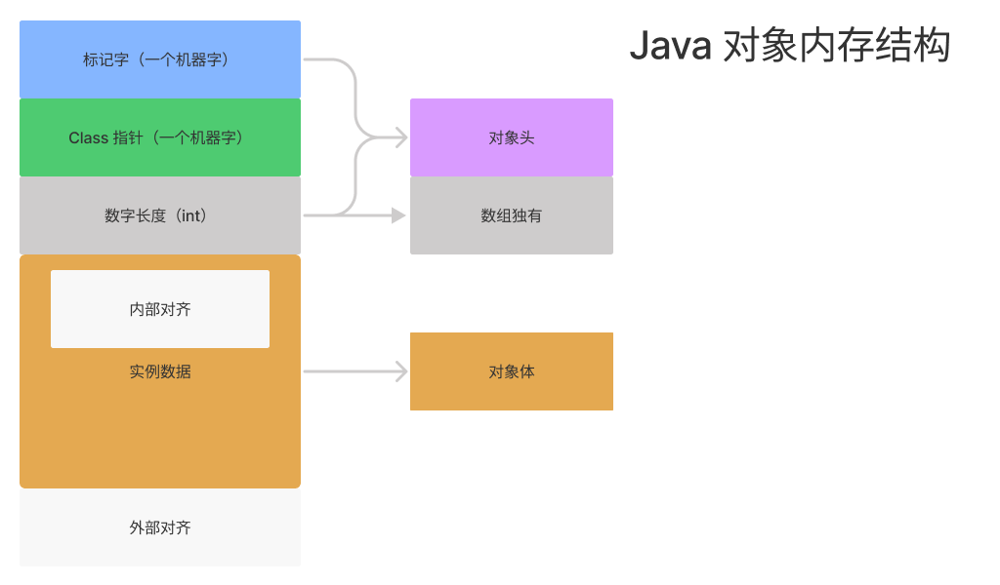

# Java 对象

Java 是一门面向对象的编程语言，同时存在类和对象这两个概念。类是对一类事物的描述，是抽象的，概念上的定义；对象是类的一个实例，表示该类事物的个体，不同的对象实例往往有不同的属性。

这里，我们将介绍一些和 Java 对象相关的概念。

## 对象创建方式

- 使用 new 关键字，需要使用构造器；

- 使用反射机制，通过 `Class#newInstance` 方法或 `Constructor#newInstance` 方法，需要使用构造器；

  > 注：我们可以使用 `Class#newInstance` 方法来创建对象实例，但该方法在 JDK 9 后被废弃，可以使用`Constructor#newInstance` 来替代。

- 使用 `Object#clone` 方法，需要实现 Cloneable 接口，clone 方法时，JVM 在创建对象时不会调用构造函数；

- 使用反序列化，使用 `ObjectInputStream#readObject` 方法来反序列化一个对象，该对象需要实现 `Serializable` 接口，在反序列化时，JVM 创建对象时不会调用构造函数。

## 对象的创建过程

这里指通过 new 关键字创建一个对象。

1. new 一个对象时，如果对应的类未加载，会先进行类加载过程（加载，连接（验证，准备，解析），初始化），如果加载过了执行类的构造方法 `<init>`；
5. 申请对象内存，并给成员变量赋**默认零值**，如果有父类，先对父类的成员变量赋**默认零值**；
6. 执行类的构造方法  `<init>`；
   1. 成员变量按照循序赋初始值，如果有父类，先对父类的成员变量赋值；
   2. 执行构造函数中的语句，如果有父类，先执行父类构造函数中的语句。

## 对象分配过程

这里我们看一下，通过 new 关键字创建一个对象时，对象的分配情况是怎么样的？

1. 通过**逃逸分析**判断对象是否需要在方法栈上分配，如果不可以，下一步；

2. 如果对象比较大，直接分配到老年代，否则，下一步；

   > 通过 `-XX:PretenureSizeThreshold` 设置大对象直接进入年老代的阈值，当对象大小超过这个值时，将直接在年老代分配。

3. 尝试在 TLAB（Thread Local Allocation Buffer，本地线程分配缓冲）分配对象，如果不可以分配对象到 Eden 区。

### 逃逸分析

逃逸分析就是分析方法内创建对象实例的动态作用域，包含：

- 方法逃逸：可以在方法外部被访问到，比如作为调用参数传递到其他方法中；
- 线程逃逸：可以在创建线程外部被访问到，比如赋值将创建的对象负责给实例变量。

### 栈上分配

如果通过逃逸分析确定一个方法不会逃逸出方法之外，那么就可以在栈上分配对象，栈上分配的对象不会参与垃圾回收过程，随着栈帧出栈而销毁。栈上分配的好处是可以减少垃圾收集器回收的压力。

### TLAB 分配

TLAB，即线程本地分配缓存，是每个线程私有的一块内存区域，其位于 Eden 区，一般不会很大。JVM 在为创建的对象在新生带分配内存时，会先尝试在 TLAB 上进行分配，因为 TLAB 是线程私有的区域，所有不会出现分配冲突的问题，可以提高对象的分配效率。

## 对象内存布局

对象在内存中存储的结构由三部分组成：对象头、实例数据、对齐填充，如下图所示：



这里将对象分为普通对象和数组对象来讨论：

普通对象：

- 对象头
  - 标记字，存放对象在运行过程中的一些信息，如对象的 HashCode、GC 分代年龄、锁状态等信息，在 Hotspot 虚拟机里叫做 Mark Word，8 个字节；
  - ClassPointer，存放指向该对象所属 Class 对象的指针，如果开启了 `-XX:+UseCompressedClassPointers`（指针压缩）则为 4 个字节，否则为 8 个字节；
- 对象实例数据
- 对齐，8 的倍数。

数组对象：

- 对象头
  - 标记字，在 Hotspot 虚拟机里叫做 Mark Word，8 个字节；
  - ClassPointer：如果开启了 `-XX:+UseCompressedClassPointers`（指针压缩）则为 4 个字节，否则为 8 个字节；
  - 数组长度，一个 int，4 个字节；
- 对象实例数据
- 对齐，8 的倍数。

> 如果是二维数组，可理解为一个一维数组存储多个一维数组对象，存储的每个一维数组对象都和额外使用 4 个字节存储数组长度。
>
> 比如：
>
> ```java
> int[][] arrayA = new int[1][10]; 
> int[][] arrayB = new int[10][1];
> ```
>
> arrayB 比 arrayA 占用的内存多，因为 arrayB 比 arrayA 用来存储数组的长度所用的字节更多。arrayA 共需要 8 个字节来存储数组长度，arrayB 共需要使用 44 g个字节来存储数组长度。

### 标记字（64 位）

标记字（Mark Word）用来存储对象自身的运行数据，如哈希码（HashCode）、GC 分代年龄、锁标志位等信息，**Mark Word 会随着程序的运行发生变化**，状态如下所示：


> 图片来自于：[12 | 多线程之锁优化（上）：深入了解Synchronized同步锁的优化方法 (geekbang.org)](https://time.geekbang.org/column/article/101244)

在 JDK 1.6 之前，只有重量级锁，但是这个是依赖底层操作系统的 mutex 指令，其阻塞或唤醒一个 Java 线程需要操作系统切换 CPU 状态来完成，这种状态转换需要耗费处理器时间，如果同步代码块中的内容过于简单，状态转换消耗的时间有可能比用户代码执行的时间还要长，比较消耗性能，在 JDK 1.6 之后，为了解决此类问题，出现了偏向锁、轻量级锁。

所以现在锁的状态总共有四种，分别为无锁状态、偏向锁、轻量级锁和重量级锁，随着锁的竞争，锁可以从偏向锁升级到轻量级锁，再升级的重量级锁，下面是这些锁状态的含义：

- 无锁：无锁没有对资源进行锁定，线程循环尝试修改一个共享资源，如果没有冲突则修改成功并退出，否则继续尝试。
- 偏向锁：线程通过判断标记字里的 Thread ID 来决定是否执行同步代码块，在只有一个线程执行同步代码块时减少获取锁的代价。

- 轻量级锁：线程通过**自旋的方式**来获取锁，轻量级锁适用于线程交替执行同步块的场景，且每个同步周期都不长。

- 重量级锁：线程通过阻塞唤醒机制竞争锁，依赖底层操作系统的 mutex 指令。

锁状态的转换：


如上图所示，JVM 在初始分配对象是，对象的锁状态可能有两种，分别是左边的偏向锁可用状态和右边的偏向锁不可用状态，这取决于是否开启或关闭了偏向锁，JVM 选项为：

```
-XX:-UseBiasedLocking // 关闭偏向锁（默认打开）

-XX:+UseHeavyMonitors  // 设置重量级锁
```

如果偏向锁关闭了，那么锁状态的转换就没有左边部分，这里假设开启了偏向锁，那么锁状态转换的流程为：

1. 一个线程访问同步方法；

2. 如果对象的初始状态为未锁定、未偏向但可偏向的状态，此时进行**初始锁定**，线程使用 CAS 的方式将 Thread ID 写入到对象头 Mark Word 中，如果设置失败，表示已经有其他线程持有了偏向锁，此时进行偏向锁撤销，即第 7 步；

3. 在接下来的运行过程中，每当有线程请求这把锁，JVM 只需判断锁对象标记字段中，最后三位是否为 101，Thread ID 是否和当前线程相等，以及 epoch 值是否和**锁对象类**的 epoch 值相同，如果都满足，那么当前线程持有该偏向锁，可以直接返回；

4. 如果线程请求锁时标记字中的 Thead ID 和当前线程不等（epoch 值相等），此时进行偏向锁撤销，即第 7 步，如果此时同时满足类的 epoch 值和标记字中的不相等，进行**重偏向**（重新绑定 Thread ID）；

5. **某类锁对象**偏向撤销 20 次后（对应 JVM 参数 `-XX:BiasedLockingBulkRebiasThreshold`，默认为 20），JVM 会宣布这个**类**的偏向锁失效，此时 JVM 将该**类**的 epoch 值加 1，表示之前那一代的偏向锁已经失效，而新设置的偏向锁则需要复制新的 epoch 值；

   > 为了保证当前持有偏向锁并且已加锁的线程不至于因此丢锁，JVM 需要遍历所有线程的 Java 栈，找出该类已加锁的实例，并且将它们标记字段中的 epoch 值加 1，该操作需要所有线程处于安全点状态。

6. **某类锁对象**偏向撤销数超过 40 次后（对应 JVM 参数 `-XX:BiasedLockingBulkRevokeThreshold`，默认值为 40），那么 JVM 会认为这个类已经不再适合偏向锁，此时，JVM 会撤销该类实例的偏向锁，并且在之后的加锁过程中直接为该类实例设置轻量级锁。
7. 偏向锁的撤销需要等待全局安全点（STW），暂停持有该锁的线程，同时检查该线程是持有对象锁，如果是，则升级为轻量级锁，反之恢复到无锁不可偏向状态。

## 对象的大小

我们可以借助 `java.lang.instrument.Instrumentation` 这个类来观察对象实例实际占用空间大小，这里我们通过 Java agent 的方式来实现，以下是编写 Java agent 的步骤：

1. 首先我们创建一个 object-size-agent Maven 工程，并且编写 ObjectSizeAgent 类，代码如下所示：

   ```java
   public class ObjectSizeAgent {
   
       private static Instrumentation inst;
   
       /**
        * jvm 参数形式启动，运行此方法
        *
        * @param agentArgs agentArgs
        * @param _inst     inst
        */
       public static void premain(String agentArgs, Instrumentation _inst) {
           inst = _inst;
       }
   
       /**
        * 动态 attach 方式启动，运行此方法
        *
        * @param agentArgs agentArgs
        * @param _inst     inst
        */
       public static void agentmain(String agentArgs, Instrumentation _inst) {
           inst = _inst;
       }
   
       public static long sizeOf(Object o) {
           return inst.getObjectSize(o);
       }
   }
   ```

   其中除了 sizeOf 为自定义方法用来获取对象大小外，其余可认为固定写法，有点类似 Spring 中的 Aware 模式。

2. 打包

   在 resources 创建配置文件 `META-INF/MANIFEST.MF`，文件内容如下所示：

   ```
   Manifest-Version: 1.0
   Premain-Class: learn.jvm.agent.ObjectSizeAgent
   Agent-Class: learn.jvm.agent.ObjectSizeAgent
   Can-Redefine-Classes: true
   Can-Retransform-Classes: true
   
   ```

   > 注意：文件需要以空行结尾。

   引入 maven 插件，在 pom 文件中添加插件依赖：

   ```xml
   <build>
       <plugins>
           <plugin>
               <groupId>org.apache.maven.plugins</groupId>
               <artifactId>maven-assembly-plugin</artifactId>
               <configuration>
                   <descriptorRefs>
                       <descriptorRef>jar-with-dependencies</descriptorRef>
                   </descriptorRefs>
                   <archive>
                       <manifestFile>
                           src/main/resources/META-INF/MANIFEST.MF
                       </manifestFile>
                       <!--<manifestEntries>-->
                       <!--<Premain-Class>com.git.hui.agent.SimpleAgent</Premain-Class>-->
                       <!--<Agent-Class>com.git.hui.agent.SimpleAgent</Agent-Class>-->
                       <!--<Can-Redefine-Classes>true</Can-Redefine-Classes>-->
                       <!--<Can-Retransform-Classes>true</Can-Retransform-Classes>-->
                       <!--</manifestEntries>-->
                   </archive>
               </configuration>
   
               <executions>
                   <execution>
                       <goals>
                           <goal>attached</goal>
                       </goals>
                       <phase>package</phase>
                   </execution>
               </executions>
           </plugin>
       </plugins>
   </build>
   ```

   运行以下命令构建 jar 包：

   ```
   mvn assembly:assembly
   ```

   运行完命令后，在项目 taget 目录下会有类似于 `object-size-agent-1.0-SNAPSHOT-jar-with-dependencies.jar` 就是我们需要的 agent jar。

3. 使用 agent jar

   在需要使用 agent 的工程引入上一步创建的 jar，编写测试类，代码如下所示：

   ```java
   @Slf4j
   public class SizeOfAnObject {
   
       public static void main(String[] args) {
           // 对象头（8） + ClassPointer（4） + 补齐（4）= 16
           log.info("{}", ObjectSizeAgent.sizeOf(new Object()));
           // 对象头（8） + ClassPointer（4） + 数组长度（4）+ 补齐（0） = 16
           log.info("{}", ObjectSizeAgent.sizeOf(new int[]{}));
           // 对象头（8） + ClassPointer（4） + 实例内容（19）+ 补齐（1） = 32
           log.info("{}", ObjectSizeAgent.sizeOf(new SizeObject()));
       }
   
       // -XX:+UseCompressedClassPointers：开启 ClassPointer 压缩，开启 4 个字节，不开启 8 个字节，默认开启
       // -XX:+UseCompressedOops：开启引用类型指针压缩，开启，开启 4 个字节，不开启 8 个字节，默认开启
       // Oops = ordinary object pointers
       static class SizeObject {
           // 8 Mark Word
           // 4 class pointer
           int id;         // 4
           int age;        // 4
   
           String name;    // 4 ordinary object pointers
           Object o;       // 4 ordinary object pointers
   
           byte b1;        // 1
           byte b2;        // 1
           byte b3;        // 1
           // 对齐，8 的倍数
       }
   }
   ```

   添加 JVM 启动参数：

   ```
   -javaagent:F:\LearnProjects\learn\programing-language\java\jvm\examples\object-size-agent\target\object-size-agent-1.0-SNAPSHOT-jar-with-dependencies.jar
   ```

   运行测试类，观察输出结果，我们可以发现 new 一个 Object 对象实例，该实例占用内存空间大小为 16 个字节，其中标记字 8 个字节，类指针 4 个字节，对齐 4 个字节。

## 对象访问定位

Java 中对象访问定位有两种方式，分别为：

- 使用句柄访问方式：如果使用句柄访问方式，Java 堆中会划分出一块内存来作为句柄池，reference（方法局部变量表的引用） 中存储的就是对象的句柄地址，而句柄中包含了对象实例数据和类型数据各自的具体地址信息。使用句柄方式最大的好处就是 reference 中存储的是稳定的句柄地址，在对象被移动（垃圾收集时移动对象是非常普遍的行为）时只会改变句柄中的实例数据指针，而 reference 本身不需要被修改。
- 使用直接指针访问方式：如果使用直接指针方式，Java 堆对象的布局就必须考虑如何放置访问类型数据的相关信息，reference 中直接存储的就是对象地址，使用直接指针方式最大的好处就是速度更快，节省了一次指针定位的时间开销。

## 总结

Java 是一门面向对象的编程语言，对象的概念十分重要。

首先我们关注对象实例的创建方式，一共有 4 种，通过 new 关键字创建，通过反射 API（`Class#newInstance` 和 `Constructor#newInstance`）来创建，通过 clone 方法创建，通过反序列化，需要注意的是前两种方法会执行对象的构造方法，后两种则不会。

然后我们讨论了通过 new 关键字创建对象实例的过程，这里需要注意在给对象实例变量赋值时也会有一个先赋默认零值的过程。

在对象分配里，我们讨论了一个对象实例在分配时具体会被分配到运行时内存的那个区域。

我们还讨论了对象的内存布局，尤其时对象头中的标记字（Mark Word），它是在运行过程中会动态变化的，其最后三个字节表示了锁的状态，有无锁、偏向锁、轻量级锁和重量级锁，锁的不同状态在 JDK 1.6 后引入，对锁在某些特定使用场景进行了优化。

在了解了对象的内存布局后，我们通过编写 agent 的方法观察一个对象实例的具体大小，最后简单介绍了句柄访问和直接引用访问两种对象访问定位方式。

### 参考连接

- [Java对象分配简要流程 - SegmentFault 思否](https://segmentfault.com/a/1190000004606059)

- [Java对象在内存中的结构（HotSpot虚拟机） - duanxz - 博客园 (cnblogs.com)](https://www.cnblogs.com/duanxz/p/4967042.html)

- [多线程之锁优化（上）：深入了解Synchronized同步锁的优化方法 (geekbang.org)](https://time.geekbang.org/column/article/101244)

- [不可不说的Java“锁”事 - 美团技术团队 (meituan.com)](https://tech.meituan.com/2018/11/15/java-lock.html)

- [Synchronization - Synchronization - OpenJDK Wiki (java.net)](https://wiki.openjdk.java.net/display/HotSpot/Synchronization)

- [IDEA + maven 零基础构建 java agent 项目 - 云+社区 - 腾讯云 (tencent.com)](https://cloud.tencent.com/developer/article/1602018)