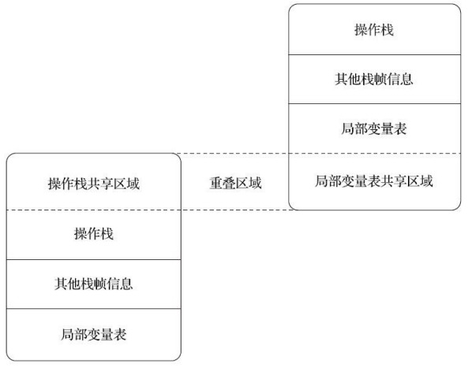

# 虚拟机执行引擎

执行引擎是 Java 虚拟机核心的组成部分之一。“虚拟机”是一个相对于“物理机”的概念，这两种机 器都有代码执行能力，其区别是物理机的执行引擎是直接建立在处理器、缓存、指令集和操作系统层 面上的，而虚拟机的执行引擎则是由软件自行实现的，因此可以不受物理条件制约地定制指令集与执 行引擎的结构体系，能够执行那些不被硬件直接支持的指令集格式。

在《Java 虚拟机规范》中制定了 Java 虚拟机字节码执行引擎的概念模型，这个概念模型成为各大发行商的 Java 虚拟机执行引擎的统一外观（Facade）。在不同的虚拟机实现中，执行引擎在执行字节码的时候，通常会有解释执行（通过解释器执行）和编译执行（通过即时编译器产生本地代码执行）两种选择，也可能两者兼备。

## 运行时栈帧结构

Java 虚拟机以方法作为最基本的执行单元，“栈帧”（Stack Frame）则是用于支持虚拟机进行方法调用和方法执行背后的数据结构，它也是虚拟机运行时数据区中的虚拟机栈。

每一个栈帧都包括了局部变量表、操作数栈、动态连接、方法返回地址和一些额外的附加信息。 在编译 Java 程序源码的时候，栈帧中需要多大的局部变量表，需要多深的操作数栈就已经被分析计算 出来，并且写入到方法表的 Code 属性之中。换言之，**一个栈帧需要分配多少内存，并不会受到程序运行期变量数据的影响，而仅仅取决于程序源码和具体的虚拟机实现的栈内存布局形式**。


### 局部变量表

局部变量表（Local Variables Table）是一组变量值的存储空间，用于存放方法参数和方法内部定义的局部变量。

局部变量表的容量以变量槽（Variable Slot）为最小单位，一个变量槽可以存放一个 32 位以内的数据类型。对于 64 位的数据类型，Java 虚拟机会以高位对齐的方式为其分配两个连续的变量槽空间。

当一个方法被调用时，Java 虚拟机会使用局部变量表来完成参数值到参数变量列表的传递过程， 即实参到形参的传递。如果执行的是实例方法，那局部变量表中第 0 位索引的变量槽默认是用于传递方法所属对象实例的引用，在方法中可以通过关键字“this”来访问到这个隐含的参数。其余参数则按照参数表顺序排列，占用从 1 开始的局部变量槽，参数表分配完毕后，再根据方法体内部定义的变量顺序和作用域分配其余的变量槽。

**为了尽可能节省栈帧耗用的内存空间，局部变量表中的变量槽是可以重用的，方法体中定义的变量，其作用域并不一定会覆盖整个方法体，如果当前字节码 PC 计数器的值已经超出了某个变量的作用域，那这个变量对应的变量槽就可以交给其他变量来重用**。不过，这样的设计除了节省栈帧空间以外，还会伴随有少量额外的副作用，例如在某些情况下变量槽的复用会直接影响到系统的垃圾收集行为。

比如：

```java
public class LocalVariableImpactGC {

    // GC 和局部变量在同一个作用域，bytes 是 GC Roots，数组对象不会被回收
    private static void run1() {
        byte[] bytes = new byte[64 * 1024 * 1024];
        System.gc();
    }

    // GC 和局部变量在同一个作用域，bytes 置为 null，数组对象被回收
    private static void run2() {
        byte[] bytes = new byte[64 * 1024 * 1024];
        bytes = null;
        System.gc();
    }

    // GC 和局部变量不在同一个作用域，bytes 虽然已经不再使用了，但还是不会被回收
    private static void run3() {
        {
            byte[] bytes = new byte[64 * 1024 * 1024];
        }
        System.gc();
    }

    // GC 和局部变量不在同一个作用域，变量槽被作用域外的另一个变量覆盖，bytes 会被回收
    private static void run4() {
        {
            byte[] bytes = new byte[64 * 1024 * 1024];
        }
        int a = 0;
        System.gc();
    }
}
```

使用 `-verbose:gc` 观察日志：

```
run1
[0.189s][info][gc] GC(0) Pause Full (System.gc()) 69M->66M(230M) 3.324ms

run2
[0.165s][info][gc] GC(0) Pause Full (System.gc()) 69M->1M(14M) 7.597ms

run3
[0.171s][info][gc] GC(0) Pause Full (System.gc()) 69M->66M(230M) 2.722ms

run4
[0.169s][info][gc] GC(0) Pause Full (System.gc()) 69M->1M(14M) 6.127ms
```

可以发现，`run1` 和 `run3` 的局部变量内存不会被回收，`run2` 和 `run4` 会被回收。

- 方法一不会被回收的原因是因为数组对象被 bytes 引用着，bytes 是 GC Root，所以不会被回收。

- 方法二则将 bytes 引用断掉，因此可以被回收。

- 方法三则将收集行为和变量放到不同的作用域，虽然在局部变量已经没有在使用了，但数组对象仍然在变量槽中，还是不会被回收。

- 方法四在作用域外又声明了另外的局部变量，变量槽被覆盖，数组对象被回收了。


关于局部变量表，还有一点可能会对实际开发产生影响，就是局部变量不像前面介绍的类变量那样存在“准备阶段”。如果一个局部变量定义了但没有初始化，那它是完全不能使用的，其没有赋默认零值的过程。

### 操作数栈

操作数栈（Operand Stack）也常被称为操作栈，它是一个后入先出（Last In First Out，LIFO） 栈。

操作数栈的每一个元素都可以是包括 long 和 double 在内的任意 Java 数据类型。32 位数据类型所占的栈容量为 1，64 位数据类型所占的栈容量 2。

当一个方法刚刚开始执行的时候，这个方法的操作数栈是空的，在方法的执行过程中，会有各种字节码指令往操作数栈中写入和提取内容，也就是出栈和入栈操作。譬如在做算术运算的时候是通过 将运算涉及的操作数栈压入栈顶后调用运算指令来进行的，又譬如在调用其他方法的时候是通过操作 数栈来进行方法参数的传递。举个例子，例如整数加法的字节码指令 `iadd`，这条指令在运行的时候要 求操作数栈中最接近栈顶的两个元素已经存入了两个 int 型的数值，当执行这个指令时，会把这两个 int 值出栈并相加，然后将相加的结果重新入栈。

比如下面例子：

下述代码就是先声明了两个变量 a、b，在通过一个临时变量 c，交换这两个变量的值。

```java
public class BytecodeExample3 {

    public void foo() {
        int a = 1;
        int b = 2;

        int c = a;
        a = b;
        b = c;
    }
}
```

上述方法，声明并初始化了两个局部遍历 a，b，借助局部变量 c，将 a 和 b 的值进行交换，其操作码如下所示：

```
 0 iconst_1   将 int 常量 1 push 到栈顶中                      
 1 istore_1   将栈顶的 int 元素出栈，并将其存放在局部变量 1 号槽位中     int a = 1;
 2 iconst_2   将 int 常量 2 push 到栈顶中    
 3 istore_2   将栈顶的 int 元素出栈，并将其存放在局部变量 2 号槽位中     int b = 2;
 4 iload_1    获取局部变量表 1 号槽位的 int 值，并压入栈顶
 5 istore_3   将栈顶的 int 元素出栈，并将其存放在局部变量 3 号槽位中     int c = a;
 6 iload_2    获取局部变量表 2 号槽位的 int 值，并压入栈顶
 7 istore_1   将栈顶的 int 元素出栈，并将其存放在局部变量 1 号槽位中     a = b;
 8 iload_3    获取局部变量表 3 号槽位的 int 值，并压入栈顶
 9 istore_2   将栈顶的 int 元素出栈，并将其存放在局部变量 2 号槽位中     b = c;
10 return     方法结束返回
```


另外在概念模型中，每个栈帧都有自己独有的操作数栈和局部变量表，彼此之间互不影响。

但是在大多虚拟机的实现里都会进行一些优化处理，令两个栈帧出现一部分重叠。让下面栈帧的部分操作数 栈与上面栈帧的部分局部变量表重叠在一起，这样做不仅节约了一些空间，更重要的是在进行方法调 用时就可以直接共用一部分数据，无须进行额外的参数复制传递了。

重叠部分如下图所示：



### 动态连接

每个栈帧都包含一个指向运行时常量池中该栈帧所属方法的引用，持有这个引用是为了支持方法调用过程中的动态连接（Dynamic Linking）。

我们知道 Class 文件的常量池中存 有大量的符号引用，字节码中的方法调用指令就以常量池里指向方法的符号引用作为参数。这些符号引用一部分会在类加载阶段或者第一次使用的时候就被转化为直接引用，这种转化被称为静态解析。

另外一部分将在每一次运行期间都转化为直接引用，这部分就称为动态连接。

### 方法返回地址

当一个方法开始执行后，只有两种方式退出这个方法。第一种方式是执行引擎遇到任意一个方法 返回的字节码指令，这时候可能会有返回值传递给上层的方法调用者，这种退出叫做正常完成。

另外一种退出方式是在方法执行的过程中遇到了异常，并且这个异常没有在方法体内得到妥善处理。

无论采用何种退出方式，在方法退出之后，都必须返回到最初方法被调用时的位置，程序才能继续执行，方法返回时可能需要在栈帧中保存一些信息，用来帮助恢复它的上层主调方法的执行状态。

## 方法调用

方法调用并不等同于方法中的代码被执行，方法调用阶段唯一的任务就是决定要调用哪个方法。

Class 文件的编译过程中不包含传统程序语言编译的连接步骤，一切方法调用在 Class 文件里面存储的都只是符号引用，而不是方法在实际运行时内存布局中的入口地址。这个特性给 Java 带来了更强大的动态扩展能力，但也使得 Java 方法调用过程变得相对复杂，某些调用需要在类加载期间，甚至到运行期间才能确定目标方法的直接引用。

### 解析调用

所有方法调用的目标方法在 Class 文件里面都是一个常量池中的符号引用，在类加载的解析阶段，会将其中的一部分符号引用转化为直接引用，这种解析能够成立的前提是：方法在程序真正运行之前就有一个可确定的调用版本，并且这个方法的调用版本在运行期是不可改变的。

能够在类加载解析阶段就将符号引用转为静态引用的方法对应到 Java 编码层面主要有**静态方法**和**私有方法**两大类。前者与类型直接关联，后者在外部不可被访问，这两种方法有个特点就是不能被重写，因此其可以在类加载阶段就进行解析。


调用不同类型的方法，字节码指令集里设计了不同的指令。在 Java 虚拟机支持以下 5 条方法调用 节码指令，分别是：	

- `invokestatic`：用于调用静态方法；
- `invokespecial`：用于调用实例构造器方法 `<init>()` 方法，私有方法和父类中的方法；
- `invokevirtual`：用于调用所有的虚方法；
- `invokeinterface`：用于调用接口方法，会在运行时再确定一个实现该接口的对象；
- `invokedynamic`：先在运行时动态解析出调用点限定符所引用的方法，然后再执行该方法。

**前面 4 条调用指令，分派逻辑都固化在 Java 虚拟机内部，而 `invokedynamic` 指令的分派逻辑是由用户设定的引导方法来决定的**。


只要能被 `invokestatic` 和 `invokespecial` 指令调用的方法，都可以在解析阶段中确定唯一的调用版本， Java 语言里符合这个条件的方法共有静态方法、私有方法、实例构造器、父类方法 4 种，再加上被 final 修饰的方法（尽管它使用 `invokevirtual` 指令调用），这 5 种方法调用会在类加载的时候就可以把符号引用解析为该方法的直接引用，这些方法统称为“非虚方法“。与之相对的就叫做虚方法。

简单来讲可以被重写的方法就叫做虚方法，否则叫做非虚方法。对于虚方法执行的指令为 `invokevirtual`，该指令的第一步就是找方法所在对象的实际类型，其时多态实现的关键。


上述说到的解析调用一定是个静态的过程，在编译期间就完全确定，在类加载的解析阶段就会把涉及的符号引用全部转变为明确的直接引用，不必延迟到运行期再去完成。而另一种主要的方法调用形式：分派 （Dispatch）调用则要复杂许多，它可能是静态的也可能是动态的，按照分派依据的宗量数可分为单分派和多分派。这两类分派方式两两组合就构成了静态单分派、静态多分派、动态单分派、动态多分派 4 种分派组合情况。

### 分派调用

#### 静态分派

静态分派也就是方法重载。

下面时静态分派的一个例子：

```java
public class StaticDispatchExample {

    public static void main(String[] args) {
        Human man = new Man();
        Human woman = new Woman();
        StaticDispatchExample sr = new StaticDispatchExample();
        sr.sayHello(man);   // Hello,guy!
        sr.sayHello(woman); // Hello,guy!
    }

    public void sayHello(Human human) {
        System.out.println("Hello,guy!");
    }

    public void sayHello(Man guy) {
        System.out.println("hello,gentleman!");
    }

    public void sayHello(Woman guy) {
        System.out.println("hello,lady!");
    }

    static abstract class Human {}

    static class Man extends Human {}

    static class Woman extends Human {}
}
```

我们把上面代码的 Human 成为静态类型或外观类型，把 Man 和 Woman 叫做实际类型或者运行时类型。

静态类型是在编译期可知的，而实际类型变化的结果在运行期才可确定。所以对于重载方法，调用哪个在编译期间就以及决定了。选择的时候根据方法的参数的类型和实参的类型进行最优匹配，然后调用。

#### 动态分派

`invokevirtual`。

动态分派和它与 Java 语言多态性的另外 一个重要体现——重写（Override）有着很密切的关联。

比如下面这个例子：

```java
public class DynamicDispatchExample {

    public static void main(String[] args) {
        Human man = new Man();
        Human woman = new Woman();
        man.sayHello();
        woman.sayHello();
        man = new Woman();
        man.sayHello();
    }

    static abstract class Human {
        protected abstract void sayHello();
    }

    static class Man extends Human {
        @Override
        protected void sayHello() {
            System.out.println("man say hello");
        }
    }

    static class Woman extends Human {
        @Override
        protected void sayHello() {
            System.out.println("woman say hello");
        }
    }
}
```

上述方法对应的字节码：

```
 0 new #2 <learn/java/jvm/executive/methodcall/StaticDispatchExample$Man>
 3 dup
 4 invokespecial #3 <learn/java/jvm/executive/methodcall/StaticDispatchExample$Man.<init> : ()V>
 7 astore_1
 8 new #4 <learn/java/jvm/executive/methodcall/StaticDispatchExample$Woman>
11 dup
12 invokespecial #5 <learn/java/jvm/executive/methodcall/StaticDispatchExample$Woman.<init> : ()V>
15 astore_2
16 new #6 <learn/java/jvm/executive/methodcall/StaticDispatchExample>
19 dup
20 invokespecial #7 <learn/java/jvm/executive/methodcall/StaticDispatchExample.<init> : ()V>
23 astore_3
24 aload_3
25 aload_1
26 invokevirtual #8 <learn/java/jvm/executive/methodcall/StaticDispatchExample.sayHello : (Llearn/java/jvm/executive/methodcall/StaticDispatchExample$Human;)V>
29 aload_3
30 aload_2
31 invokevirtual #8 <learn/java/jvm/executive/methodcall/StaticDispatchExample.sayHello : (Llearn/java/jvm/executive/methodcall/StaticDispatchExample$Human;)V>
34 return
```

上面多态查找是怎么实现的呢？

根据《Java 虚拟机规范》， `invokevirtual` 指令的运行时解析过程大致分为以下几步：

- **找到操作数栈顶的第一个元素所指向的对象的实际类型，记作 C**；
- 如果在类型 C 中找到与常量中的描述符和简单名称都相符的方法，则进行访问权限校验，如果通过则返回这个方法的直接引用，查找过程结束；不通过则返回 `java.lang.IllegalAccessError` 异常；
- 否则，按照继承关系从下往上依次对 C 的各个父类进行第二步的搜索和验证过程。
- 如果始终没有找到合适的方法，则抛出 `java.lang.AbstractMethodError` 异常。

正是因为 `invokevirtual` 指令执行的第一步就是在运行期确定接收者的实际类型，所以两次调用中的 `invokevirtual` 指令并不是把常量池中方法的符号引用解析到直接引用上就结束了，还会根据方法接收者的实际类型来选择方法版本，这个过程就是 Java 语言中方法重写的本质。


在 Java 里面只有虚方法存在， 字段永远不可能是虚的，换句话说，字段永远不参与多态，哪个类的方法访问某个名字的字段时，该 名字指的就是这个类能看到的那个字段。当子类声明了与父类同名的字段时，虽然在子类的内存中两个字段都会存在，但是在子类中子类的字段会遮蔽父类的同名字段。

看下面这个例子：

```java
public class FieldHasNoPolymorphic {

    public static void main(String[] args) {
        Father gay = new Son();
        System.out.println("This gay has $" + gay.money);
    }

    static class Father {
        public int money = 1;
        public Father() {
            money = 2;
            showMeTheMoney();
        }
        public void showMeTheMoney() {
            System.out.println("I am Father, i have $" + money);
        }
    }
    static class Son extends Father {
        public int money = 3;
        public Son() {
            money = 4;
            showMeTheMoney();
        }
        public void showMeTheMoney() {
            System.out.println("I am Son, i have $" + money);
        }
    }
}
```

上述的输出结果为：

```
I am Son, i have $0   
I am Son, i have $4
This gay has $2.   
```

输出两句都是 “I am Son”，这是因为 Son 类在创建的时候，首先隐式调用了 Father 的构造函数，而 Father 构造函数中对 `showMeTheMoney` 的调用是一次虚方法调用，实际执行的版本是 `Son#showMeTheMoney` 方法，所以输出的是“I am Son”，这点经过前面的分析相信读者是没有疑问的了。

而这时候虽然父类的 money 字段已经被初始化成 2 了，但 `Son::showMeTheMoney` 方法中访问的却是子类的 money 字段，这时候结果自然还是 0，因为它要到子类的构造函数执行时才会被初始化。

 main 方法的最后一句通过静态类型访问到了父类中的 money，输出了 2，这也说明了没有虚字段这一事实。


#### 单分派和多分派

方法的接收者与方法的参数统称为方法的宗量。根据分派基于多少种宗量，可以将分派划分为单分派和多分派两种。单分派是根据一个宗量对 目标方法进行选择，多分派则是根据多于一个宗量对目标方法进行选择。

 Java 语言是一门静态多分派、动态单分派的语言，比如下面例子：

```java
public class DispatchExample {

    public static void main(String[] args) {
        Father son = new Son();
        son.showNumber(1);
    }

    static class Father {

        public void showNumber(Number number) {
            System.out.println("father show number " + number);
        }

        public void showNumber(Integer integer) {
            System.out.println("father show integer " + integer);
        }
    }

    static class Son extends Father {

        public void showNumber(Number number) {
            System.out.println("son show number " + number);
        }

        public void showNumber(Integer integer) {
            System.out.println("son show integer " + integer);
        }
    }
}
```

上述的输出结果为 `son show integer 1`，表明了在实际运行过程中。

首先编译期间根据变量类型和参数类型选择了 `Father#showNumber(Integer)` 方法（如果将上述的 `showNumber(Integer)` 方法注释后，代码将出现编译错误）。运行期间，参数类型以及决定了，根据根据变量类型选择 Son。

因此 Java 语言是一门静态多分派、动态单分派的语言。

#### 虚拟机动态分派的实现

动态分派是执行非常频繁的动作，而且动态分派的方法版本选择过程需要运行时在接收者类型的 方法元数据中搜索合适的目标方法，因此，Java 虚拟机实现基于执行性能的考虑，真正运行时一般不 会如此频繁地去反复搜索类型元数据。

面对这种情况，一种基础而且常见的优化手段是为类型在方法 区中建立一个虚方法表，使用虚方法表索引来代替元数据查找以提高性能。虚方法表中存放着各个方法的实际入口地址。如果某个方法在子类中没有被重写，那子类的虚方 法表中的地址入口和父类相同方法的地址入口是一致的，都指向父类的实现入口。如果子类中重写了这个方法，子类虚方法表中的地址也会被替换为指向子类实现版本的入口地址。

这样运行过程中执行虚方法时，先找到对应类型，在到对应虚方法表就可以找到并执行对应方法。

## 动态类型语言支持

`invokedynamic` 和 方法句柄。

什么时动态类型语言。

**动态类型语言的关键特征是它的类型检查的主体过程是在运行期而不是编译期进行的**。

静态类型语言能够在编译期确定变量类型，最显著的好处是编译器可以提供全面严谨的 类型检查，这样与数据类型相关的潜在问题就能在编码时被及时发现，利于稳定性及让项目容易达到 更大的规模。而动态类型语言在运行期才确定类型，这可以为开发人员提供极大的灵活性，某些在静 态类型语言中要花大量臃肿代码来实现的功能，由动态类型语言去做可能会很清晰简洁，清晰简洁通 常也就意味着开发效率的提升。

#### 方法句柄

`JDK` 7 时新加入的 `java.lang.invoke` 包，这个包的主要目的是在之前单纯依靠符号引用来确定调用的目标方法这条路之外，提供一种新的**动态确定目标方法的机制**，称为“方法句柄”（Method Handle）。

下面展示了方法句柄的基本使用：

```java
public class MethodHandleExample {

    public static void main(String[] args) throws Throwable {
        Object obj = System.currentTimeMillis() % 2 == 0 ? System.out : new Foo();
        getPrintlnMethodHandle(obj).invokeExact("simon");
    }

    // 模拟 invokevirtual 指令的执行过程，根据 receiver 的实际类型在虚方法表里找到对应方法，返回方法句柄
    private static MethodHandle getPrintlnMethodHandle(Object receiver) throws Throwable {
        // MethodType 表明了方法类型，void.class 说明了返回类型为 void， String.class 说明了方法参数类型为 String
        MethodType mt = MethodType.methodType(void.class, String.class);
        // 在指定类中查找符合给定的方法名称、方法类型，并且符合调用权限的虚方法句柄
        return MethodHandles.lookup().findVirtual(receiver.getClass(), "println", mt).bindTo(receiver);
    }

    static class Foo {
        public void println(String s) {
            System.out.println(s);
        }
    }
}
```

上面查找类中方法返回，然后再执行的能力反射中以及有了，那么 Method Handle 和反射有什么区别呢？

- Reflection 和 Method Handle 机制本质上都是在模拟方法调用，但是 Reflection 是在模拟 Java 代码层次 的方法调用，而 Method Handle是在模拟字节码层次的方法调用。在 `MethodHandles.Lookup` 上的3个方法 `findStatic()`、`findVirtual()`、`findSpecial()` 正是为了对应于 `invokestatic`、`invokevirtual`（以及 `invokeinterface`）和 `invokespecial` 这几条字节码指令的执行权限校验行为，而这些底层细节在使用 Reflection API 时是不需要关心的。
- Reflection 中的 `java.lang.reflect.Method` 对象远比 Method Handle 机制中的 `java.lang.invoke.MethodHandle` 对象所包含的信息来得多。前者是方法在Java端的全面映像，包含了方法 的签名、描述符以及方法属性表中各种属性的 Java 端表示方式，还包含执行权限等的运行期信息。而后者仅包含执行该方法的相关信息。用开发人员通俗的话来讲，Reflection 是重量级，而 Method Handle 是轻量级。

- 由于 Method Handle 是对字节码的方法指令调用的模拟，那理论上虚拟机在这方面做的各种优化 （如方法内联），在 Method Handle上也应当可以采用类似思路去支持，而通过反射去调用方法则几乎不可能直接去实施各类调用点优化措施。
-  Reflection API 的设计目标是只为Java语言服务的，而 Method Handle 则设计为可服务于所有 Java 虚拟机之上的语言，其中也包括了 Java 语言。

#### invokedynamic 指令

某种意义上可以说 `invokedynamic` 指令与 Method Handle 机制的作用是一样的，都是为了解决原有 4  条 `invoke*` 指令方法分派规则完全固化在虚拟机之中的问题，把如何查找目标方法的决定权从虚拟机转嫁到具体用户代码之中，让用户有更高的自由度。


每一处含有 `invokedynamic` 指令的位置都被称作动态调用点， 这条指令的第一个参数不再是代表方法符号引用的 `CONSTANT_Methodref_info` 常量，而是变为新加入的 `CONSTANT_InvokeDynamic_info` 常量，从这个新常量中可以得到 3 项信息：引导方法 （Bootstrap Method，该方法存放在新增的 `BootstrapMethods` 属性中）、方法类型（`MethodType`）和 名称。

根据 `CONSTANT_InvokeDynamic_info` 常量中提供的信息，虚拟机可以找到 并且执行引导方法，从而获得一个 `CallSite` 对象，最终调用到要执行的目标方法上。

`invokedynamic` 指令与此前 4 条传统的 `invoke*` 指令的最大区别就是它的分派逻辑不是由虚拟机决定的，而是由程序员决定。

## 基于栈的字节码解释执行引擎

### 编译执行和解释执行

编译：将源代码一次性转换为机器码的过程（机器码有保存为文件，下次运行的时候直接运行机器码）。

解释：将源代由逐行转换为机器码并运行的过程（机器码并没有保存下来）。

### 基于栈的指令集与基于寄存器的指令集

比如最简单的 1+1 基于栈的指令集如下：

```
iconst_1
iconst_1
iadd
istore_0
```

基于寄存器的指令集如下：

```
mov eax, 1
add eax, 1
```

