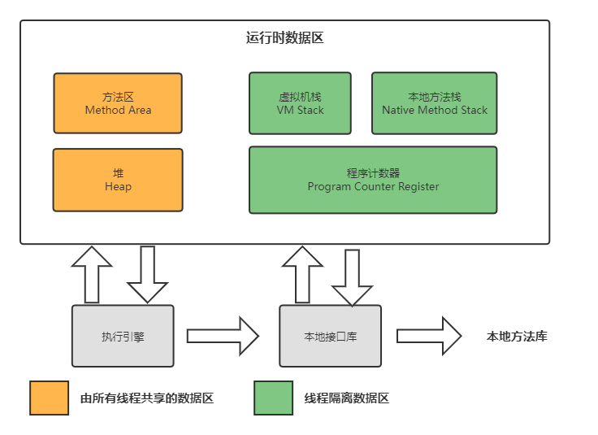

# 运行时内存区域

Java 虚拟机了在执行程序期间使用的各种运行时数据区域，这些数据区域中的有的在 Java 虚拟机启动时创建，并且仅在 Java 虚拟机退出时被销毁，有的数据区域是每个线程私有的区域，随着线程启动而创建，所在线程退出而销毁。

Java 虚拟机在运行时有以下几个内存区域：



## PC 寄存器

PC（Program Counter Register）：PC 寄存器是一块很小的内存空间，主要用来记录当前线程执行的字节码的地址。字节码解释器工作时就是通过改变这个计数器的值来选取下一条需要执行的字节码指令。分支、循环、跳转、异常、线程恢复等都依赖于计数器。

由于 Java 虚拟机的多线程是通过线程轮流切换、分配处理器执行时间的方式来实现的，在任何一个确定的时刻，一个处理器（对于多核处理器来说是一个内核）都只会执行一条线程中的指令。因此，为了线程切换后能恢复到正确的执行位置，每条线程都需要有一个独立的程序计数器，各条线程之间计数器互不影响，独立存储，我们称这类内存区域为“线程私有”的内存。

此内存区域是唯一一个在《Java 虚拟机规范》中没有规定任何 `OutOfMemoryError` 情况的区域。

## Java 虚拟机栈

Java 的方法栈也是线程私有的区域，每一个线程一个个栈，运行的每个方法对应一个栈帧，每个栈帧里面有**局部变量表**、**操作数栈**、**动态连接**、**方法出口**等信息。一个方法被调用至执行完毕的过程，就对应着一个栈帧在虚拟机栈中从入栈到出栈的过程。

栈帧中的局部变量表，放了编译期可知的各种 Java 虚拟机基本数据类型（boolean、byte、char、short、int、float、long、double）和对象引用。这些数据类型在局部变量表中的存储空间以局部变量槽（Slot）来表示，其中 64 位长度的 long 和 double 类型的数据会占用两个变量槽，其余的数据类型只占用一个。

下面一个例子来介绍每个函数的栈帧里的操作数栈，代码如下所示：

```java
public class IPlusPlus {

    public static void main(String[] args) {
        // 8
        testIPlusPlus();
        // 9
        testPlusPlusI();
    }

    static void testIPlusPlus() {
        int i = 8;
        i = i++;
        System.out.println(i);
    }

    static void testPlusPlusI() {
        int i = 8;
        i = ++i;
        System.out.println(i);
    }
}
```

上述代码都对 i 进行 ++ 操作，再赋值给 i，不同的是一个 ++ 在前，一个在后，它们得到的结果也是不同的，我们可以通过分析方法的操作数栈和局部变量表，来看为什么会有这样的结果。

方法 `IPlusPlus#testIPlusPlus` 的操作数栈和局部变量表如下所示（可以使用 IDEA 插件 jclasslib 查看）：

```
 0 bipush 8
 2 istore_0
 3 iload_0
 4 iinc 0 by 1
 7 istore_0
 8 getstatic #4 <java/lang/System.out>
11 iload_0
12 invokevirtual #5 <java/io/PrintStream.println>
15 return

0	3	13	0	cp_info #20	cp_info #21
```

上述字节码表示的过程如下：

- bipush 8：表示将 8 压入栈中，其中 b 表示 byte；
- istore_0：表示将操作数栈顶的值 8 出栈，并存储到本地变量表的 0 号槽位中，此时本地变量表 0 号槽位的值为 8；
- iload_0：表示本地变量表 0 号槽位的值 8，压入栈中，此时本地变量表 0 号槽位的值为 8；
- iinc 0 by 1：表示将本地变量表 0 号槽位的值加 1，此时本地变量表 0 号槽位的值为 9；
- istore_0：表示将操作数栈顶的值 8 出栈，并存储到本地变量表的 0 号槽位中，此时本地变量表 0 号槽位的值又变回 8。

 `IPlusPlus#testPlusPlusI` 的字节码和局部变量表如下所示：

```
 0 bipush 8
 2 istore_0
 3 iinc 0 by 1
 6 iload_0
 7 istore_0
 8 getstatic #4 <java/lang/System.out>
11 iload_0
12 invokevirtual #5 <java/io/PrintStream.println>
15 return

0	3	13	0	cp_info #20	cp_info #21
```

上述字节码表示过程如下：

- bipush 8：表示将 8 压入栈中，其中 b 表示 byte；
- istore_0：表示将操作数栈顶的值 8 出栈，并存储到本地变量表的 0 号槽位中，此时本地变量表 0 号槽位的值为 8；
- iinc 0 by 1：表示将本地变量表 0 号槽位的值加 1，此时本地变量表 0 号槽位的值为 9；
- iload_0：表示本地变量表 0 号槽位的值 9，压入栈中，此时本地变量表 0 号槽位的值为 9；
- istore_0：表示将操作数栈顶的值 9 出栈，并存储到本地变量表的 0 号槽位中，此时本地变量表 0 号槽位的值还为 9。


在《Java 虚拟机规范》中，对这个内存区域规定了两类异常状况：如果线程请求的栈深度大于虚拟机所允许的深度，将抛出 `StackOverflowError` 异常；如果Java 虚拟机栈容量可以动态扩展，当栈扩展时无法申请到足够的内存会抛出 `OutOfMemoryError` 异常。

## 本地方法栈

本地方法栈跟 Java 虚拟机栈的功能类似，Java 虚拟机栈用于管理 Java 函数的调用，而本地方法栈则用于管理本地方法的调用。但本地方法并不是用 Java 实现的，而是由 C 语言实现的。

## 堆

堆是 JVM 内存中最大的一块内存空间，该内存被所有线程共享，几乎所有对象和数组都被分配到了堆内存中，堆也是垃圾回收器重点管理区域。

堆可以固定大小，也可以动态扩容，堆内存不足使用时，Java 虚拟机将抛出 `OutOfMemoryError`。

Java 堆是垃圾收集器管理的内存区域，因此一些资料中它也被称作 GC 堆。从回收内存的角度看，由于现代垃圾收集器大部分都是基于分代收集理论设计的，所以Java堆中经常会出现新生代、老年代、永久代、Eden 空间、From Survivor 空间 、To Survivor 空间。这些区域划分仅仅是一部分垃圾收集器的共同特性或者说设计风格而已，而非某个 Java 虚拟机具体实现的固有内存布局，更不是《Java 虚拟机规范》里对Java堆的进一步细致划分。

不过无论从什么角度，无论如何划分，都不会改变Java堆中存储内容的共性，无论是哪个区域，存储的都只能是对象的实例，将 Java 堆细分的目的只是为了更好地回收内存，或者更快地分配内存。

## 方法区

方法区也是一块线程共享的内存区域，主要用来存放虚拟机加载的类型信息、常量、静态变量、即时编译器编译后的代码缓存等数据。

方法区在逻辑上是堆的一部分，但 JVM 规范并没有明确定义方法区的位置和具体管理方法区存放内容的策略，也不要求方法区是一块连续的内存区域，方法区有各种不同的实现，如：

- Permanent Generation：Hotspot 在 JDK8 之前对方法区的实现，和 Java 堆位于一块连续的内存，为了和 Java 堆区分开来，也叫做“非堆”（Non-Heap）。HotSpot 虚拟机设计团队选择把收集器的分代设计扩展至方法区，这样使得 HotSpot 的垃圾收集器能够像管理 Java 堆一样管理这部分内存，因此出现了永久代。但在 JDK1.7 开始，就开始准备移除永久代，首先将永久代的静态变量和运行时常量池转移到堆中，原因如下：

  - 移除永久代是为了融合 HotSpot JVM 与 JRockit VM 而做出的努力，因为 JRockit 没永久代，所以不需要配置永久代。

  - 永久代内存容易发生内存溢出，抛出异常 java.lang.OutOfMemoryError: PermGen。

- MetaSpace：Hotspot 在 JDK8 和之后对方法区的实现，使用堆外内存。方法区描述的**静态变量和运行时常量池以及字符串常量池存放在堆中**，但类的元信息等还是存放在了本地内存中。

## 运行时常量池

运行时常量池存放编译后的 Class 文件常量池里的内容，即 Class 文件中的常量池在类加载到内存后会放到运行时常量池中，并且运行时常量池是全局共享的，这意味着不同 Class 中相同的字面量在运行常量池中只会存在一份。

Java 语言并不要求常量一定只有编译期才能产生，运行期间也可以将新的常量放入池中，这种特性被开发人员利用得比较多的便是 `String#intern` 方法。

> 关于常量池的几个问题：
>
> Class 常量池，运行时常量池，字符串常量池？
>
> - Class 文件中的常量池：存放各种类型的常量值，一共有 17 中类型。
>
> - 运行时常量池：运行时常量池和 Class 文件的常量池是一一对应的，它就是 Class 文件的常量池来构建，存放着字面量和符号引用，其中字面量有包括文本字符串、final 常量值、基本数据类型的值；符号引用包括类完全限定名、字段名称、方法名称和描述符。
>
> - 字符串常量池：存放字符串字面量（String Literals），字符串字面量总是指向（interned）同一个字符串对象，具体可参考参考 [Chapter 3. Lexical Structure (oracle.com)](https://docs.oracle.com/javase/specs/jls/se17/html/jls-3.html#jls-3.10.5)。
>
>   比如我们有下代码：
>
>   ```java
>   public class StringLiterals {
>     
>       public static void main(String[] args) {
>           String hello = "Hello", lo = "lo";
>           // true，字符串常量池中同一个字面量，指向同一个字符串对象
>           System.out.println(hello == "Hello");
>           // true，字符串常量池中同一个字面量，指向同一个字符串对象
>           System.out.println(Other.hello == hello);
>           // true，"Hel" + "lo" 编译为 "Hello"
>           System.out.println(hello == ("Hel" + "lo"));
>           // false，运行时用一个字符串连接一个字符串字面量，此时创建了一个新的字符串对象
>           System.out.println(hello == ("Hel" + lo));
>           // false
>           System.out.println(("Hel" + lo) == ("Hel" + lo));
>           // String#intern 方法返回与此字符串（对象）值相同并来自于字符串常量池的唯一字符串
>           // true
>           System.out.println(hello == ("Hel" + lo).intern());
>       }
>   }
>     
>   class Other {
>       static String hello = "Hello";
>   }
>   ```
>
>   在如下面这句代码创建了多少个对象：
>
>   ```java
>   String s = new String("Hello");
>   ```
>
>   首先会在用字符串常量池管理 Hello 变量，然后在堆中创建一个新的字符串对象，对象的数据执行常量池里的字面量。
>
>   
>
>   Integer 的缓存机制
>
>   ```java
>   /**
>    * Returns an {@code Integer} instance representing the specified
>    * {@code int} value.  If a new {@code Integer} instance is not
>    * required, this method should generally be used in preference to
>    * the constructor {@link #Integer(int)}, as this method is likely
>    * to yield significantly better space and time performance by
>    * caching frequently requested values.
>    *
>    * This method will always cache values in the range -128 to 127,
>    * inclusive, and may cache other values outside of this range.
>    *
>    * @param  i an {@code int} value.
>    * @return an {@code Integer} instance representing {@code i}.
>    * @since  1.5
>    */
>   public static Integer valueOf(int i) {
>       if (i >= IntegerCache.low && i <= IntegerCache.high)
>           return IntegerCache.cache[i + (-IntegerCache.low)];
>       return new Integer(i);
>   }
>   ```
>
>   ```java
>   /**
>    * {@link Integer#valueOf} 缓存机制，会缓存 -127 ~ 128 中的值，类似的还有 {@link Short#valueOf}，{@link Long#valueOf}
>    */
>   @SuppressWarnings("ALL")
>   public class IntegerCache {
>   
>       public static void main(String[] args) {
>           Integer i = 1;
>           Integer j = 1;
>   
>           // ture 自动包箱使用了 Integer#valueOf 方法，存在缓存机制，-127 ~ 128 之间的值会被缓存，多次会取到同一个对象
>           System.out.println(i == j);
>           // false new Integer(1) 则会创建一个新的对象
>           System.out.println(i == new Integer(1));
>       }
>   }
>   ```

## Directory Memory

> 直接内存（Direct Memory）并不是虚拟机运行时数据区的一部分，也不是《Java虚拟机规范》中定义的内存区域。但是这部分内存也被频繁地使用，而且也可能导致 `OutOfMemoryError` 异常出现。  
>
> 在 JDK 1.4 中新加入了 NIO（New Input/Output）类，引入了一种基于通道（Channel）与缓冲区（Buffer）的 I/O 方式，它可以使用 Native 函数库直接分配堆外内存，然后通过一个存储在 Java 堆里面的 `DirectByteBuffer` 对象作为这块内存的引用进行操作。这样能在一些场景中显著提高性能，因为避免了在 Java 堆和 Native 堆中来回复制数据。  
>
> 本机直接内存的分配不会受到 Java 堆大小的限制，但是，既然是内存，则肯定还是会受到本机总内存（包括物理内存、SWAP 分区或者分页文件）大小以及处理器寻址空间的限制，一般服务器管理员配置虚拟机参数时，会根据实际内存去设置 `-Xmx` 等参数信息，但经常忽略掉直接内存，使得各个内存区域总和大于物理内存限制（包括物理的和操作系统级的限制），从而导致动态扩展时出现 `OutOfMemoryError` 异常。
>
> ​																																																						——《深入理解Java虚拟机》

我们可以使用以下代码分配直接内存：

```java
// 分配直接内存
ByteBuffer buffer = ByteBuffer.allocateDirect(1024);
```

## 总结

JVM 使用堆栈结构对外提供计算能力，其中栈是线程私有的区域，堆是线程共有的区域。

Java 方法栈是由一个一个栈帧组成，每一个栈帧对应一个方法，栈帧里面有局部变量表，操作数栈等信息。Java 的对象实例存放在堆中，堆也是垃圾收集器管理的主要区域。此外 JVM 运行时区域还有方法区，方法区主要用来存放和类相关的一些数据，方法区是一个逻辑上的区域， JVM 规范并没有明确定义方法区的位置和具体管理方法区存放内容的策略，在具体实现上， JDK 8 之前，方法区使用永久代实现，到 JDK 8 及之后使用原空间实现。

此外我们还讨论了直接内存，直接内存不是虚拟机运行时数据区的一部分，它可以使用 Native 函数库直接分配堆外内存，然后通过一个存储在 Java 堆里面的 `DirectByteBuffer` 对象作为这块内存的引用进行操作，这样能在一些场景中显著提高性能，因为避免了在 Java 堆和 Native 堆中来回复制数据。  

### 参考连接

- [Chapter 2. The Structure of the Java Virtual Machine (oracle.com)](https://docs.oracle.com/javase/specs/jvms/se17/html/jvms-2.html#jvms-2.5)

- [JVM内存模型  | 极客时间.Java性能调优实战-21](https://time.geekbang.org/column/article/106203)

- [JVM详解之运行时常量池 | SegmentFault 思否](https://segmentfault.com/a/1190000023250174)