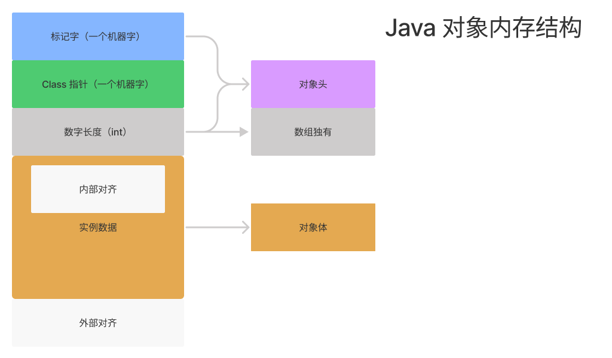

# Java 对象

Java 对象实例。

## 对象创建方式

- 使用 new 关键字，需要使用构造器；

- 使用反射机制，通过 `Class#newInstance` 方法或 `Constructor#newInstance` 方法，需要使用构造器；

  > 注：我们可以使用 `Class#newInstance` 方法来创建对象实例，但该方法在 JDK 9 后被废弃，可以使用 `Constructor#newInstance` 来替代。

- 使用 `Object#clone` 方法，需要实现 `Cloneable` 接口，clone 方法时，JVM 在创建对象时不会调用构造函数；

- 使用反序列化，使用 `ObjectInputStream#readObject` 方法来反序列化一个对象，该对象需要实现 `Serializable` 接口，在反序列化时，JVM 创建对象时不会调用构造函数。

## 对象的创建过程

这里指通过 new 关键字创建一个对象。

1. new 一个对象时，如果对应的类未加载，会先进行类加载过程（加载，连接（验证，准备，解析），初始化），如果加载过了执行类的构造方法 `<init>`；

2. 为对象分配内层，对象所需内存的大小在类加载完成后便可完全确定，为对象分配空间的任务实际上便等同于把一块确定大小的内存块从 Java 堆中划分出来。划分的方式有两种，指针碰撞和空闲列表。

   > 假设 Java 堆中内存是绝对规整的，所有被使用过的内存都被放在一边，空闲的内存被放在另一边，中间放着一个指针作为分界点的指示器，那所分配内存就仅仅是把那个指针向空闲空间方向挪动一段与对象大小相等的距离，这种分配方式称为“指针碰撞”（Bump The Pointer）。
   >
   > 但如果 Java 堆中的内存并不是规整的，已被使用的内存和空闲的内存相互交错在一起，那就没有办法简单地进行指针碰撞了，虚拟机就必须维护一个列表，记录上哪些内存块是可用的，在分配的时候从列表中找到一块足够大的空间划分给对象实例，并更新列表上的记录，这种分配方式称为“空闲列表”（Free List）。

   > 内存分配线程安全问题。
   >
   > 对象创建在虚拟机中是非常频繁的行为，即使仅仅修改一个指针所指向的位置，在并发情况下也并不是线程安全的，可能出现正在给对象 A 分配内存，指针还没来得及修改，对象 B 又同时使用了原来的指针来分配内存的情况。
   >
   > 这个问题有两种方法：一个是使用 CAS 加上失败重试的方式保证更新操作的原子性。或者把内存分配的动作按照线程划分在不同的空间之中进行，即每个线程在 Java 堆中预先分配一小块内存，称为本地线程分配缓冲（Thread Local Allocation Buffer，TLAB），哪个线程要分配内存，就在哪个线程的本地缓冲区中分配，只有本地缓冲区用完了，分配新的缓存区时才需要同步锁定。

3. 默认零值：内存分配完成后，虚拟机需要将分配到的内存空间都初始化为零值（不包括对象头），这一步操作保证了对象的实例字段在 Java 代码中可以不赋初始值就直接使用，程序能访问到这些字段的数据类型所对应的零值。

3. 设置对象头，对象头中包含了 Class 指针、标记字（HashCode、锁、GC 分代）。

4. 上面步骤执行完毕后，堆内存上就有一个对象实例了，但对象的属性还都是默认零值，构造方法里的逻辑还没有开始执行。new 之后会接着执行类的构造方法  `<init>`，对对象进行初始化操作；

   1. 成员变量按照循序赋初始值，如果有父类，先对父类的成员变量赋值；
   2. 执行构造函数中的语句，如果有父类，先执行父类构造函数中的语句。

## 对象内存布局

对象在内存中存储的结构由三部分组成：对象头、实例数据、对齐填充，如下图所示：



这里将对象分为普通对象和数组对象来讨论：

普通对象：

- 对象头
  - 第一部分是对象对应 Class 对象的指针，默认是 8 字节，开启了指针压缩后是 4 字节。
  - 第二部分存放者对象运行时数据信息，成为标记字，8 个字节。
  
- 对象实例数据
- 对齐，8 的倍数。

数组对象：

- 对象头
  - 标记字，在 HotSpot 虚拟机里叫做 Mark Word，8 个字节；
  - `ClassPointer`：如果开启了 `-XX:+UseCompressedClassPointers`（指针压缩）则为 4 个字节，否则为 8 个字节；
  - 数组长度，一个 int，4 个字节；
- 对象实例数据
- 对齐，8 的倍数。

> 如果是二维数组，可理解为一个一维数组存储多个一维数组对象，存储的每个一维数组对象都和额外使用 4 个字节存储数组长度。
>
> 比如：
>
> ```java
> int[][] arrayA = new int[1][10]; 
> int[][] arrayB = new int[10][1];
> ```
>
> arrayB 比 arrayA 占用的内存多，因为 arrayB 比 arrayA 用来存储数组的长度所用的字节更多。arrayA 共需要 8 个字节来存储数组长度，arrayB 共需要使用 44 g个字节来存储数组长度。

## 对象访问定位

Java 中对象访问定位有两种方式，分别为：

- 使用句柄访问方式：如果使用句柄访问方式，Java 堆中会划分出一块内存来作为句柄池，reference（方法局部变量表的引用） 中存储的就是对象的句柄地址，而句柄中包含了对象实例数据和类型数据各自的具体地址信息。使用句柄方式最大的好处就是 reference 中存储的是稳定的句柄地址，在对象被移动（垃圾收集时移动对象是非常普遍的行为）时只会改变句柄中的实例数据指针，而 reference 本身不需要被修改。
- 使用直接指针访问方式：如果使用直接指针方式，Java 堆对象的布局就必须考虑如何放置访问类型数据的相关信息，reference 中直接存储的就是对象地址，使用直接指针方式最大的好处就是速度更快，节省了一次指针定位的时间开销。

## 打印对象大小

我们可以借助 `java.lang.instrument.Instrumentation` 这个类来观察对象实例实际占用空间大小，这里我们通过 Java agent 的方式来实现，以下是编写 Java agent 的步骤：


创建一个 object-size-agent Maven 工程，并且编写 `ObjectSizeAgent` 类，代码如下所示：

```java
public class ObjectSizeAgent {

    private static Instrumentation inst;

    /**
     * jvm 参数形式启动，运行此方法
     *
     * @param agentArgs agentArgs
     * @param _inst     inst
     */
    public static void premain(String agentArgs, Instrumentation _inst) {
        inst = _inst;
    }

    /**
     * 动态 attach 方式启动，运行此方法
     *
     * @param agentArgs agentArgs
     * @param _inst     inst
     */
    public static void agentmain(String agentArgs, Instrumentation _inst) {
        inst = _inst;
    }

    public static long sizeOf(Object o) {
        return inst.getObjectSize(o);
    }
}
```

其中除了 `sizeOf` 为自定义方法用来获取对象大小外。

打包

在 resources 创建配置文件 `META-INF/MANIFEST.MF`，文件内容如下所示：

```
Manifest-Version: 1.0
Premain-Class: learn.jvm.agent.ObjectSizeAgent
Agent-Class: learn.jvm.agent.ObjectSizeAgent
Can-Redefine-Classes: true
Can-Retransform-Classes: true

```

> 注意：文件需要以空行结尾。

引入 maven 插件，在 pom 文件中添加插件依赖：

```xml
<build>
    <plugins>
        <plugin>
            <groupId>org.apache.maven.plugins</groupId>
            <artifactId>maven-assembly-plugin</artifactId>
            <configuration>
                <descriptorRefs>
                    <descriptorRef>jar-with-dependencies</descriptorRef>
                </descriptorRefs>
                <archive>
                    <manifestFile>
                        src/main/resources/META-INF/MANIFEST.MF
                    </manifestFile>
                    <!--<manifestEntries>-->
                    <!--<Premain-Class>com.git.hui.agent.SimpleAgent</Premain-Class>-->
                    <!--<Agent-Class>com.git.hui.agent.SimpleAgent</Agent-Class>-->
                    <!--<Can-Redefine-Classes>true</Can-Redefine-Classes>-->
                    <!--<Can-Retransform-Classes>true</Can-Retransform-Classes>-->
                    <!--</manifestEntries>-->
                </archive>
            </configuration>

            <executions>
                <execution>
                    <goals>
                        <goal>attached</goal>
                    </goals>
                    <phase>package</phase>
                </execution>
            </executions>
        </plugin>
    </plugins>
</build>
```

运行以下命令构建 jar 包：

```
mvn assembly:assembly
```

运行完命令后，在项目 taget 目录下会有类似于 `object-size-agent-1.0-SNAPSHOT-jar-with-dependencies.jar` 就是我们需要的 agent jar。


使用 agent jar

在需要使用 agent 的工程引入上一步创建的 jar，编写测试类，代码如下所示：

```java
@Slf4j
public class SizeOfAnObject {

    public static void main(String[] args) {
        // 标记字（8） + ClassPointer（4） + 补齐（4）= 16
        log.info("{}", ObjectSizeAgent.sizeOf(new Object()));
        // 标记字（8） + ClassPointer（4） + 数组长度（4）+ 补齐（0） = 16
        log.info("{}", ObjectSizeAgent.sizeOf(new int[]{}));
        // 标记字（8） + ClassPointer（4） + 实例内容（19）+ 补齐（1） = 32
        log.info("{}", ObjectSizeAgent.sizeOf(new SizeObject()));
    }

    // -XX:+UseCompressedClassPointers：开启 ClassPointer 压缩，开启 4 个字节，不开启 8 个字节，默认开启
    // -XX:+UseCompressedOops：开启引用类型指针压缩，开启，开启 4 个字节，不开启 8 个字节，默认开启
    // Oops = ordinary object pointers
    static class SizeObject {
        // 8 Mark Word
        // 4 class pointer
        int id;         // 4
        int age;        // 4

        String name;    // 4 ordinary object pointers
        Object o;       // 4 ordinary object pointers

        byte b1;        // 1
        byte b2;        // 1
        byte b3;        // 1
        // 对齐，8 的倍数
    }
}
```

添加 JVM 启动参数：

```
-javaagent:F:\LearnProjects\learn\programing-language\java\jvm\examples\object-size-agent\target\object-size-agent-1.0-SNAPSHOT-jar-with-dependencies.jar
```

运行测试类，观察输出结果，我们可以发现 new 一个 Object 对象实例，该实例占用内存空间大小为 16 个字节，其中标记字 8 个字节，类指针 4 个字节，对齐 4 个字节。

## 总结

### 参考连接

- [Java对象分配简要流程 - SegmentFault 思否](https://segmentfault.com/a/1190000004606059)
- [Java对象在内存中的结构（HotSpot虚拟机） - duanxz - 博客园 (cnblogs.com)](https://www.cnblogs.com/duanxz/p/4967042.html)
- [IDEA + maven 零基础构建 java agent 项目 - 云+社区 - 腾讯云 (tencent.com)](https://cloud.tencent.com/developer/article/1602018)