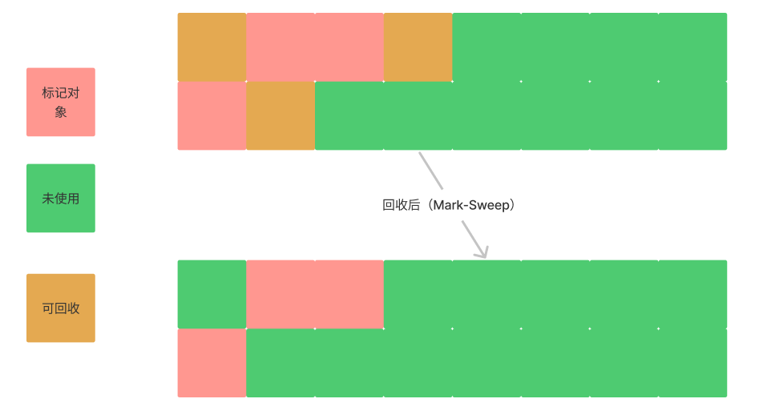
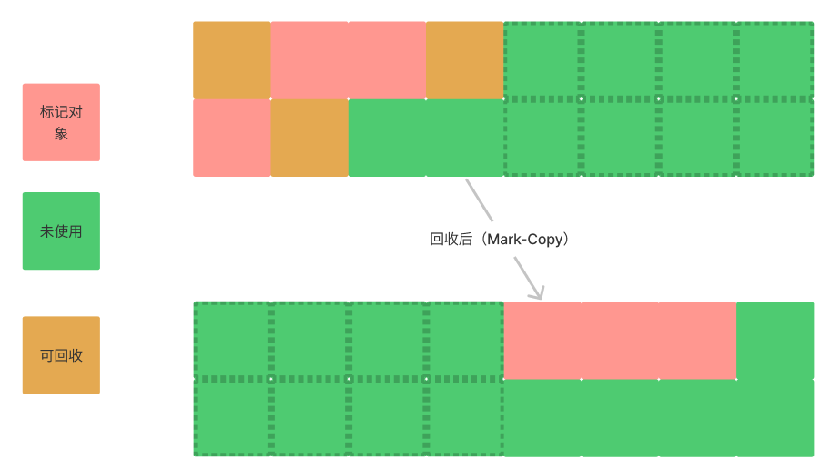
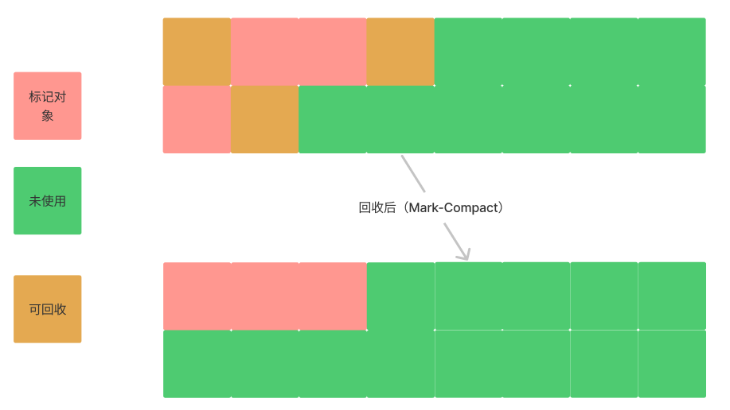

# 垃圾回收算法

在通过对象判活算法标记出存活对象后，接下来就回收标记外的对象，此时回收也有多种算法，常见的有**标记-清除（Mark-Sweep）**、**标记-复制（Mark-Copy）**、**标记-整理（Mark-Compact）**算法。

## 标记-清除

标记清除算法的思想比较简单，标记清除会进行两次扫描，第一次标记出存活的对象，第二次将未标记存活外的对象清除，如下图所示：

标记清除算法最大的的缺点的是内存碎片，因为存活的对象会随机分配到内存的不同区域，这种算法比较适合一次垃圾回收存活对象较多的情况。

## 标记-复制

标记复制算法是每次预留一般可用内存空间，垃圾回收时将标记存活的对象复制到另一半未使用的内存中，然后清除当前使用一半内存中所有对象，作为下次垃圾回收的预留空间，如下图所示：

标记清除的优点是不会产生内存碎片，并且效率很高，缺点是可用内存的空间减半。

## 标记-压缩

标记压缩是在垃圾回收过程中将可用对象重新排列，使其占用内存连续，如下图所示：

标记压缩算法的好处是不会产生内存碎片，且可用空间也没有减半，但其需要移动对象排列对象，效率相对较低。

## 总结

常见的垃圾回收算法有三种，分别是：

- 标记清除
- 标记复制
- 标记压缩

其中标记清除最大的缺点是会产生内存碎片，降低内存的使用率；标记复制通过预留一半内存和复制对象的方式解决了内存碎片的问题，但也直接导致了可用内存减半；此外还有标记压缩算法，其通过移动重排列对象的方式整理存活对象，不会造成垃圾碎片，可用空间不会减半，但效率较低。