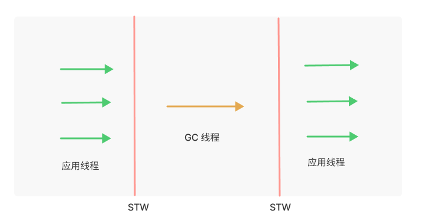

# 垃圾收集器发展史

垃圾收集器相对学术一点的叫法叫做自动内存管理（Automatic Memory Management，AMM），其承担了内存分配、内存回收、内存整理的工作。

简单来说垃圾收集器的工作流程是：在程序运行工程中为其产生的对象实例分配内存，并且通过一定的标识来标记对象的存活状态，然后当内存空间不够使用的时候对未标记的对象进行回收；因为回收对象在内存中的位置是随机的，回收后会产生内存碎片，影响内存使用率，这时候垃圾回收器还会进行内存整理。

垃圾收集器有一个重要的概念是 STW（Stop The World），垃圾收集器在进行垃圾回收是，会先暂停应用线程的工作，等待垃圾回收动作完成后继续进行工作。之所以需要暂停应用线程，是为了避免在垃圾回收过程中对象引用关系发生改变，让垃圾回收动作难以实现；但暂停了应用线程会带来一个明显的问题就是若暂停时间过长，会影响到系统的性能，这在某些场景下是难以接受的。

其实在上述垃圾收集器的工作流程中，我们可以发现，每次回收对象前会扫描整个内存找到可以回收的对象，然后进行回收整理，当内存空间较大时，这一过程是比较耗时的。

同时我们还发现，对象的存活有以下特点：

- 大部分对象创建后很快就不再使用；
- 一个对象如果不会很快被回收，那么其可能会继续存活更长的时间。

针对以上特点，垃圾收集器将管理的内存拆分成年轻代和老年代，新分配的对象先分配的年轻代，多次回收后还存在的对象就将其移动至老年代，这样一来，存活周期不同的对象就被分配到不同的内存区域中，这样就可以在新生代和老年代使用不同的垃圾回收算法来回收垃圾。

比如新生代的对象存活周期大多数都比较短，这里采用标记-复制的垃圾收集算法，老年代对象存活的周期比较长，这时候使用标记-整理的收集算法。

## 垃圾收集器

现在已经有的垃圾收集器，如下图所示：


## 串行 GC

串行 GC 如上述图中的 Serial（新生代） 和 Serial Old（老年代），串行是指用来回收垃圾的 GC 线程是单线程，在回收过程中有 STW，如下图所示：



## 并行 GC

并行如上述图中的 Parallel Scavenge 和 Parallel Old，和串行 GC 最大的不同是垃圾收集线程是多线程，即并行收集，其同样也有 STW，如下图所示：


## CMS

在讨论 CMS 之前，我们先来看看并并行 GC 和并发 GC 这两个概念：

- 并行 GC：并行 GC 指 GC 时应用线程全部停止，GC 至少使用 2 个或以上的核心进行 GC 处理；
- 并发 GC：并发 GC 指 GC 时应用线程不停止，依然可以获得 CPU 时间（但并不代码它们一定在物理上和 GC 线程同时进行）。

### CMS 垃圾收集阶段

CMS 垃圾收集器首次引入了并发 GC 的概念，使得在垃圾收集的某个阶段的时候，应用线程不会被暂停，CMS 垃圾收集阶段如下所示：


如上图所示，CMS 一次垃圾回收的过程可以分成 4 个阶段：

- 初始标记

  这个阶段只标记的对象分别是：

  - 标记老年代中所有的 **GC Roots** 对象；
  - 标记年被轻代 GC Roots 引用的老年代的对象。

  标记的对象如下图所示：

  

  > 图片来自于：[GC 算法(实现篇) - GC参考手册_铁锚的CSDN博客-CSDN博客](https://blog.csdn.net/renfufei/article/details/54885190)

  这个阶段的标记过程存在 STW，因为 GC Roots 对象的范围理论上来说是一个可控制的范围，所以这阶段 标记速度很快，STW 时间短。

  > 一般来讲在分代收集算法中，暂停时间大多数来自于对对象的扫描标记。虽然我们通过对象的存活特点将对象进行分代存放，但还是不能避免年轻代和老年代对象之间的引用关系，这就间接导致了每次垃圾扫描的内存范围变大。比如在年轻代垃圾回收的过程中，可能有老年代里的对象引用了年轻代对象，在对老年代垃圾回收的过程中可能后年轻代里的对象引用了老年代对象，间接导致每次对象标记的范围扩大到整个堆内存。

- 并发标记

  并发标记阶段，继续标记根对象引用的对象，这时候 GC 线程和应用线程并发执行，没有 STW，在这个阶段，CMS 使用到了三色标记算法来标记对象，三色分别指三种类型的对象：

  - 黑色：扫描的对象可达且完成了对子引用的扫描，则该对象被标记成黑色；
  - 灰色：扫描的对象可达但未完成对子引用的扫描，则该对象被标记成灰色；
  - 白色：扫描对象不可达或者未被扫描到，则该对象被标记成白色。

  三色标记发存在可达对象漏标的问题，这就会导致还需要被使用的对象在垃圾收集过程中被清理了，这对程序来说往往是不可接受的，漏标问题如下图所示：

  

  如上图所示，在并发标记阶段，灰色对象引用的白色对象引用解除并且被一个黑色对象引用，根据三色标记算法的逻辑，黑色对象的子引用不会被扫描，导致这个白色对象永远不会被标记，产生漏标。

  漏标问题往往是不可接受的，因为其可能会导致还需要被使用的对象被回收，CMS 是通过写屏障来解决这个问题的。

  > 写屏障就是在引用关系建立的时候产生一个屏障，通知垃圾收集器处理某些事情，类似于 AOP 的概念如：
  >
  > ```
  > Java 
  > o.f = r;
  > 
  > C++
  > write_barrier(o,&(o->f),r)
  > o->f = r;
  > ```
  >
  > 写屏障在 Java 代码层面是没有感知的，在底层 C++ 代码执行的时候会添加写屏障来处理一些逻辑，比如这就就是在黑色对象和白色对象建立引用关系时，添加写屏障，执行将黑色对象变成灰色的逻辑，这样白色对象就可以被扫描到，就解决了漏标问题。

  如下图所示，展示了如何通过写屏障解决漏标问题：

  

- 重新标记

  该阶段存在 STW，该阶段的任务是标记出老年代所有的存活对象，是对初始标记的完善补充，由于并发标记阶段和应用线程是并发执行的，对象之间引用关系可能发生了多次改变，该阶段需要*重新扫描整个堆内存*，再次标记存活对象。

  这里重新扫描整个堆内存的原因是：对于老年代中的对象，如果被新生代中的对象引用，那么就会被视为存活对象（这个我们在初始标记阶段就可以知道），即使新生代的对象已经不可达了，也会被老年代视作 GC ROOTS 标记其引用的对象。当此阶段耗时较长的时候，可以加入参数 `-XX:+CMSScavengeBeforeRemark`，表示在重新标记前进行一次 YGC，清除掉年轻代无用的对象，减少并发标记的时间。

- 并发清除

  这个阶段用来清除没有被标记的对象，由于 CMS 并发清理阶段用户线程还在运行着，伴随程序运行可能会有新的垃圾不断产生（比如标记为黑色对象的引用关系解除了），这一部分垃圾出现在标记过程之后，CMS 无法在当次收集中处理掉它们，只好留待下一次 GC 时再清理掉，这一部分垃圾就称为**浮动垃圾**。

### CMS 有什么问题

首先 CMS 在回收垃圾的时候采用的是标记清除算法，会有内存碎片问题，此外就是上述在并发清理中提到的**浮动垃圾**问题，内存碎片和浮动垃圾都有可能导致在 CMS 运行期间，老年代预留的空间不足以分配给新创建的对象，此时垃圾回收器会退化成 Serial Old，严重影响到 GC 性能，这一现象也被称之为 **Concurrent Mode Failure**。

## G1

G1 GC 是一个暂停时间优先的 GC，它的暂停时间是可控的。和其他 GC 最大的不同是，G1 提出了 Region 的概念，如下图所示：


G1 将内存区域分为多个 Region，每个 Region 即可以是年轻代也可以是老年代，但在同一时刻只属于某个代，每次垃圾回收时，优先回收花费时间少，垃圾比例高的 Region，这也是 G1 回收垃圾时间可控的原因。

Region 的大小不是固定的，可能为 1M，2M，4M，8M，16M，32M，但都是 2 的整数幂。

Region 个数 2048 个，可通过 `-XX:G1HeapRegionSize` 手工指定。

### G1 的工作模式

G1 有三种工作模式，分别为：

- YGC：当新生代空间不足时，G1 触发 YGC 回收新生代空间。新生代使用复制算法回收垃圾，将新生代存活的对象复制到 Survivor 区或晋升到 Old 区；

- Mixed GC：当使用堆空间使用量达到某个阈值时会触发 Mixed GC，默认是 45%（可通过 `-XX:InitiatingHeapOccupancyPercent=n` 来指定 ）。此时 G1 会回收所有新生代的 Region，并且根据用户指定的暂停时间来选择收益高的老年代 Region 进行回收。

- Full GC：按照 G1 的垃圾回收策略，正常流程下应该不存在 Full GC，只有在垃圾回收器处理不过来（或者主动触发）时才会出现。G1 的 FGC 是单线程执行的  Serial Old GC，会导致非常长的 STW，所以要尽量避免 FGC。

  G1 Full GC 出现的原因如下：

  - 程序主动执行 `System.gc()`；
  - 全局并发标记期间老年代空间被填满（并发模式失败）；
  - Mixed GC 期间老年代空间被填满（晋升失败）；
  - Young GC 时 Survivor 空间和老年代没有足够空间容纳存活对象。

### MixGC 垃圾收集阶段


### G1 写屏障的实现


暂停时间（延迟）和吞吐量。

## 总结

### 参考链接

- [Garbage First Garbage Collector Tuning | Oracle 中国](https://www.oracle.com/cn/technical-resources/articles/java/g1gc.html)