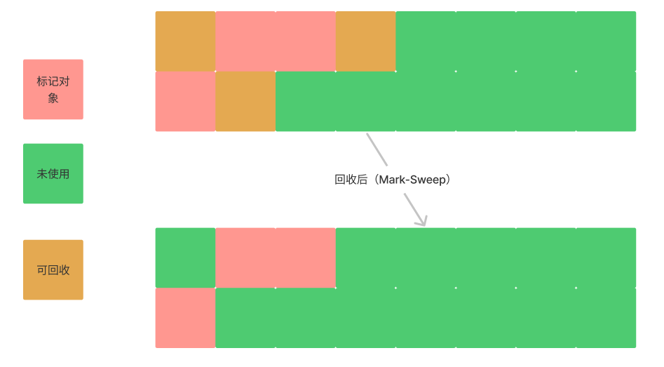

# 垃圾回收算法

在通过对象判活算法标记出存活对象后，接下来就回收标记外的对象，此时回收也有多种算法，常见的有**标记-清除（Mark-Sweep）**、**标记-复制（Mark-Copy）**、**标记-整理（Mark-Compact）**算法。

## 分代收集理论

分代收集实际来着与两个经验法则：

- 弱分代假说（Weak Generational Hypothesis）：绝大多数对象都是朝生夕灭的；

- 强分代假说（Strong Generational Hypothesis）：熬过越多次垃圾收集过程的对象就越难以消亡。

这两个分代假奠定了多款常用的垃圾收集器的一致的设计原则：收集器应该将 Java 堆划分出不同的区域，然后将回收对象依据其年龄（年龄即对象熬过垃圾收集过程的次数）分配到不同的区域之中存储。

显而易见，如果一个区域中大多数对象都是朝生夕灭，难以熬过垃圾收集过程的话，那么把它们集中放在一起，每次回收时只关注如何保留少量存活而不是去标记那些大量将要被回收的对象，就能以较低代价回收到大量的空间；如果剩下的都是难以消亡的对象，那把它们集中放在一块，虚拟机便可以使用较低的频率来回收这个区域，这就同时兼顾了垃圾收集的时间开销和内存的空间有效利用。

基于分代理论，设计者一般将堆内存划分为新生代（Young Generation）和老年代（Old Generation）。

堆内存分代是可以极大提高垃圾收集的速度，但也不是没有问题的。基于内存分代设计的垃圾收集器，不得不面临一个难题——如何处理跨代引用。

假如要现在进行一次只局限于新生代区域内的收集（Minor GC），但新生代中的对象是完全有可能被老年代所引用的，为了找出该区域中的存活对象，不得不在固定的 GC Roots 之外，再额外遍历整个老年代中所有对象来确保可达性分析结果的正确性，反过来也是一样。

遍历整个老年代所有对象的方案虽然理论上可行，但无疑会为内存回收带来很大的性能负担。为了解决这个问题，就需要对分代收集理论添加第三条经验法则：

- 跨代引用假说（Intergenerational Reference Hypothesis）：跨代引用相对于同代引用来说仅占极少数。

依据这条假说，我们就不应再为了少量的跨代引用去扫描整个老年代，也不必浪费空间专门记录每一个对象是否存在及存在哪些跨代引用，只需在新生代上建立一个全局的数据结构——**记忆集**（Remembered Set），这个结构把老年代划分成若干小块，标识出老年代的哪一块内存会存在跨代引用。此后当发生 Minor GC时，只有包含了跨代引用的小块内存里的对象才会被加入到 GC Roots 进行扫描。虽然这种方法需要在对象改变引用关系（如将自己或者某个属性赋值）时维护记录数据的正确性，会增加一些运行时的开销，但比起收集时扫描整个老年代来说仍然是划算的。

> 关于垃圾收集方式的名词。
>
> 部分收集（Partial GC）：指目标不是完整收集整个 Java 堆的垃圾收集，其中又分为：
>
> - 新生代收集（Minor GC/Young GC）：指目标只是新生代的垃圾收集；
> - 老年代收集（Major GC/Old GC）：指目标只是老年代的垃圾收集，目前只有CMS收集器会有单独收集老年代的行为；
>
> - 混合收集（Mixed GC）：指目标是收集整个新生代以及部分老年代的垃圾收集，目前只有G1收集器会有这种行为；
>
> 整堆收集（Full GC）：收集整个 Java 堆和方法区的垃圾收集。

## 标记-清除

标记清除算法的思想比较简单，标记清除会进行两次扫描，第一次标记出存活的对象，第二次将未标记存活外的对象清除，如下图所示：

标记清除算法最大的的缺点的是内存碎片，因为存活的对象会随机分配到内存的不同区域，这种算法比较适合一次垃圾回收存活对象较多的情况。

## 标记-复制

标记复制算法是每次预留一般可用内存空间，垃圾回收时将标记存活的对象复制到另一半未使用的内存中，然后清除当前使用一半内存中所有对象，作为下次垃圾回收的预留空间，如下图所示：

标记清除的优点是不会产生内存碎片，并且效率很高，缺点是可用内存的空间减半。

先代的垃圾收集器的年轻代大多使用这种垃圾收集算法。

在1989年，Andrew Appel针对具备“朝生夕灭”特点的对象，提出了一种更优化的半区复制分代策略，现在称为“Appel 式回收”。具体做法是：把新生代分为一块较大的 Eden 空间和两块较小的 Survivor 空间，每次分配内存只使用 Eden 和其中一块 Survivor。

发生垃圾搜集时，将 Eden 和 Survivor 中仍然存活的对象一次性复制到另外一块 Survivor 空间上，然后直接清理掉 Eden 和已用过的那块 Survivor 空间。HotSpot 虚拟机默认 Eden 和 Survivor 的大小比例是 8∶1。也即每次新生代中可用内存空间为整个新生代容量的 90%（Eden 的 80%加上一个 Survivor的 10%）。当然任何人都没有办法百分百保证每次回收都只有不多于 10% 的对象存活，因此 Appel 式回收还有一个充当罕见情况的“逃生门”的安全设计，当 Survivor 空间不足以容纳一次 Minor GC 之后存活的对象时，就需要依赖其他内存区域（实际上大多就是老年代）进行**分配担保**（Handle Promotion）。

## 标记-压缩

标记压缩是在垃圾回收过程中将可用对象重新排列，使其占用内存连续，如下图所示：

标记压缩算法的好处是不会产生内存碎片，且可用空间也没有减半，但其需要移动对象排列对象，效率相对较低。移动对象势必会改变对象的内存地址，因此在做这部分工作时，需要暂停工作线程（Stop The World, STW）。

## 总结

常见的垃圾回收算法有三种，分别是：

- 标记清除
- 标记复制
- 标记压缩

其中标记清除最大的缺点是会产生内存碎片，降低内存的使用率；标记复制通过预留一半内存和复制对象的方式解决了内存碎片的问题，但也直接导致了可用内存减半；此外还有标记压缩算法，其通过移动重排列对象的方式整理存活对象，不会造成垃圾碎片，可用空间不会减半，但效率较低。