# 经典的垃圾收集器

垃圾收集器相对学术一点的叫法叫做自动内存管理（Automatic Memory Management，AMM），其承担了内存分配、内存回收、内存整理的工作。

垃圾收集器要解决的三个问题：

- 什么样的对象要回收？
- 何时回收？
- 怎么回收？


简单来说垃圾收集器的工作流程是：在程序运行工程中为其产生的对象实例分配内存，并且通过一定的标识来标记对象的存活状态，然后当内存空间不够使用的时候对未标记的对象进行回收；因为回收对象在内存中的位置是随机的，回收后会产生内存碎片，影响内存使用率，必要的时候垃圾回收器还会进行内存整理。

垃圾收集器有一个重要的概念是 STW（Stop The World），垃圾收集器在进行垃圾回收是，会先暂停应用线程的工作，等待垃圾回收动作完成后继续进行工作。之所以需要暂停应用线程，是为了避免在垃圾回收过程中对象引用关系发生改变，让垃圾回收动作难以实现；但暂停了应用线程会带来一个明显的问题就是若暂停时间过长，会影响到系统的性能，这在某些场景下是难以接受的。

其实在上述垃圾收集器的工作流程中，我们可以发现，每次回收对象前会扫描整个内存找到可以回收的对象，然后进行回收整理，当内存空间较大时，这一过程是比较耗时的。

同时我们还发现，对象的存活有以下特点：

- 大部分对象创建后很快就不再使用；
- 一个对象如果不会很快被回收，那么其可能会继续存活更长的时间。

针对以上特点，垃圾收集器将管理的内存拆分成年轻代和老年代，新分配的对象先分配的年轻代，多次回收后还存在的对象就将其移动至老年代，这样一来，存活周期不同的对象就被分配到不同的内存区域中，这样就可以在新生代和老年代使用不同的垃圾回收算法来回收垃圾。

比如新生代的对象存活周期大多数都比较短，这里采用标记-复制的垃圾收集算法，老年代对象存活的周期比较长，这时候使用标记-整理的收集算法。

堆内存分代可以在垃圾收集过程中回收指定的区域，不用扫描整个堆内存，从而提高了垃圾回收的效率，但现实情况下并没有这么乐观。内存分代时往往会出现跨代引用的情况，比如老年代的对象引用到了新生代的对象。在对年轻代进行垃圾回收时，如果我们仅考虑年轻代的对象，就有可能把老年代还在引用的年轻代的对象给回收了；若对整个堆进行扫描找到老年代引用了年轻代的对象，则会影响到年轻垃圾回收的效率，为此在 HotSpot JVM，引入卡表（**Card Table**）来对跨代引用进行标记。

Card Table，简单理解是一种空间换时间的思路，因为存在跨代引用的对象大概占比不到 1%，因此可将堆空间划分成大小为 512 字节的卡页，如果卡页中有一个对象存在跨代引用，则可以用 1 个字节来标识该卡页是 dirty 状态（dirty 状态是通过写屏障来实现）。

引入卡表后年轻代的标记算法就变成：

- 从根节点开始扫描年轻代对象，直到扫描下个引用为非年轻代对象；
- 扫描老年代 dirty 区域，即扫描到被老年代对象引用的年轻代对象。

## 垃圾收集器

现在已经有的垃圾收集器，如下图所示：


## Serial 收集器

Serial收集器（串行 GC）如上述图中的 Serial（新生代） 和 Serial Old（老年代），串行是指用来回收垃圾的 GC 线程是单线程，在回收过程中有 STW，如下图所示：

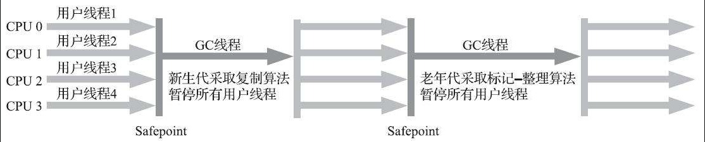

从这个收集器开始，就已经有了 STW 的概念。Stop The World 这个词语也许听起来很酷，但这项工作是由虚拟机在后台自动发起和自动完成的，在用户不可知、不可控的情况下把用户的正常工作的线程全部停掉，这对很多应用来说都是不能接受的。

但 STW 确实又是不可避免的，因此后序垃圾收集器发展的思路就是降低或消除垃圾收集导致用户程序暂停的时间。

## ParNew 收集器

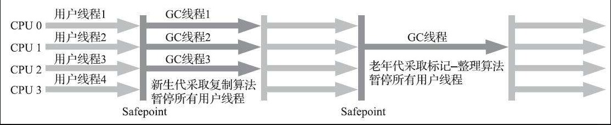

ParNew 收集器除了支持多线程并行收集之外，其他与 Serial 收集器相比并没有太多创新之处，但它却是不少运行在服务端模式下的 HotSpot 虚拟机。其中有一个与功能、性能无关但其实很重要的原因是：除了 Serial 收集器外，目前只有它能与 CMS 收集器配合工作。

在 JDK 5发布时，HotSpot 推出了一款在强交互应用中几乎可称为具有划时代意义的垃圾收集器——CMS 收集器。

ParNew 收集器在单核心处理器的环境中绝对不会有比 Serial 收集器更好的效果，甚至由于存在线程交互的开销，该收集器在通过超线程（Hyper-Threading）技术实现的伪双核处理器环境中都不能百分之百保证超越 Serial 收集器。

当然，随着可以被使用的处理器核心数量的增加，ParNew 对于垃圾收集时系统资源的高效利用还是很有好处的。它默认开启的收集线程数与处理器核心数量相同，在处理器核心非常多的环境中，可以使用 `-XX:ParallelGCThreads` 参数来限制垃圾收集的线程数。

> 并行和并发
>
> 并行（Parallel）：并行描述的是多条垃圾收集器线程之间的关系，说明同一时间有多条这样的线程在协同工作，通常默认此时用户线程是处于等待状态。
>
> 并发（Concurrent）：并发描述的是垃圾收集器线程与用户线程之间的关系，说明同一时间垃圾收集器线程与用户线程都在运行。由于用户线程并未被冻结，所以程序仍然能响应服务请求，但由于垃圾收集器线程占用了一部分系统资源，此时应用程序的处理的吞吐量将受到一定影响。

## Parallel Scavenge 收集器

Parallel Scavenge 收集器也是一款新生代收集器，它同样是基于标记-复制算法实现的收集器。

Parallel Scavenge 收集器的特点是它的关注点与其他收集器不同，CMS 等收集器的关注点是尽可能地缩短垃圾收集时用户线程的停顿时间，而 Parallel Scavenge收集器的目标则是达到一个可控制的吞吐量（Throughput）。所谓吞吐量就是处理器用于运行用户代码的时间与处理器总消耗时间的比值。

停顿时间越短就越适合需要与用户交互或需要保证服务响应质量的程序，良好的响应速度能提升用户体验；而高吞吐量则可以最高效率地利用处理器资源，尽快完成程序的运算任务，主要适合在后台运算而不需要太多交互的分析任务。

Parallel Scavenge 收集器提供了两个参数用于精确控制吞吐量，分别是控制最大垃圾收集停顿时间的 `-XX:MaxGCPauseMillis` 参数以及直接设置吞吐量大小的 `-XX:GCTimeRatio` 参数。

`-XX:MaxGCPauseMillis` 参数允许的值是一个大于0的毫秒数，收集器将尽力保证内存回收花费的时间不超过用户设定值。不过大家不要异想天开地认为如果把这个参数的值设置得更小一点就能使得系统的垃圾收集速度变得更快，垃圾收集停顿时间缩短是以牺牲吞吐量和新生代空间为代价换取的：系统把新生代调得小一些，收集 300MB 新生代肯定比收集 500MB 快，但这也直接导致垃圾收集发生得更频繁，原来 10 秒收集一次、每次停顿 100 毫秒，现在变成5秒收集一次、每次停顿 70 毫秒。停顿时间的确在下降，但吞吐量也降下来了。

`-XX:GCTimeRatio` 参数的值则应当是一个大于 0 小于 100 的整数，也就是垃圾收集时间占总时间的比率，相当于吞吐量的倒数。譬如把此参数设置为 19，那允许的最大垃圾收集时间就占总时间的 5%（即 1/(1+19)），默认值为 99，即允许最大1%（即 1/(1+99)）的垃圾收集时间。


除上述两个参数之外，Parallel Scavenge 收集器还有一个参数 `-XX:+UseAdaptiveSizePolicy` 值得我们关注。这是一个开关参数，当这个参数被激活之后，就不需要人工指定新生代的大小（`-Xmn`）、Eden 与 Survivor 区的比例（`-XX:SurvivorRatio`）、晋升老年代对象大小（`-XX:PretenureSizeThreshold`）等细节参数了，虚拟机会根据当前系统的运行情况收集性能监控信息，动态调整这些参数以提供最合适的停顿时间或者最大的吞吐量。这种调节方式称为垃圾收集的自适应的调节策略（GC Ergonomics）。

## Serial Old 收集器

Serial Old 是 Serial 收集器的老年代版本，它同样是一个单线程收集器，使用标记-整理算法。

这个收集器的主要意义也是供客户端模式下的 HotSpot 虚拟机使用。如果在服务端模式下，它也可能有两种用途：一种是在 JDK 5 以及之前的版本中与 Parallel Scavenge 收集器搭配使用[插图]，另外一种就是作为 CMS 收集器发生失败时的后备预案，在并发收集发生 Concurrent Mode Failure 时使用。


## Parallel Old 收集器

Parallel Old 是 Parallel Scavenge 收集器的老年代版本，支持多线程并发收集，基于标记-整理算法实现。

直到 Parallel Old 收集器出现后，“吞吐量优先”收集器终于有了比较名副其实的搭配组合，在注重吞吐量或者处理器资源较为稀缺的场合，都可以优先考虑 Parallel Scavenge 加 Parallel Old 收集器这个组合。

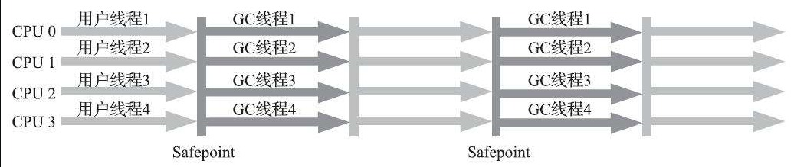

## CMS

在讨论 CMS 之前，我们先来看看并并行 GC 和并发 GC 这两个概念：

- 并行 GC：并行 GC 指 GC 时应用线程全部停止，GC 至少使用 2 个或以上的核心进行 GC 处理；
- 并发 GC：并发 GC 指 GC 时应用线程不停止，依然可以获得 CPU 时间（但并不代码它们一定在物理上和 GC 线程同时进行）。

### CMS 垃圾收集阶段

CMS 垃圾收集器首次引入了并发 GC 的概念，使得在垃圾收集的某个阶段的时候，应用线程不会被暂停，CMS 垃圾收集阶段如下所示：

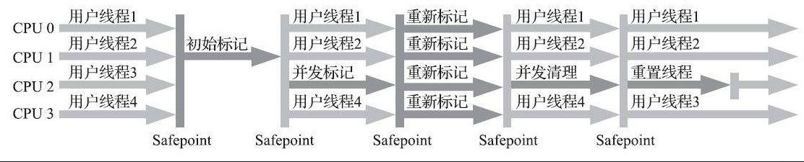

如上图所示，CMS 一次垃圾回收的过程可以分成 4 个阶段（主要是将标记阶段拆分开来，分成三个阶段）：

- 初始标记：标记 GC Roots 能够直接关联到的对象。

- 并发标记：并发标记阶段就是从 GC Roots 的直接关联对象开始遍历整个对象图的过程，这个过程耗时较长但是不需要停顿用户线程，可以与垃圾收集线程一起并发运行。
- 重写标记：重新标记阶段则是为了修正并发标记期间，因用户程序继续运作而导致标记产生变动的那一部分对象的标记记录，这个阶段的停顿时间通常会比初始标记阶段稍长一些，但也远比并发标记阶段的时间短。
- 并发清除：清理删除掉标记阶段判断的已经死亡的对象，由于不需要移动存活对象，所以这个阶段也是可以与用户线程同时并发的。

### CMS 有什么问题

#### 处理器资源铭感

CMS 收集器对处理器资源非常敏感。事实上，**面向并发设计的程序都对处理器资源比较敏感**。

并发标记阶段，虽然 GC 线程和工作线程可以一起工作，但会因为占用了一部分线程，导致吞吐量的下降。尤其是当处理器核心较少的情况下，这种影响更加明显。

#### 浮动垃圾

无法处理浮动垃圾。

在 CMS 的并发标记和并发清理阶段，用户线程是还在继续运行的，程序在运行自然就还会伴随有新的垃圾对象不断产生，但这一部分垃圾对象是出现在标记过程结束以后，CMS 无法在当次收集中处理掉它们，只好留待下一次垃圾收集时再清理掉。这一部分垃圾就称为“浮动垃圾”。

#### Concurrent Mode Failure

也是因为在垃圾收集阶段工作线程也在进行，所以 CMS 不能像其他线程一样到了老年代几乎被填满时再收集，而是必须预留一部分空间供并发收集阶段程序运作使用。在 JDK 5 的默认设置下，CMS 收集器当老年代使用了68%的空间后就会被激活，这是一个偏保守的设置，如果在实际应用中老年代增长并不是太快，可以适当调高参数 `-XX:CMSInitiatingOccu-pancyFraction` 的值来提高 CMS 的触发百分比，降低内存回收频率，获取更好的性能。

到了 JDK 6 时，CMS 收集器的启动阈值就已经默认提升至 92%。但这又会更容易面临另一种风险：要是 CMS 运行期间预留的内存无法满足程序分配新对象的需要，就会出现一次“并发失败”（Concurrent Mode Failure），这时候虚拟机将不得不启动后备预案：冻结用户线程的执行，临时启用 Serial Old 收集器来重新进行老年代的垃圾收集，但这样停顿时间就很长了。

#### 内存碎片

CMS 为了在清除阶段，让工作线程更好的运行，采用的是标记清除算法，这种算法会造成内存碎片。也会导致上述的并发失败问题。

#### 三色标记漏标问题

并发标记阶段，继续标记根对象引用的对象，这时候 GC 线程和应用线程并发执行，没有 STW，在这个阶段，CMS 使用到了三色标记算法来标记对象，三色分别指三种类型的对象：

- 黑色：扫描的对象可达且完成了对子引用的扫描，则该对象被标记成黑色；
- 灰色：扫描的对象可达但未完成对子引用的扫描，则该对象被标记成灰色；
- 白色：扫描对象不可达或者未被扫描到，则该对象被标记成白色。

三色标记发存在可达对象漏标的问题，这就会导致还需要被使用的对象在垃圾收集过程中被清理了，这对程序来说往往是不可接受的，漏标问题如下图所示：


如上图所示，在并发标记阶段，灰色对象引用的白色对象引用解除并且被一个黑色对象引用，根据三色标记算法的逻辑，黑色对象的子引用不会被扫描，导致这个白色对象永远不会被标记，产生漏标。

漏标问题往往是不可接受的，两种解决方案：

- 第一种解决办法是增量更新，当黑色对象指向白色对象时，让其变成灰色，这样就会重新扫描。

  

- 第二种解决办法是原始快照，当灰色对象要删除指向白色对象的引用关系时，就将这个要删除的引用记录下来，在并发扫描结束之后，再将这些记录过的引用关系中的灰色对象为根，重新扫描一次。简化理解为无论引用关系删除与否，都会按照刚刚开始扫描那一刻的对象图快照来进行搜索。

  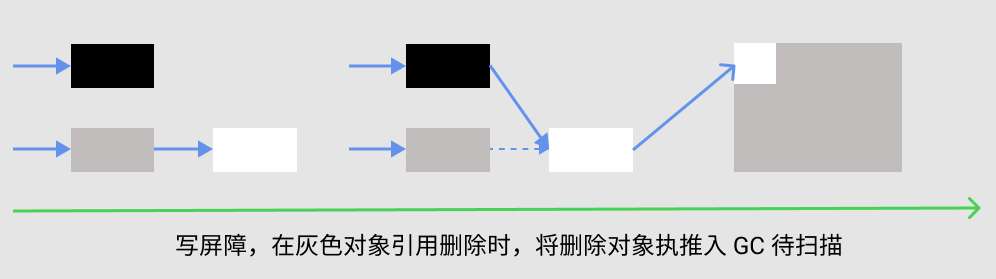

以上解决办法无论是对引用关系记录的插入还是删除，虚拟机的记录操作都是通过写屏障实现的。

## Garbage First 收集器

Garbage First（简称 G1）收集器是垃圾收集器技术发展历史上的里程碑式的成果，它开创了收集器面向**局部收集**的设计思路和**基于 Region 的内存布局形式**。

G1 实现了**停顿时间模型**（停顿时间可控）这一目标，停顿时间模型的意思是能够支持指定在一个长度为 M 毫秒的时间片段内，消耗在垃圾收集上的时间大概率不超过 N 毫秒这样的目标。

要怎么实现这以目标呢？

使用 `MixedGC`，垃圾收集活动的目标范围不再限制于整个年轻代（Minor GC）、整个老年代（Major GC）或整个堆（Full GC），而是基于回收集合（Collection Set，CSet）进行回收，每次回收垃圾最多，收益最高的区域。

G1 开创的基于 Region 的堆内存布局是它能够实现这个目标的关键。虽然 G1 也仍是遵循分代收集理论设计的，但其堆内存的布局与其他收集器有非常明显的差异：G1不再坚持固定大小以及固定数量的分代区域划分，而是把连续的 Java 堆划分为多个大小相等的独立区域（Region），每一个 Region 都可以根据需要，扮演新生代的 Eden 空间、Survivor 空间，或者老年代空间。收集器能够对扮演不同角色的 Region 采用不同的策略去处理，这样无论是新创建的对象还是已经存活了一段时间、熬过多次收集的旧对象都能获取很好的收集效果。

Region 中还有一类特殊的 Humongous 区域，专门用来存储大对象。G1 认为只要大小超过了一个Region容量一半的对象即可判定为大对象。每个 Region 的大小可以通过参数 `-XX:G1HeapRegionSize` 设定，取值范围为 1MB～32MB，且应为 2 的 N 次幂。G1 的 Region 如下所示：

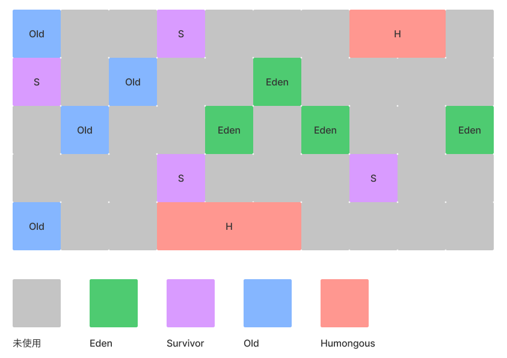

基于 Region 能够实现可控制的暂停时间，但在实现上任然是一个不小的挑战。

第一个挑战是，如何处理跨 Region 引用。

和分代一样，使用记忆集来记录跨 Region 引用，并且每个 Region 有着自己的记忆集，这些记忆集会记录下别的 Region 指向自己的指针，并标记这些指针分别在哪些卡页的范围之内。因为每个 Region 都要维护记忆集，因此 G1 收集器要比其他的传统垃圾收集器有着更高的内存占用负担。


第二个挑战是，如何在并发标记阶段如何保证收集线程与用户线程互不干扰地运行？

首先要解决的是用户线程改变对象引用关系时，必须保证其不能打破原本的对象图结构，导致标记结果出现错误（三色标记-漏标）。CMS 收集器采用增量更新算法实现，而 G1 收集器则是通过原始快照（SATB）算法来实现的。

处理并发标记阶段对象引用改变之外，还有可能需要分配新的的对象。为此 G1 为每个 Region  两个名为 TAMS（Top at Mark Start）的指针，把 Region 中的一部分空间划分出来用于并发回收过程中的新对象分配，并发回收时新分配的对象地址都必须要在这两个指针位置以上。G1 收集器默认在这个地址以上的对象是被隐式标记过的，即默认它们是存活的，不纳入回收范围。

与 CMS 中的 Concurrent Mode Failure 失败会导致 Full GC 类似，如果内存回收的速度赶不上内存分配的速度，G1 收集器也要被迫冻结用户线程执行，导致 Full GC 而产生长时间 Stop The World。


第三个挑战是怎么建立起可靠的停顿预测模型？

可以通过 `-XX:MaxGCPauseMillis` 控制每次 GC 最大暂停时间，但 G1 收集器要怎么做才能满足用户的期望呢？

G1 收集器的停顿预测模型是以衰减均值（Decaying Average）为理论基础来实现的，在垃圾收集过程中，G1 收集器会记录每个 Region 的回收耗时、每个 Region 记忆集里的脏卡数量等各个可测量的步骤花费的成本，并分析得出平均值、标准偏差、置信度等统计信息。在这个统计信息下，每次对价值最高的 Region 进行回收。

### G1 垃圾收集阶段

- 初始标记（Initial Marking）：仅仅只是标记一下 GC Roots 能直接关联到的对象，并且修改 TAMS 指针的值，让下一阶段用户线程并发运行时，能正确地在可用的 Region 中分配新对象。这个阶段需要停顿线程，但耗时很短，而且是借用进行 Minor GC 的时候同步完成的，所以 G1 收集器在这个阶段实际并没有额外的停顿；
- 并发标记（Concurrent Marking）：从 GC Root 开始对堆中对象进行可达性分析，递归扫描整个堆里的对象图，找出要回收的对象，这阶段耗时较长，但可与用户程序并发执行。当对象图扫描完成以后，还要重新处理SATB记录下的在并发时有引用变动的对象。

- 最终标记（Final Marking）：对用户线程做另一个短暂的暂停，用于处理并发阶段结束后仍遗留下来的最后那少量的 SATB 记录。
- 筛选回收（Live Data Counting and Evacuation）：负责更新 Region 的统计数据，对各个 Region 的回收价值和成本进行排序，根据用户所期望的停顿时间来制定回收计划，可以自由选择任意多个  Region 构成回收集，然后把决定回收的那一部分 Region 的存活对象复制到空的 Region 中，再清理掉整个旧Region 的全部空间。这里的操作涉及存活对象的移动，是必须暂停用户线程，由多条收集器线程并行完成的。

从上述阶段的描述可以看出，G1 收集器除了并发标记外，其余阶段也是要完全暂停用户线程的，换言之，它并非纯粹地追求低延迟，官方给它设定的目标是在延迟可控的情况下获得尽可能高的吞吐量，所以才能担当起“全功能收集器”的重任与期望。

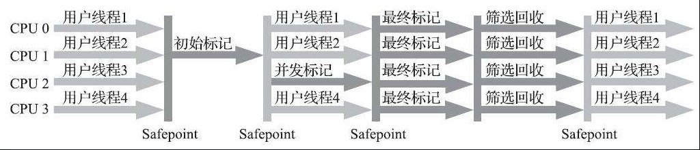


毫无疑问，可以由用户指定期望的停顿时间是 G1 收集器很强大的一个功能，设置不同的期望停顿时间，可使得 G1 在不同应用场景中取得关注吞吐量和关注延迟之间的最佳平衡。

不过，这里设置的“期望值”必须是符合实际的，一般来说回收阶段占到几十到一百甚至接近两百毫秒都很正常，但如果我们把停顿时间调得非常低，譬如设置为二十毫秒，很可能出现的结果就是由于停顿目标时间太短，导致每次选出来的回收集只占堆内存很小的一部分，**收集器收集的速度逐渐跟不上分配器分配的速度**，导致垃圾慢慢堆积。很可能一开始收集器还能从空闲的堆内存中获得一些喘息的时间，但应用运行时间一长就不行了，最终占满堆引发Full GC反而降低性能，所以通常把期望停顿时间设置为一两百毫秒或者两三百毫秒会是比较合理的。

### G1 存在的问题

#### 内存占用高

每个 Region 需要用卡表记录跨 Region 引用，内存消耗较大。

#### 执行负载

CMS 用写后屏障来更新维护卡表。而 G1 除了使用写后屏障来进行同样的（由于 G1 的卡表结构复杂、）卡表维护操作外，为了实现原始快照搜索（SATB）算法，还需要使用写前屏障来跟踪并发时的指针变化情况。先比只用一种方式，负载会更高。由于 G1 对写屏障的复杂操作要比 CMS 消耗更多的运算资源，所以CMS 的写屏障实现是直接的同步操作，而 G1 就不得不将其实现为类似于消息队列的结构，把写前屏障和写后屏障中要做的事情都放到队列里，然后再异步处理。

按照经验，目前在小内存应用上 CMS 的表现大概率仍然要会优于 G1，而在大内存应用上 G1 则大多能发挥其优势，这个优劣势的 Java 堆容量平衡点通常在 6GB~8GB 之间。


## 低延迟收集器

衡量垃圾收集器的三项最重要的指标是：内存占用（Footprint）、吞吐量（Throughput）和延迟（Latency），三者总体的表现会随技术进步而越来越好，但是要在这三个方面同时具有卓越表现的“完美”收集器是极其困难甚至是不可能的，一款优秀的收集器通常最多可以同时达成其中的两项。

在内存占用、吞吐量和延迟这三项指标里，延迟的重要性日益凸显，越发备受关注。

原因主要是因为硬件规格的提高。内存增大、性能提升给内存和吞吐量带来的是正面的提升，但对延迟带来的却是负面效果。更大的内存意味着一次需要回收更多的垃圾，有更长的 STW 时间，延迟也就变高。虚拟机要回收完整的 1TB 的堆内存，毫无疑问要比回收 1GB 的堆内存耗费更多时间。


下图展示了各种垃圾收集器并发情况：

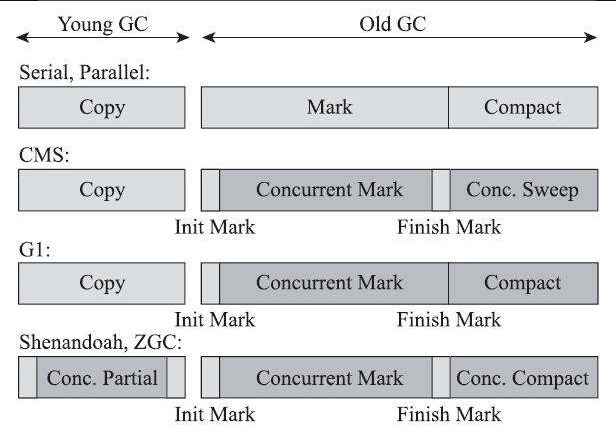

最后的两款收集器，Shenandoah 和 ZGC，几乎整个工作过程全部都是并发的，没有并发的阶段如初始标记、最终标记，这部分停顿的时间基本上是固定的，与堆的容量、堆中对象的数量没有正比例关系。因此它们都可以在任意可管理的（譬如现在 ZGC 只能管理 4TB 以内的堆）堆容量下，实现垃圾收集的停顿都不超过**十毫秒**这种以前听起来是天方夜谭、匪夷所思的目标。

### Shenandoah 收集器

比起 ZGC，Shenandoah 反而更像是 G1 的下一代继承者，它们两者有着相似的堆内存布局，在初始标记、并发标记等许多阶段的处理思路上都高度一致，甚至还直接共享了一部分实现代码。

Shenandoah 和 G1 的不同：

- 最主要的不同在于回收垃圾阶段支持并发整理，使用读屏障和转发指针来实现；
- 不使用分代收集，没有实现分代，并不是说分代对 Shenandoah 没有价值，这更多是出于性价比的权衡；
- Shenandoah 摒弃了在 G1 中耗费大量内存和计算资源去维护的记忆集，改用名为“连接矩阵”（Connection Matrix）的全局数据结构来记录跨 Region 的引用关系，降低了处理跨代指针时的记忆集维护消耗，也降低了**伪共享**问题。

连接矩阵示意图如下：

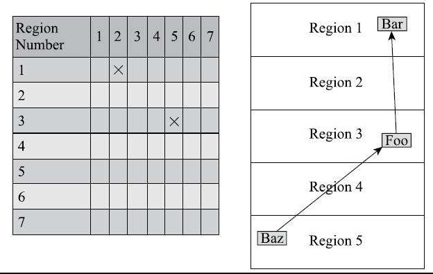

> 注：上述图片中矩阵中 (1,2) 标记应该在 (1,3) 位置。
>
> 可以理解为图的邻接矩阵表示法。


#### Shenandoah 收集阶段

- 初始标记（Initial Marking）：与 G1一样，首先标记与 GC Roots 直接关联的对象，这个阶段仍是“Stop The World”的，但停顿时间与堆大小无关，只与 GC Roots 的数量相关。
- 并发标记（Concurrent Marking）：与 G1 一样，遍历对象图，标记出全部可达的对象，这个阶段是与用户线程一起并发的，时间长短取决于堆中存活对象的数量以及对象图的结构复杂程度。

- 最终标记（Final Marking）：与 G1一样，处理剩余的SATB扫描，并在这个阶段统计出回收价值最高的 Region，将这些Region构成一组回收集（Collection Set）。最终标记阶段也会有一小段短暂的停顿。

- 并发清理（Concurrent Cleanup）：这个阶段用于清理那些整个区域内连一个存活对象都没有找到的 Region（这类 Region 被称为 Immediate Garbage Region）。

- 并发回收（Concurrent Evacuation）：并发回收阶段是 Shenandoah 与之前 HotSpot 中其他收集器的核心差异。

  在这个阶段，Shenandoah 要把回收集里面的存活对象先复制一份到其他未被使用的 Region 之中。难点在于在用户线程还在运行，移动对象是一次性的行为，但移动之后整个内存中所有指向该对象的引用都还是旧对象的地址，这是很难一瞬间全部改变过来的。

  对于并发回收阶段遇到的这些困难，Shenandoah 将会通过读屏障和被称为 Brooks Pointers 的转发指针来解决。

  并发回收阶段运行的时间长短取决于回收集的大小。

- 初始引用更新（Initial Update Reference）：并发回收阶段复制对象结束后，还需要把堆中所有指向旧对象的引用修正到复制后的新地址，这个操作称为引用更新。

- 并发引用更新（Concurrent Update Reference）：真正开始进行引用更新操作，这个阶段是与用户线程一起并发的，时间长短取决于内存中涉及的引用数量的多少。

- 最终引用更新（Final Update Reference）：解决了堆中的引用更新后，还要修正存在于 GC Roots 中的引用。这个阶段是Shenandoah的最后一次停顿，停顿时间只与 GC Roots 的数量相关。

- 并发清理（Concurrent Cleanup）：经过并发回收和引用更新之后，整个回收集中所有的 Region 已再无存活对象，这些 Region 都变成 Immediate Garbage Regions 了，最后再调用一次并发清理过程来回收这些 Region 的内存空间，供以后新对象分配使用。

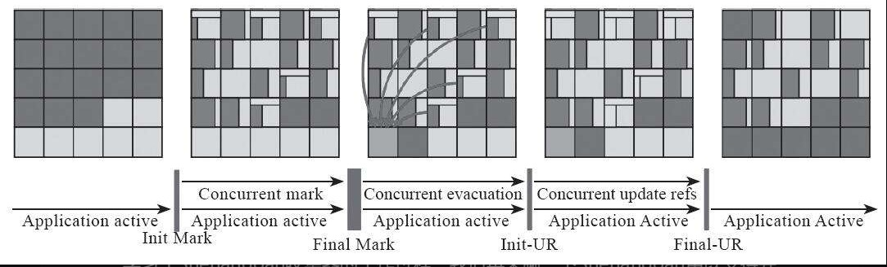


并发回收中的 Brooks Pointer。

用来保证解决在收集过程中，在对象引用发生改变时工作线程任然能够正常执行。

Brooks 是个人名，1984 年在论文中提出了转发指针（Forwarding Pointer）来实现对象移动与用户程序并发的一种解决方案。

此前，要做类似的并发操作，通常是在被移动对象原有的内存上设置**保护陷阱**（Memory Protection Trap），一旦用户程序访问到归属于旧对象的内存空间就会产生自陷中段，进入预设好的异常处理器中，再由其中的代码逻辑把访问转发到复制后的新对象上。虽然确实能够实现对象移动与用户线程并发，但是如果没有操作系统层面的直接支持，这种方案将导致用户态频繁切换到核心态	，代价是非常大的，不能频繁使用。

Brooks 提出的新方案不需要用到内存保护陷阱，而是在原有对象布局结构的最前面统一增加一个新的引用字段，在正常不处于并发移动的情况下，该引用指向对象自己。对象引用发生变化时，只需要修改旧对象上转发指针的引用位置，使其指向新对象，便可将所有对该对象的访问转发到新的副本上。

从设计上看转发指针和内存的句柄访问类似，带来的问题是每次多一次访问定位的开销。

// TODO ...

### ZGC 收集器

ZGC 和 Shenandoah 目标类似，都希望在尽可能对吞吐量影响不太大的前提下，实现在任意堆内存大小下都可以把垃圾收集的停顿时间限制在十毫秒以内的低延迟。但是 ZGC 和 Shenandoah 的实现思路又是差异显著的。

ZGC 收集器是一款基于 Region 内存布局的，（暂时）不设分代的，使用了读屏障、染色指针和内存多重映射等技术来实现可并发的标记-整理算法的，以低延迟为首要目标的一款垃圾收集器。

ZGC 的 Region 具有动态性。分为大中小三种容量：

- 小型 Region：大小固定在 2MB，用于放置小于 256KB 的小对象；
- 中型 Region：容量固定为 32MB，用于放置大于等于 256KB 但小于 4MB 的对象；
- 大型 Region：容量不固定，可以动态变化，但必须为 2MB 的整数倍，用于放置 4MB 或以上的大对象。每个大型 Region 中只会存放一个大对象。


ZGC 解决并发整理回收使用的方法和 Shenandoah 不同，标志性的设计是它采用的染色指针技术（Colored Pointer）和内存多重映射的技术。

从前，如果我们要在对象上存储一些额外的、只供收集器或者虚拟机本身使用的数据，通常会在对象头中增加额外的存储字段，如对象的哈希码、分代年龄、锁记录等就是这样存储的。

对于之和对象引用打交道，但不会对象本身内存直接产生关系，例如对象标记的过程中需要给对象打上三色标记，这些标记本质上就只和对象的引用有关，而与对象本身无关—**—某个对象只有它的引用关系能决定它存活与否，对象上其他所有的属性都不能够影响它的存活判定结果**。HotSpot 虚拟机的几种收集器有不同的标记实现方案，有的把标记直接记录在对象头上（如 Serial 收集器），有的把标记记录在与对象相互独立的数据结构上（如 G1、Shenandoah 使用了一种相当于堆内存的 1/64 大小的，称为 BitMap 的结构来记录标记信息），而 ZGC 的染色指针是最直接的、最纯粹的，它直接把标记信息记在引用对象的指针上。

染色指针是一种直接将少量额外的信息存储在指针上的技术，可是为什么指针本身也可以存储额外信息呢？在 64 位系统中，理论可以访问的内存高达 16EB（2 的64 次幂）字节。实际上用不了这么多内存，操作系统也不支持理论上虚拟内存，这就意味着这 64 位中有多余的位置可以使用。

比如 Linux 下的染色指针如下：

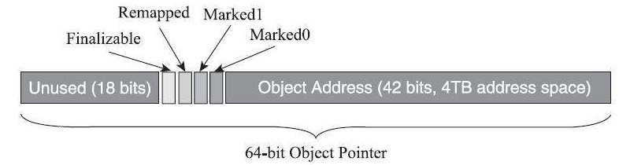

ZGC 的染色指针技术将原本指针的 46 位的高 4 位提取出来存储四个标志信息。由于这些标志位进一步压缩了原本就只有46位的地址空间，也直接导致 ZGC 能够管理的内存不可以超过 4TB。

虽然染色指针有 4TB 的内存限制，不能支持 32 位平台，不能支持压缩指针，但它带来的收益也是非常可观的。其有三大优势：

- 染色指针可以使得一旦某个 Region 的存活对象被移走之后，这个 Region 立即就能够被释放和重用掉，而不必等待整个堆中所有指向该 Region 的引用都被修正后才能清理。
- 染色指针可以大幅减少在垃圾收集过程中内存屏障的使用数量，设置内存屏障，尤其是写屏障的目的通常是为了记录对象引用的变动情况，如果将这些信息直接维护在指针中，显然就可以省去一些专门的记录操作。
- 染色指针可以作为一种可扩展的存储结构用来记录更多与对象标记、重定位过程相关的数据，以便日后进一步提高性能。

染色指针寻址——多重映射技术。


#### ZGC 收集阶段

- 并发标记（Concurrent Mark）：与 G1、Shenandoah 一样，并发标记是遍历对象图做可达性分析的阶段，前后也要经过类似于 G1、Shenandoah 的初始标记、最终标记（尽管 ZGC 中的名字不叫这些）的短暂停顿，而且这些停顿阶段所做的事情在目标上也是相类似的。与 G1、Shenandoah 不同的是，ZGC 的标记是在指针上而不是在对象上进行的，标记阶段会更新染色指针中的 Marked 0、Marked 1 标志位。

- 并发预备重分配（Concurrent Prepare for Relocate）：这个阶段需要根据特定的查询条件统计得出本次收集过程要清理哪些 Region，将这些 Region 组成重分配集（Relocation Set）。重分配集与 G1 收集器的回收集（Collection Set）还是有区别的，ZGC 划分 Region 的目的并非为了像 G1 那样做收益优先的增量回收。相反，ZGC 每次回收都会扫描所有的 Region，用范围更大的扫描成本换取省去 G1 中记忆集的维护成本。因此，ZGC 的重分配集只是决定了里面的存活对象会被重新复制到其他的 Region 中，里面的 Region 会被释放，而并不能说回收行为就只是针对这个集合里面的 Region 进行，因为标记过程是针对全堆的。

- 并发重分配（Concurrent Relocate）：重分配是 ZGC 执行过程中的核心阶段，这个过程要把重分配集中的存活对象复制到新的 Region 上，并为重分配集中的每个 Region 维护一个转发表（Forward Table），记录从旧对象到新对象的转向关系。

  得益于染色指针的支持，ZGC 收集器能仅从引用上就明确得知一个对象是否处于重分配集之中，如果用户线程此时并发访问了位于重分配集中的对象，这次访问将会被预置的内存屏障所截获，然后立即根据 Region 上的转发表记录将访问转发到新复制的对象上，并同时修正更新该引用的值，使其直接指向新对象，ZGC 将这种行为称为指针的“自愈”（Self-Healing）能力。

  这样做的好处是只有第一次访问旧对象会陷入转发，也就是只慢一次，对比 Shenandoah 的 Brooks 转发指针，那是每次对象访问都必须付出的固定开销，简单地说就是每次都慢，因此 ZGC 对用户程序的运行时负载要比 Shenandoah 来得更低一些。

  还有另外一个直接的好处是由于染色指针的存在，一旦重分配集中某个 Region 的存活对象都复制完毕后，这个 Region 就可以立即释放用于新对象的分配但是转发表还得留着不能释放掉），哪怕堆中还有很多指向这个对象的未更新指针也没有关系，这些旧指针一旦被使用，它们都是可以自愈的。

- 并发重映射（Concurrent Remap）：重映射所做的就是修正整个堆中指向重分配集中旧对象的所有引用，这一点从目标角度看是与 Shenandoah 并发引用更新阶段一样的，但是 ZGC 的并发重映射并不是一个必须要“迫切”去完成的任务，因为前面说过，即使是旧引用，它也是可以自愈的，最多只是第一次使用时多一次转发和修正操作。

  重映射清理这些旧引用的主要目的是为了不变慢（还有清理结束后可以释放转发表这样的附带收益），所以说这并不是很“迫切”。因此，ZGC 很巧妙地把并发重映射阶段要做的工作，合并到了下一次垃圾收集循环中的并发标记阶段里去完成，反正它们都是要遍历所有对象的，这样合并就节省了一次遍历对象图的开销。一旦所有指针都被修正之后，原来记录新旧对象关系的转发表就可以释放掉了。

## 收集器的权衡

选择前要先明确三个方面问题：

- 应用程序的主要关注点是什么？

  如果是数据分析、科学计算类的任务，目标是能尽快算出结果，那吞吐量就是主要关注点。

  如果是 SLA 应用，那停顿时间直接影响服务质量，严重的甚至会导致事务超时，这样延迟就是主要关注点。

  > SLA，服务等级协议，服务级别协议是指提供服务的企业与客户之间就服务的品质、水准、性能等方面所达成的双方共同认可的协议或契约。
  >
  > 更多信息： [服务级别协议_百度百科 (baidu.com)](https://baike.baidu.com/item/服务级别协议/10967493)

  而如果是客户端应用或者嵌入式应用，那垃圾收集的内存占用则是不可忽视的。

### 虚拟机及垃圾收集器日志

在 JDK 9 以前，HotSpot 并没有提供统一的日志处理框架。直到 JDK 9，HotSpot 所有功能的日志都收归到了 `-Xlog` 参数上：

```
-Xlog[:[selector][:[output][:[decorators][:output-options]]]]
```

命令行中最关键的参数是选择器（Selector），它由标签（Tag）和日志级别（Level）共同组成。标签可理解为虚拟机中某个功能模块的名字，它告诉日志框架用户希望得到虚拟机哪些功能的日志输出。

1. 查看 GC 基本信息，JDK 9 以前用 `-XX:+PrintGC`，JDK 9 用 `-Xlog:gc`。
2. 查看 GC 详细信息，JDK 9 之前使用 `-XX:+PrintGCDetails`，在 JDK 9 之后使用 `-Xlog:gc*` 。
3. 查看 GC 前后的堆、方法区可用容量变化，在 JDK 9 之前使用 `-XX:+PrintHeapAtGC`，JDK 9 之后使用 `-Xlog:gc+heap=debug`。
4. 查看GC 过程中用户线程并发时间以及停顿的时间，在 JDK 9之前使用 `-XX:+Print-GCApplicationConcurrentTime` 以及 `-XX:+PrintGCApplicationStoppedTime`，JDK 9 之后使用 `-Xlog:safepoint`。

5. 查看收集器 Ergonomics 机制（自动设置堆空间各分代区域大小、收集目标等内容，从 Parallel 收集器开始支持）自动调节的相关信息。在 JDK 9 之前使用 `-XX：+PrintAdaptiveSizePolicy`，JDK 9 之后使用 `-Xlog:gc+ergo*=trace`

6. 查看熬过收集后剩余对象的年龄分布信息，在 JDK 9 前使用 `-XX:+PrintTenuringDistribution`，JDK 9之后使用 `-Xlog:gc+age=trace`。

其他 GC 日志参数：

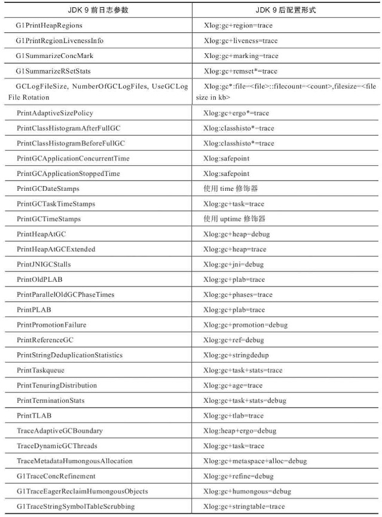


和垃圾收集相关参数：

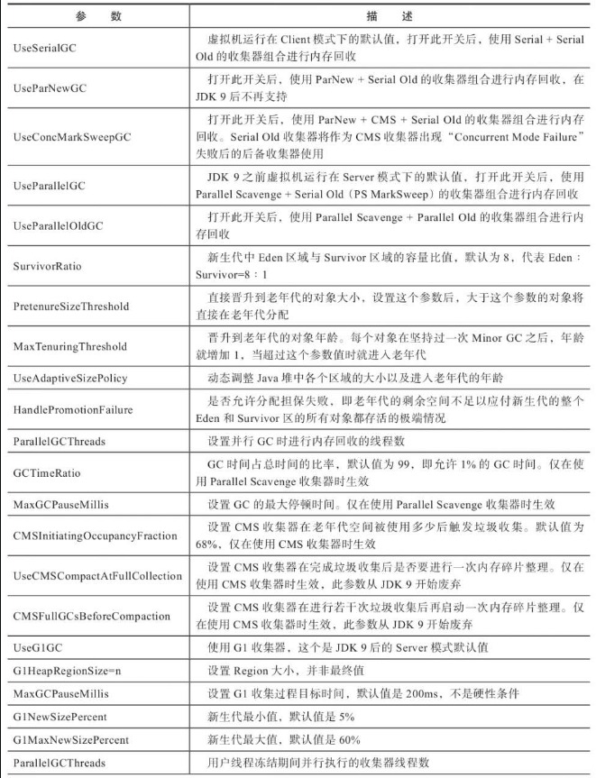

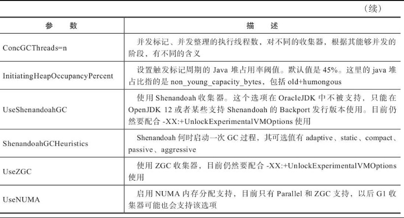

## 总结

垃圾收集器有三个重要衡量指标，内存占用（Footprint）、吞吐量（Throughput）和延迟（Latency）。随着硬件规格的提高，延迟更受关注。

回顾垃圾收集的发展，其在一步一步向着低延迟的目标迈进，到最新的 ZGC 和 Shenandoah 都可以做到在任意可管理的内存范围内实现 10ms 的暂停时间。

实现上，主要是将垃圾收集的阶段都变成并发的，即工作线程和 GC 线程并发执行，即使有不能并发进行的阶段，这些节点停顿的时间基本固定，不会和内存大小成正相关。

### 原文链接

- [深入理解Java虚拟机：JVM高级特性与最佳实践（第3版）-周志明-微信读书 (qq.com)](https://weread.qq.com/web/reader/cf1320d071a1a78ecf19254k1ff325f02181ff1de7742fc)

