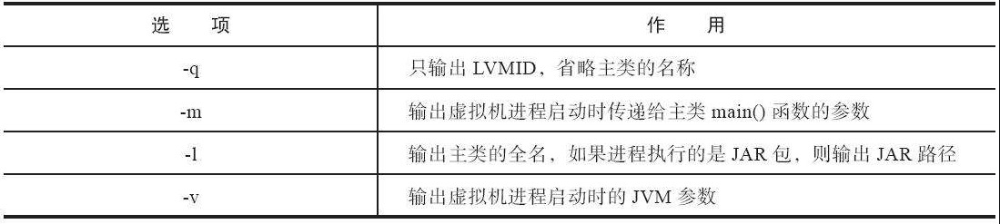
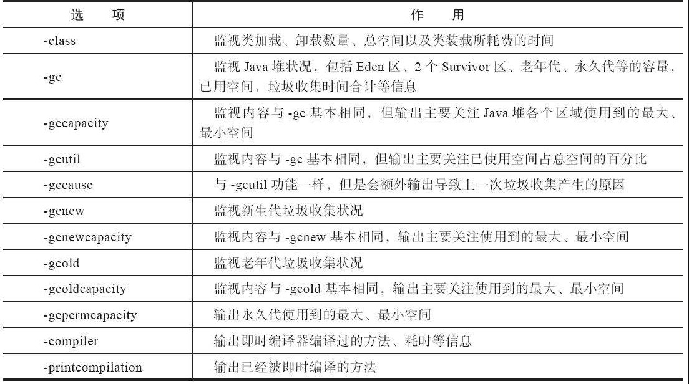

# 基础故障处理工具


## jps 虚拟机进程监控工具

```
jps -l
```



## jstat 虚拟机统计信息监视工具

jstat（JVM Statistics Monitoring Tool）是用于监视虚拟机各种运行状态信息的命令行工具。

它可以显示本地或者远程[插图]虚拟机进程中的类加载、内存、垃圾收集、即时编译等运行时数据.

假设需要每250毫秒查询一次进程 2764 垃圾收集状况，一共查询 20 次，那命令应当是：

```
jstat -gc 66 250 20
```



## jinfo Java 配置信息工具

比如查询 CMSInitiatingOccupancyFraction 参数值

```
jinfo -flag CMSInitiatingOccupancyFraction 66
```

## jmap Java 内存映射工具

此外我们可以借助一些工具来实时查看 JVM 堆内存的使用情况，比如 JDK 自带的工具 jmap，如

```powershell
# 查看堆内存的使用情况
jmap -heap <pid>

# 查看堆内存中对象的分布情况（windows）
jmap -histo:live <pid> | Select -First 20
 
# 生成堆转储为文件
jmap -dump:live,format=b,file=heap.hrof <pid>
```

### jhat 虚拟机堆转储快照分析工具

专业用于分析堆转储快照文件的 Eclipse Memory Analyzer、IBM HeapAnalyzer 等工具。

## jstack Java堆栈跟踪工具

jstack（Stack Trace for Java）命令用于生成虚拟机当前时刻的线程快照。线程快照就是当前虚拟机内每一条线程正在执行的方法堆栈的集合，生成线程快照的目的通常是定位线程出现长时间停顿的原因，如线程间死锁、死循环、请求外部资源导致的长时间挂起等，都是导致线程长时间停顿的常见原因。线程出现停顿时通过 jstack 来查看各个线程的调用堆栈，就可以获知没有响应的线程到底在后台做些什么事情，或者等待着什么资源。
