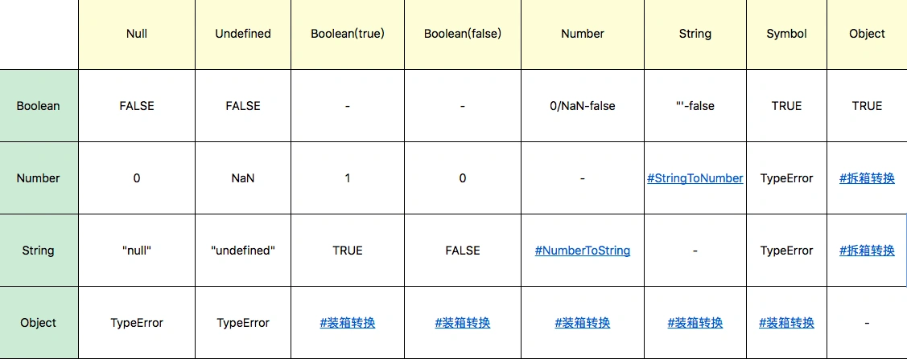
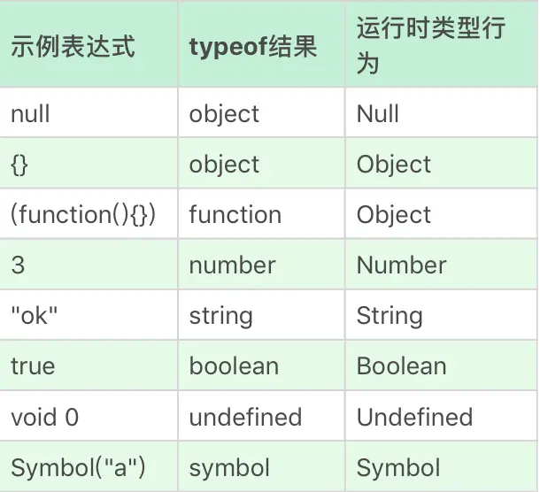

# JavaScript 类型

原文链接：[JavaScript类型：关于类型，有哪些你不知道的细节？ (geekbang.org)](https://time.geekbang.org/column/article/78884)

## 类型

JavaScript 语言的每一个值都属于某一种数据类型。JavaScript 语言规定了 7 种语言类型。语言类型广泛用于变量、函数参数、表达式、函数返回值等场合。根据最新的语言标准，这 7 种语言类型是：

1. Undefined；
2. Null；
3. Boolean；
4. String；
5. Number；
6. Symbol；
7. Object。

### Undefined 

Undefined 类型表示未定义，它的类型只有一个值，就是 undefined。

任何变量在赋值前是 Undefined 类型、值为 undefined，一般我们可以用全局变量 undefined（就是名为 undefined 的这个变量）来表达这个值，或者 void 运算来把任意一个表达式变成 undefined 值。

但是呢，因为 JavaScript 的代码 undefined 是一个全局变量（即变量名为 "undefined" ，类型为 Undefined，值也 undefined 的一个全局变量），而并非是一个关键字，这是 JavaScript 语言公认的设计失误之一。所以，我们为了避免无意中被篡改这个全局变量，我建议使用 void 0 来获取 undefined 值，而不是用全局变量"undefined"来获取 undefined 值。

### Null

Null 表示的是：“定义了但是为空”。所以，在实际编程时，我们一般不会把变量赋值为 undefined，这样可以保证所有值为 undefined 的变量，都是从未赋值的自然状态。

Null 表示的是：“定义了但是为空”。所以，在实际编程时，我们一般不会把变量赋值为 undefined，这样可以保证所有值为 undefined 的变量，都是从未赋值的自然状态。

### Boolean

Boolean 类型有两个值， true 和 false，它用于表示逻辑意义上的真和假，同样有关键字 true 和 false 来表示两个值。

### String

String 用于表示文本数据。String 有最大长度是 2^53 - 1，这在一般开发中都是够用的，但是有趣的是，这个所谓最大长度，并不完全是你理解中的字符数。

因为 String 的意义并非“字符串”，而是字符串的 UTF16 编码，我们字符串的操作 charAt、charCodeAt、length 等方法针对的都是 UTF16 编码。所以，字符串的最大长度，实际上是受字符串的编码长度影响的。

```
Note：
现行的字符集国际标准，字符是以 Unicode 的方式表示的，每一个 Unicode 的码点表示一个字符，理论上，Unicode 的范围是无限的。UTF 是 Unicode 的编码方式，规定了码点在计算机中的表示方法，常见的有 UTF16 和 UTF8。 Unicode 的码点通常用 U+??? 来表示，其中 ??? 是十六进制的码点值。 0-65536（U+0000 - U+FFFF）的码点被称为基本字符区域（BMP）。
```

JavaScript 中的字符串是永远无法变更的，一旦字符串构造出来，无法用任何方式改变字符串的内容，所以字符串具有值类型的特征。

JavaScript 字符串把每个 UTF16 单元当作一个字符来处理，所以处理非 BMP（超出 U+0000 - U+FFFF 范围）的字符时，你应该格外小心。

### Number

Number 类型表示我们通常意义上的“数字”。这个数字大致对应数学中的有理数，当然，在计算机中，我们有一定的精度限制。

JavaScript 中的 Number 类型有 18437736874454810627(即 2^64-2^53+3) 个值。

JavaScript 中的 Number 类型基本符合 IEEE 754-2008 规定的双精度浮点数规则，但是 JavaScript 为了表达几个额外的语言场景（比如不让除以 0 出错，而引入了无穷大的概念），规定了几个例外情况（3 个特殊的值）：

- NaN，占用了 9007199254740990，这原本是符合 IEEE 规则的数字；
- Infinity，无穷大；
- -Infinity，负无穷大。

值得注意的是，JavaScript 中有 +0 和 -0，在加法类运算中它们没有区别，但是除法的场合则需要特别留意区分，“忘记检测除以 -0，而得到负无穷大”的情况经常会导致错误，而区分 x 为 +0 和 -0 的方式，就是检测 1/x 是 Infinity 还是 -Infinity。

### Symbol

Symbol 是 ES6 中引入的新类型，它是一切非字符串的对象 key 的集合，在 ES6 规范中，整个对象系统被用 Symbol 重塑。

### Object

Object 是 JavaScript 中最复杂的类型，也是 JavaScript 的核心机制之一。Object 表示对象的意思，它是一切有形和无形物体的总称。

在 JavaScript 中，对象的定义是“属性的集合”。属性分为数据属性和访问器属性，二者都是 key-value 结构，key 可以是字符串或者 Symbol 类型。

JavaScript 中的几个基本类型，都在对象类型中有一个包装类型。它们是：

- Number；
- String；
- Boolean；
- Symbol。

我们必须认识到 3 与 new Number(3) 是完全不同的值，它们一个是 Number 类型， 一个是对象类型。

JavaScript 语言设计上试图模糊对象和基本类型之间的关系，我们日常代码可以把对象的方法在基本类型上使用，这是因为点运算符提供了装箱操作，它会根据基础类型构造一个临时对象，使得我们能在基础类型上调用对应对象的方法。

## 类型转换

因为 JS 是弱类型语言，所以类型转换发生非常频繁，大部分我们熟悉的运算都会先进行类型转换。大部分类型转换符合人类的直觉，但是如果我们不去理解类型转换的严格定义，很容易造成一些代码中的判断失误。

其中最为臭名昭著的是 JavaScript 中的“ == ”运算，因为试图实现跨类型的比较，它的规则复杂到几乎没人可以记住。很多实践中推荐禁止使用“ ==”，而要求程序员进行显式地类型转换后，用 === 比较。其它运算，如加减乘除大于小于，也都会涉及类型转换。幸好的是，实际上大部分类型转换规则是非常简单的，如下表所示：



### StringToNumber

字符串到数字的类型转换，存在一个语法结构，类型转换支持十进制、二进制、八进制和十六进制，比如：

字符串到数字的类型转换，存在一个语法结构，类型转换支持十进制、二进制、八进制和十六进制，比如：30；0b111；0o13；0xFF。

此外，JavaScript 支持的字符串语法还包括正负号科学计数法，可以使用大写或者小写的 e 来表示：1e3；-1e-2。

需要注意的是，parseInt 和 parseFloat 并不使用这个转换，所以支持的语法跟这里不尽相同。在不传入第二个参数的情况下，parseInt 只支持 16 进制前缀“0x”，而且会忽略非数字字符，也不支持科学计数法。

多数情况下，Number 是比 parseInt 和 parseFloat 更好的选择。

### NumberToString

在较小的范围内，数字到字符串的转换是完全符合你直觉的十进制表示。当 Number 绝对值较大或者较小时，字符串表示则是使用科学计数法表示的。

### 装箱转换

每一种基本类型 Number、String、Boolean、Symbol 在对象中都有对应的类，所谓装箱转换，正是把基本类型转换为对应的对象，它是类型转换中一种相当重要的种类。

全局的 Symbol 函数无法使用 new 来调用，但我们仍可以利用装箱机制来得到一个 Symbol 对象，我们可以利用一个函数的 call 方法来强迫产生装箱。

```js
var symbolObject = (function(){ return this; }).call(Symbol("a"));

console.log(typeof symbolObject); //object
console.log(symbolObject instanceof Symbol); //true
console.log(symbolObject.constructor == Symbol); //true
```

装箱机制会频繁产生临时对象，在一些对性能要求较高的场景下，我们应该尽量避免对基本类型做装箱转换。

使用内置的 Object 函数，我们可以在 JavaScript 代码中显式调用装箱能力。

```js
var symbolObject = Object(Symbol("a"));

console.log(typeof symbolObject); //object
console.log(symbolObject instanceof Symbol); //true
console.log(symbolObject.constructor == Symbol); //true
```

每一类装箱对象皆有私有的 Class 属性，这些属性可以用 Object.prototype.toString 获取：

```js
var symbolObject = Object(Symbol("a"));

console.log(Object.prototype.toString.call(symbolObject)); //[object Symbol]
```

在 JavaScript 中，没有任何方法可以更改私有的 Class 属性，因此 Object.prototype.toString 是可以准确识别对象对应的基本类型的方法，它比 instanceof 更加准确。

但需要注意的是，call 本身会产生装箱操作，所以需要配合 typeof 来区分基本类型还是对象类型。

### 拆箱转换

在 JavaScript 标准中，规定了 ToPrimitive 函数，它是对象类型到基本类型的转换（即，拆箱转换）。

对象到 String 和 Number 的转换都遵循**先拆箱再转换**的规则。通过拆箱转换，把对象变成基本类型，再从基本类型转换为对应的 String 或者 Number。

拆箱转换会尝试调用 valueOf 和 toString 来获得拆箱后的基本类型。如果 valueOf 和 toString 都不存在，或者没有返回基本类型，则会产生类型错误 TypeError。

```js
var o = {
    valueOf : () => {console.log("valueOf"); return {}},
    toString : () => {console.log("toString"); return {}}
}

o * 2
// valueOf
// toString
// TypeError
```

我们定义了一个对象 o，o 有 valueOf 和 toString 两个方法，这两个方法都返回一个对象，然后我们进行 o*2 这个运算的时候，你会看见先执行了 valueOf，接下来是 toString，最后抛出了一个 TypeError，这就说明了这个拆箱转换失败了。

到 String 的拆箱转换会优先调用 toString。我们把刚才的运算从 o*2 换成 String(o)，那么你会看到调用顺序就变了。

```js
var o = {
    valueOf : () => {console.log("valueOf"); return {}},
    toString : () => {console.log("toString"); return {}}
}

String(o)
// toString
// valueOf
// TypeError
```

在 ES6 之后，还允许对象通过显式指定 @@toPrimitive Symbol 来覆盖原有的行为。

```js
var o = {
    valueOf : () => {console.log("valueOf"); return {}},
    toString : () => {console.log("toString"); return {}}
}

o[Symbol.toPrimitive] = () => {console.log("toPrimitive"); return "hello"}


console.log(o + "")
// toPrimitive
// hello
```

## 规范类型

除了七种基本语言类型，还有一些语言的实现者更关心的规范类型。

- List 和 Record： 用于描述函数传参过程。
- Set：主要用于解释字符集等。
- Completion Record：用于描述异常、跳出等语句执行过程。
- Reference：用于描述对象属性访问、delete 等。
- Property Descriptor：用于描述对象的属性。
- Lexical Environment 和 Environment Record：用于描述变量和作用域。
- Data Block：用于描述二进制数据。


JavaScript 语言中提供了 typeof 这样的运算，用来返回操作数的基本类型，但 typeof 的运算结果，与运行时类型的规定有很多不一致的地方。我们可以看下表来对照一下。



在表格中，多数项是对应的，但是请注意 object——Null 和 function——Object 是特例，我们理解类型的时候需要特别注意这个区别。


instanceof 和 typeof 的区别：

typeof 用来判断参数的基本类型，如：

```js
typeof 123; // number
typeof 'jartto'; // string
typeof !!’0’; // boolean
typeof new Function(); // function
typeof name; // undefined
```

这里可以扩展一下，假如我们要判断某个变量是否存在：

```js
if(!a) { console.log('error')}
```

这时候，控制台会报错：Uncaught ReferenceError: a is not defined

所以我们可以使用 `typeof` 来判断：

```js
if(typeof a === 'undefined') { 
  console.log('error');
}
```

这样，就能避免代码异常，是一种比较严谨的处理方式。


`instanceof` 是用来判断 A 是否为 B 的实例，表达式为：`A instanceof B`，如果 A 是 B 的实例，则返回 true，否则返回 false。

```js
2 instanceof Number // false
new Number(2) instanceof Number // true
```

