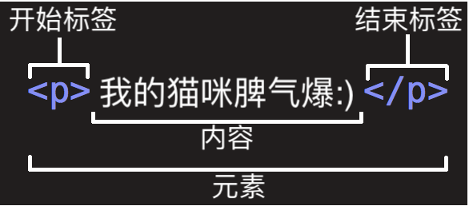

# HTML 基础

原文链接：[HTML 基础 - 学习 Web 开发 | MDN (mozilla.org)](https://developer.mozilla.org/zh-CN/docs/Learn/Getting_started_with_the_web/HTML_basics)

超文本标记语言 (英语：**H**yper**t**ext **M**arkup **L**anguage，简称：HTML ) 是一种用来结构化 Web 网页及其内容的标记语言。网页内容可以是：一组段落、一个重点信息列表、也可以含有图片和数据表。


## HTML

HTML 不是一门编程语言，而是一种用于定义内容结构的标记语言。HTML 由一系列的元素（elements）组成，这些元素可以用来包围不同部分的内容，使其以某种方式呈现或者工作。 一对标签（ tags）可以为一段文字或者一张图片添加超链接，将文字设置为斜体，改变字号，等等。


## HTML 元素详解



这个元素的主要部分有：

1. **开始标签**（Opening tag）：包含元素的名称（本例为 p），被大于号、小于号所包围。表示元素从这里开始或者开始起作用 —— 在本例中即段落由此开始。
2. **结束标签**（Closing tag）：与开始标签相似，只是其在元素名之前包含了一个斜杠。这表示着元素的结尾 —— 在本例中即段落在此结束。初学者常常会犯忘记包含结束标签的错误，这可能会产生一些奇怪的结果。
3. **内容**（Content）：元素的内容，本例中就是所输入的文本本身。
4. **元素**（Element）：开始标签、结束标签与内容相结合，便是一个完整的元素。

元素也可以有属性（Attribute）：属性包含了关于元素的一些额外信息，这些信息本身不应显现在内容中。本例中，`class` 是属性名称，`editor-note` 是属性的值 。`class` 属性可为元素提供一个标识名称，以便进一步为元素指定样式或进行其他操作时使用。

属性应该包含：

1. 在属性与元素名称（或上一个属性，如果有超过一个属性的话）之间的空格符。
2. 属性的名称，并接上一个等号。
3. 由引号所包围的属性值。

### 嵌套元素

也可以将一个元素置于其他元素之中 —— 称作**嵌套**。要表明猫咪非常暴躁，可以将 “暴躁” 用 [``](https://developer.mozilla.org/zh-CN/docs/Web/HTML/Element/strong) 元素包围，爆字将突出显示：

```html
<p>我的猫咪脾气<strong>暴躁</strong>:)</p>
```

### 空元素

不包含任何内容的元素称为空元素。比如  ``  元素：

```html

```

该元素通过包含图像文件路径的地址属性 `src`，可在所在位置嵌入图像。

该元素还包括一个替换文字属性 `alt`，是图像的描述内容，用于当图像不能被用户看见时显示，不可见的原因可能是：

1. 用户有视觉障碍。视障用户可以使用屏幕阅读器来朗读 `alt` 属性的内容。
2. 有些错误使图像无法显示。可以试着故意将 `src` 属性里的路径改错。保存并刷新页面就可以在图像位置看到。`alt` 属性的关键字即“描述文本”。`alt` 文本应向用户完整地传递图像要表达的意思。

### 文本标记元素

本段包含了一些最常用的文本标记 HTML 元素。

- 标题（Heading）

  标题元素可用于指定内容的标题和子标题。就像一本书的书名、每章的大标题、小标题，等。HTML 文档也是一样。HTML 包括六个级别的标题， `<h1> (en-US)–<h6> (en-US) `，一般最多用到 3-4 级标题。

  ```html
  <h1>主标题</h1>
  <h2>顶层标题</h2>
  <h3>子标题</h3>
  <h4>次子标题</h4>
  ```

  > 注：可以发现 MDN 网站上 第一级标题的主题是隐藏的。不要使用标题元素来加大、加粗字体，因为标题对于 [无障碍访问](https://developer.mozilla.org/zh-CN/docs/learn/Accessibility) 和 [搜索引擎优化](https://developer.mozilla.org/zh-CN/docs/learn/HTML/Introduction_to_HTML/HTML_text_fundamentals#为什么我们需要结构化) 等问题非常有意义。要保持页面结构清晰，标题整洁，不要发生标题级别跳跃。

- 段落（Paragraph）

  如上文所讲，`<p> ` 元素是用来指定段落的。通常用于指定常规的文本内容。

- 列表（List）

  Web 上的许多内容都是列表，HTML 有一些特别的列表元素。标记列表通常包括至少两个元素。最常用的列表类型为：

  1. **无序列表（Unordered List）**中项目的顺序并不重要，就像购物列表。用一个 `ul` 元素包围。
  2. **有序列表（Ordered List）**中项目的顺序很重要，就像烹调指南。用一个 `ol` 元素包围。

  列表的每个项目用一个列表项目（List Item）元素 `<li>` 包围。如下所示：

  ```html
  <p>Mozilla 是一个全球社区，这里聚集着来自五湖四海的</p>
  
  <ul>
    <li>技术人员</li>
    <li>思考者</li>
    <li>建造者</li>
  </ul>
  
  <p>我们致力于……</p>
  ```

- 链接

  链接非常重要 — 它们赋予 Web 网络属性。要植入一个链接，我们需要使用一个简单的元素 — `<a>` — a 是 "anchor" （锚）的缩写。要将一些文本添加到链接中，如下所示：

  ```html
  <a href="https://www.mozilla.org/zh-CN/about/manifesto/">Mozilla 宣言</a>
  ```

## HTML 文档详解

现在来看看单个元素如何彼此协同构成一个完整的 HTML 页面。

```html
<!DOCTYPE html>
<html>
  <head>
    <meta charset="utf-8">
    <title>测试页面</title>
  </head>
  <body>
    
  </body>
</html>
```

这里有：

- `<!DOCTYPE html>` — 文档类型。混沌初分，HTML 尚在襁褓（大约是 1991/92 年）之时，`DOCTYPE` 用来链接一些 HTML 编写守则，比如自动查错之类。`DOCTYPE` 在当今作用有限，仅用于保证文档正常读取。现在知道这些就足够了。
- `<html></html>` — `<html>` 元素。该元素包含整个页面的内容，也称作根元素。
- `<head></head>` — `<head>` 元素。该元素的内容对用户不可见，其中包含例如面向搜索引擎的搜索关键字、页面描述、CSS 样式表和字符编码声明等。
- `<meta charset="utf-8">` — 该元素指定文档使用 UTF-8 字符编码 ，UTF-8 包括绝大多数人类已知语言的字符。基本上 UTF-8 可以处理任何文本内容，还可以避免以后出现某些问题，没有理由再选用其他编码。
- `<title></title>` — `<title>` 元素。该元素设置页面的标题，显示在浏览器标签页上，也作为收藏网页的描述文字。
- `<body></body>` — `<body>` 元素。该元素包含期望让用户在访问页面时看到的内容，包括文本、图像、视频、游戏、可播放的音轨或其他内容。


## 总结

### 参考链接

1. [HTML 基础 - 学习 Web 开发 | MDN (mozilla.org)](https://developer.mozilla.org/zh-CN/docs/Learn/Getting_started_with_the_web/HTML_basics)