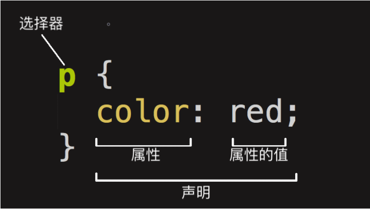

# CSS 基础

原文链接：[CSS 基础 - 学习 Web 开发 | MDN (mozilla.org)](https://developer.mozilla.org/zh-CN/docs/Learn/Getting_started_with_the_web/CSS_basics)

层叠样式表（**C**ascading **S**tyle **S**heet，简称：CSS）是为网页添加样式的代码。

## CSS

和 HTML 类似，CSS 也不是真正的编程语言，甚至不是标记语言。它是一门样式表语言，这也就是说人们可以用它来选择性地为 HTML 元素添加样式。举例来说，要选择一个 HTML 页面里**所有**的段落元素，然后将其中的文本改成红色，可以这样写 CSS：

```css
p {
  color: red;
}
```

我们可以将 CSS 样式单独写在一个文件中，并通过 `<link>` 元素引入到 html 文件中来，如下所示：

```html
<link href="styles/style.css" rel="stylesheet">
```

## CSS 规则集



上述整个结构称为 **规则集**（通常简称“规则”），各部分释义如下：

- 选择器（**Selector**）

  HTML 元素的名称位于规则集开始。它选择了一个或多个需要添加样式的元素（在这个例子中就是 `p` 元素）。要给不同元素添加样式只需要更改选择器就行了。

- 声明（**Declaration**）

  一个单独的规则，如 `color: red;` 用来指定添加样式元素的**属性**。

- 属性（**Properties**）

  改变 HTML 元素样式的途径。（本例中 `color` 就是 `<p>` 元素的属性。）CSS 中，由编写人员决定修改哪个属性以改变规则。

- 属性的值（Property value）

  在属性的右边，冒号后面即**属性的值**，它从指定属性的众多外观中选择一个值（我们除了 `red` 之外还有很多属性值可以用于 `color` ）。

注意其他重要的语法：

- 每个规则集（除了选择器的部分）都应该包含在成对的大括号里（`{}`）。
- 在每个声明里要用冒号（`:`）将属性与属性值分隔开。
- 在每个规则集里要用分号（`;`）将各个声明分隔开。

如果要同时修改多个属性，只需要将它们用分号隔开，就像这样：

```css
p {
  color: red;
  width: 500px;
  border: 1px solid black;
}
```

也可以选择多种类型的元素并为它们添加一组相同的样式。将不同的选择器用逗号分开。例如：

```css
p, li, h1 {
  color: red;
}
```

## 选择器

选择器有许多不同的类型。上面只介绍了**元素选择器**，用来选择 HTML 文档中给定的元素。但是选择操作可以更加具体。下面是一些常用的选择器类型：


选择器的种类远不止于此，更多信息请参阅 [CSS selectors - Learn web development | MDN (mozilla.org)](https://developer.mozilla.org/en-US/docs/Learn/CSS/Building_blocks/Selectors)

## 字体和文本

> 译注：再一次说明，中文字体文件较大，不适合直接用于 Web Font。

在探索了一些 CSS 基础后，我们来把更多规则和信息添加至 `style.css` 中，从而让示例更美观。首先，让字体和文本变得更漂亮。

1. 第一步，找到之前字体网站输出的地址。并以 `<link>` 元素的形式添加进 index.html 文档头（ `<head>` 和 `</head>` 之间的任意位置）。代码如下：

   ```html
    <link href="https://fonts.font.im/css?family=Open+Sans" rel="stylesheet" type="text/css"> 
   ```

   以上代码为当前网页下载 Open Sans 字体，从而使自定义 CSS 中可以对 HTML 元素应用这个字体。

2. 接下来，删除 `style.css` 文件中已有的规则。虽然测试是成功的了，但是红字看起来并不太舒服。

3. 将下列代码添加到相应的位置，用你在字体网站找到的字体替代 `font-family` 中的占位行。（ `font-family` 意味着你想要你的文本使用的字体。）这条规则首先为整个页面设定了一个全局字体和字号（因为 `<html>` 是整个页面的父元素，而且它所有的子元素都会继承相同的 `font-size` 和 `font-family`）：

   ```css
   html {
     /* px 表示 “像素（pixels）”: 基础字号为 10 像素 */
     font-size: 10px;
     /* Google fonts 输出的 CSS */
     font-family: 'Open Sans', sans-serif;
   }
   ```

   > **注：**CSS 文档中所有位于 `/*` 和 `*/` 之间的内容都是 CSS 注释，它会被浏览器在渲染代码时忽略。你可以在这里写下对你现在要做的事情有帮助的笔记。
   >
   > ​		`/*``*/` 不可嵌套，`/*这样的注释是/*不行*/的*/`。CSS 不接受 `//` 注释。

 4. 接下来为文档体内的元素（`<h1> (en-US)`、 `<li>` 和 `<p>`）设置字号。将标题居中显示，并为正文设置行高和字间距，从而提高页面的可读性。

    ```css
    h1 {
      font-size: 60px;
      text-align: center;
    }
    
    p, li {
      font-size: 16px;
      /* line-height 后而可以跟不同的参数，如果是数字，就是当前字体大小乘上数字 */
      line-height: 2;
      letter-spacing: 1px;
    }
    ```

## 盒子

编写 CSS 时你会发现，你的工作好像是围绕着一个一个盒子展开的——设置尺寸、颜色、位置，等等。页面里大部分 HTML 元素都可以被看作若干层叠的盒子。

并不意外，CSS 布局主要就是基于盒模型的。每个占据页面空间的块都有这样的属性：

- `padding`：即内边距，围绕着内容（比如段落）的空间。
- `border`：即边框，紧接着内边距的线。
- `margin`：即外边距，围绕元素外部的空间。


这里还使用了：

- `width` ：元素的宽度
- `background-color` ：元素内容和内边距底下的颜色
- `color` ：元素内容（通常是文本）的颜色
- `text-shadow` ：为元素内的文本设置阴影
- `display` ：设置元素的显示模式（暂略）

## 更多的样式设计

### 更改页面颜色

```css
html {
  background-color: #00539F;
}
```

### 文档体格式设计

```css
body {
  width: 600px;
  margin: 0 auto;
  background-color: #FF9500;
  padding: 0 20px 20px 20px;
  border: 5px solid black;
}
```

现在是 `<body>` 元素。以上条声明，我们来逐条查看：

- `width: 600px;` —— 强制页面永远保持 600 像素宽。
- `margin: 0 auto;` —— 为 `margin` 或 `padding` 等属性设置两个值时，第一个值代表元素的上方**和**下方（在这个例子中设置为 `0`），而第二个值代表左边**和**右边（在这里，`auto` 是一个特殊的值，意思是水平方向上左右对称）。你也可以使用一个，三个或四个值，参考 [这里](https://developer.mozilla.org/zh-CN/docs/Web/CSS/margin#取值) 。
- `background-color: #FF9500;` —— 如前文所述，指定元素的背景颜色。我们给 body 用了一种略微偏红的橘色以与深蓝色的 [``](https://developer.mozilla.org/zh-CN/docs/Web/HTML/Element/html) 元素形成反差，你也可以尝试其它颜色。
- `padding: 0 20px 20px 20px;` —— 我们给内边距设置了四个值来让内容四周产生一点空间。这一次我们不设置上方的内边距，设置右边，下方，左边的内边距为20像素。值以上、右、下、左的顺序排列。
- `border: 5px solid black;` —— 直接为 body 设置 5 像素的黑色实线边框。

### 定位页面主标题并添加样式

```css
h1 {
  margin: 0;
  padding: 20px 0;
  color: #00539F;
  text-shadow: 3px 3px 1px black;
}
```

你可能发现页面的顶部有一个难看的间隙，那是因为浏览器会在没有任何 CSS 的情况下 给 [ (en-US)](https://developer.mozilla.org/en-US/docs/Web/HTML/Element/Heading_Elements) 等元素设置一些**默认样式**。但这并不是个好主意，因为我们希望一个没有任何样式的网页也有基本的可读性。为了去掉那个间隙，我们通过设置 `margin: 0;` 来覆盖默认样式。

至此，我们已经把标题的上下内边距设置为 20 像素，并且将标题文本与 HTML 的背景颜色设为一致。

需要注意的是，这里使用了一个 `text-shadow` 属性，它可以为元素中的文本提供阴影。四个值含义如下：

- 第一个值设置**水平偏移值** —— 即阴影右移的像素数（负值左移）。
- 第二个值设置**垂直偏移值** —— 即阴影下移的像素数（负值上移）。
- 第三个值设置阴影的**模糊半径** —— 值越大产生的阴影越模糊。
- 第四个值设置阴影的基色。

不妨尝试不同的值看看能得出什么结果。

### 图形居中

```css
img {
  display: block;
  margin: 0 auto;
}
```

最后，我们把图像居中来使页面更美观。可以复用 `body` 的 `margin: 0 auto` ，但是需要一点点调整。 `<body>` 元素是块级元素，意味着它占据了页面的空间并且能够赋予外边距和其他改变间距的值。而图片是内联元素，不具备块级元素的一些功能。所以为了使图像有外边距，我们必须使用 `display: block` 给予其块级行为。

