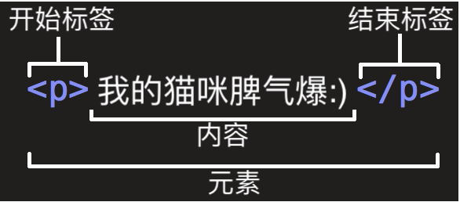
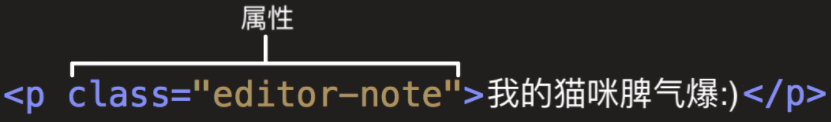
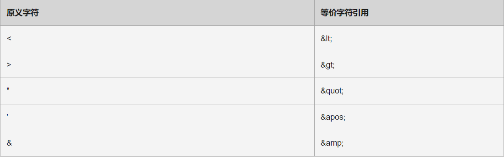

# HTML 入门

原文链接：[开始学习 HTML - 学习 Web 开发 | MDN (mozilla.org)](https://developer.mozilla.org/zh-CN/docs/Learn/HTML/Introduction_to_HTML/Getting_started)

[HTML](https://developer.mozilla.org/zh-CN/docs/Glossary/HTML) (HyperText Markup Language) 不是一门编程语言，而是一种用来告知浏览器如何组织页面的**标记语言**。HTML 可复杂、可简单，一切取决于开发者。它由一系列的**元素（[elements](https://developer.mozilla.org/zh-CN/docs/Glossary/Element)）**组成，这些元素可以用来包围不同部分的内容，使其以某种方式呈现或者工作。 一对标签（ [tags](https://developer.mozilla.org/zh-CN/docs/Glossary/Tag)）可以为一段文字或者一张图片添加超链接，将文字设置为斜体，改变字号，等等。 标签是 HTML 元素的组成部分，一般分为开始标签和结束标签，用尖括号表示，不同的标签表达了不同的涵义。

> **注：**HTML 标签不区分大小写。也就是说，输入标签时既可以使用大写字母也可以使用小写字母。例如，标签 [`title`](https://developer.mozilla.org/zh-CN/docs/Web/HTML/Element/title) 写作`<title>、<TITLE>、<Title>`，等等都可以正常工作。不过，从一致性、可读性等各方面来说，最好仅使用小写字母。

## 元素



从上述段落元素我们可以看出，这个元素的主要部分有：

1. **开始标签**（Opening tag）：包含元素的名称，被左、右角括号所包围。表示元素从这里开始或者开始起作用 —— 在本例中即段落由此开始。
2. **结束标签**（Closing tag）：与开始标签相似，只是其在元素名之前包含了一个斜杠。这表示着元素的结尾 —— 在本例中即段落在此结束。初学者常常会犯忘记包含结束标签的错误，这可能会产生一些奇怪的结果。
3. **内容**（Content）：元素的内容，本例中就是所输入的文本本身。
4. **元素**（Element）：开始标签、结束标签与内容相结合，便是一个完整的元素。

### 嵌套元素

你也可以把元素放到其它元素之中——这被称作嵌套。如下所示：

```html
<p>我的猫咪脾气<strong>爆</strong>:)</p>
```

### 块级元素和内联元素

在HTML中有两种你需要知道的重要元素类别，块级元素和内联元素。

- 块级元素在页面中以块的形式展现 —— 相对于其前面的内容它会出现在新的一行，其后的内容也会被挤到下一行展现。块级元素通常用于展示页面上结构化的内容，例如段落、列表、导航菜单、页脚等等。一个以 block 形式展现的块级元素不会被嵌套进内联元素中，但可以嵌套在其它块级元素中。
- 内联元素通常出现在块级元素中并环绕文档内容的一小部分，而不是一整个段落或者一组内容。内联元素不会导致文本换行：它通常出现在一堆文字之间例如超链接元素 `<a>` 和强调元素 `<strong>` 和 `<em>`。

如下：

```html
<em>第一</em><em>第二</em><em>第三</em>

<p>第四</p><p>第五</p><p>第六</p>
```

`<em>` 是一个内联元素，所以就像你在下方可以看到的，第一行代码中的三个元素都没有间隙的展示在了同一行。

`<p>` 是一个块级元素，所以第二行代码中的每个元素分别都另起了新的一行展现，并且每个段落间都有一些间隔（这是因为默认的浏览器有着默认的展示 `<p>`元素的 CSS styling）

### 空元素

不是所有元素都拥有开始标签，内容，结束标签。一些元素只有一个标签，通常用来在此元素所在位置插入/嵌入一些东西。例如：元素 `` 是用来在元素` ` 所在位置插入一张指定的图片。例子如下：

```html

```

> **注**: 空元素（Empty elements） 有时也被叫作 *void elements*.

## 属性

元素也可以拥有属性，如下：



**属性包含元素的额外信息，这些信息不会出现在实际的内容中**。在上述例子中，这个 class 属性给元素赋了一个识别的名字（id），这个名字此后可以被用来识别此元素的样式信息和其他信息。

一个属性必须包含如下内容：

1. 一个空格，在属性和元素名称之间。如果已经有一个或多个属性，就与前一个属性之间有一个空格。
2. 属性名称，后面跟着一个等于号。
3. 一个属性值，由一对引号 “ ” 引起来的值。

另一个例子是关于元素 [`<a>`](https://developer.mozilla.org/zh-CN/docs/Web/HTML/Element/a) 的——元素[``](https://developer.mozilla.org/zh-CN/docs/Web/HTML/Element/a)是锚，它使被标签包裹的内容成为一个超链接。此元素也可以添加大量的属性，其中几个如下：

- `href`: 这个属性声明超链接的web地址，当这个链接被点击浏览器会跳转至href声明的web地址。例如：`href="https://www.mozilla.org/"`。
- `title`: 标题 `title` 属性为超链接声明额外的信息，比如你将链接至的那个页面。例如：`title="The Mozilla homepage"`。当鼠标悬停在超链接上面时，这部分信息将以工具提示的形式显示。
- `target`: 目标 `target` 属性用于指定链接如何呈现出来。例如，`target="_blank"`将在新标签页中显示链接。如果你希望在当前标签页显示链接，忽略这个属性即可。

如下所示：

```html
<p>欲练<a href="https://zh.wikipedia.org/zh-hans/葵花宝典" title="葵花宝典简介" target="_blank">葵花宝典</a>，需引刀自宫</p>
```


### 布尔属性

**有时你会看到没有值的属性，它是合法的。这些属性被称为布尔属性，他们只能有跟它的属性名一样的属性值。**例如 [`disabled`](https://developer.mozilla.org/zh-CN/docs/Web/HTML/Element/Input#attr-disabled) 属性，他们可以标记表单输入使之变为不可用(变灰色)，此时用户不能向他们输入任何数据。

```html
<input type="text" disabled="disabled">

<!-- 使用 disabled 属性来防止终端用户输入文本到输入框中，这个写法和上述等价-->
<input type="text" disabled>

<!-- 下面这个输入框没有 disabled 属性，所以用户可以向其中输入 -->
<input type="text">
```

## HTML文档

```html
<!DOCTYPE html>
<html>
  <head>
    <meta charset="utf-8">
    <title>我的测试站点</title>
  </head>
  <body>
    <p>这是我的页面</p>
  </body>
</html>
```

1. `<!DOCTYPE html>`：声明文档类型. 很久以前，早期的HTML（大约 1991 年 2 月），文档类型声明类似于链接，规定了 HTML 页面必须遵从的良好规则，能自动检测错误和其他有用的东西。使用如下：

   ```
   <!DOCTYPE html PUBLIC "-//W3C//DTD XHTML 1.0 Transitional//EN"
   "http://www.w3.org/TR/xhtml1/DTD/xhtml1-transitional.dtd">
   ```

   然而这种写法已经过时了，这些内容已成为历史。只需要知道 `<!DOCTYPE html>` 是最短有效的 HTML 文档声明。

2. `<html></html>`: `<html>`元素。这个元素包裹了整个完整的页面，是一个根元素。

3. `<head></head>`：`<head>元素`，这个元素是一个容器，它包含了所有你想包含在 HTML 页面中但不想在 HTML 页面中显示的内容。这些内容包括你想在搜索结果中出现的关键字和页面描述，CSS 样式，字符集声明等等。

4. `<meta charset="utf-8">`：这个元素设置文档使用 utf-8 字符集编码，utf-8 字符集包含了人类大部分的文字。基本上他能识别你放上去的所有文本内容。毫无疑问要使用它，并且它能在以后避免很多其他问题。

5. `<title></title>`：设置页面标题，出现在浏览器标签上，当你标记/收藏页面时它可用来描述页面。

6. `<body></body>`：`<body>`元素。 包含了你访问页面时所有显示在页面上的内容，文本，图片，音频，游戏等等。

### HTML 中的空白

在上面的例子中，你可能已经注意到了在代码中包含了很多的空格——这是没有必要的；下面的两个代码片段是等价的：

```html
<p>狗 狗 很 呆 萌。</p>

<p>狗 狗        很
         呆 萌。</p>
```

**无论你在 HTML 元素的内容中使用多少空格（包括空白字符，包括换行），当渲染这些代码的时候，HTML 解释器会将连续出现的空白字符减少为一个单独的空格符**。

### 特殊字符引用

那么为什么我们会在 HTML 元素的嵌套中使用那么多的空白呢? 答案就是为了可读性 —— 如果你的代码被很好地进行格式化，那么就很容易理解你的代码是怎么回事，反之就只有聚做一团的混乱。在我们的 HTML 代码中，我们让每一个嵌套的元素以两个空格缩进。 你使用什么风格来格式化你的代码取决于你（比如所对于每层缩进使用多少个空格），但是你应该坚持使用某种风格。

在HTML中，字符 `<`, `>`,`"`,`'` 和 `&` 是特殊字符. 它们是 HTML 语法自身的一部分, 那么你如何将这些字符包含进你的文本中呢，比如说如果你真的想要在文本中使用符号 & 或者小于号，而不想让它们被浏览器视为代码并被解释？

我们必须使用字符引用 —— 表示字符的特殊编码，它们可以在那些情况下使用。每个字符引用以符号 & 开始, 以分号结束。如下所示：



> **提示**: 维基百科上有一个包含所有可用HTML字符实体引用的列表：[XML和HTML字符实体引用列表](http://en.wikipedia.org/wiki/List_of_XML_and_HTML_character_entity_references)。

### HTML 注释

如同大部分的编程语言一样，在 HTML 中有一种可用的机制来在代码中书写注释 —— 注释是被浏览器忽略的，而且是对用户不可见的，它们的目的是允许你描述你的代码是如何工作的和不同部分的代码做了什么等等。 如果你在半年后重新返回你的代码库，而且不能记起你所做的事情 —— 或者当你处理别人的代码的时候， 那么注释是很有用的.

为了将一段 HTML 中的内容置为注释，你需要将其用特殊的记号 `<!--` 和 `-->` 包括起来， 比如：

```html
<p>我在注释外！</p>

<!-- <p>我在注释内！</p> -->
```

