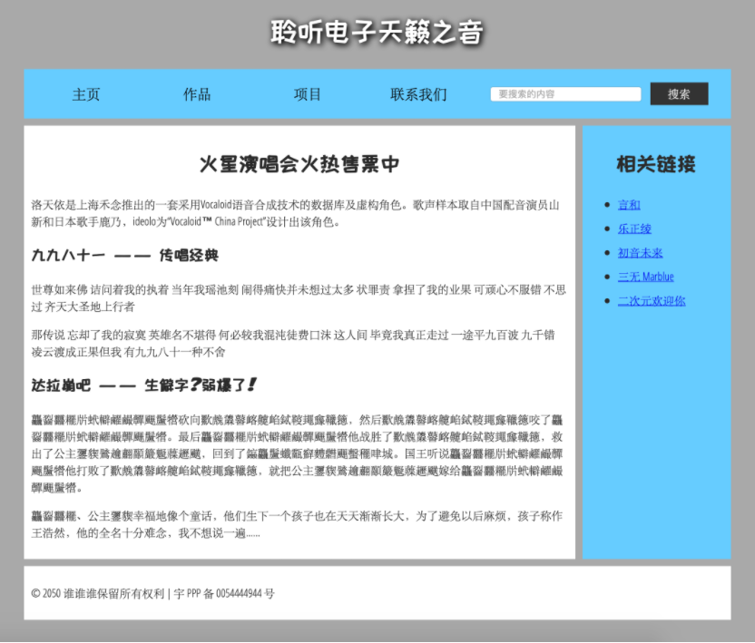

# 文档与网站架构

**敬畏语义，做到正确选用元素**。

原文链接：[文档与网站架构 - 学习 Web 开发 | MDN (mozilla.org)](https://developer.mozilla.org/zh-CN/docs/Learn/HTML/Introduction_to_HTML/Document_and_website_structure)

HTML 不仅能够定义网页的单独部分（例如“段落”或“图片”），还可以使用块级元素（例如“标题栏”、“导航菜单”、“主内容列”）来定义网站中的复合区域。本文将探讨如何规划基本的网站结构，并根据规划的结构来编写 HTML。

## 文档的基本组成部分

网页的外观多种多样，但是除了全屏视频或游戏，或艺术作品页面，或只是结构不当的页面以外，都倾向于使用类似的标准组件：

- 页眉

  通常横跨于整个页面顶部有一个大标题 和/或 一个标志。 这是网站的主要一般信息，通常存在于所有网页。

- 导航栏

  指向网站各个主要区段的超链接。通常用菜单按钮、链接或标签页表示。类似于标题栏，导航栏通常应在所有网页之间保持一致，否则会让用户感到疑惑，甚至无所适从。

- 主内容

  中心的大部分区域是当前网页大多数的独有内容，例如视频、文章、地图、新闻等。这些内容是网站的一部分，且会因页面而异。

- 侧边栏

  一些外围信息、链接、引用、广告等。通常与主内容相关（例如一个新闻页面上，侧边栏可能包含作者信息或相关文章链接），还可能存在其他的重复元素，如辅助导航系统。

- 页脚

  横跨页面底部的狭长区域。和标题一样，页脚是放置公共信息（比如版权声明或联系方式）的，一般使用较小字体，且通常为次要内容。 还可以通过提供快速访问链接来进行 SEO。

如下：



通过合适的 CSS， 你可以使用相当多种的任意页面元素来环绕在不同的页面区域来做成你想要的样子，但我们要**敬畏语义，做到正确选用元素**。

为了实现语义化标记，HTML 提供了明确这些区段的专用标签，例如：

- [`<head>`](https://developer.mozilla.org/zh-CN/docs/Web/HTML/Element/header)：页眉。
- [`nav`](https://developer.mozilla.org/zh-CN/docs/Web/HTML/Element/nav)：导航栏。
- [`<main>`](https://developer.mozilla.org/zh-CN/docs/Web/HTML/Element/main)：主内容。主内容中还可以有各种子内容区段，可用 `article`、`section`、 `div`  等元素表示。
- [`<aside>`](https://developer.mozilla.org/zh-CN/docs/Web/HTML/Element/aside)：侧边栏，经常嵌入到 `<main>` 中。
- [`<footer>`](https://developer.mozilla.org/zh-CN/docs/Web/HTML/Element/footer)：页脚。

如下所示：

```html
<!DOCTYPE html>
<html>
  <head>
    <meta charset="utf-8">
    <title>二次元俱乐部</title>
    <link href="https://fonts.googleapis.com/css?family=Open+Sans+Condensed:300|Sonsie+One" rel="stylesheet">
    <link href="https://fonts.googleapis.com/css?family=ZCOOL+KuaiLe" rel="stylesheet">
    <link href="style.css" rel="stylesheet">
  </head>

  <body>
    <header> <!-- 本站所有网页的统一主标题 -->
     	 <h1>聆听电子天籁之音</h1>
        <nav> <!-- 本站统一的导航栏 -->
            <ul>
                <li><a href="#">主页</a></li>
                <!-- 共n个导航栏项目，省略…… -->
            </ul>

            <form> <!-- 搜索栏是站点内导航的一个非线性的方式。 -->
                <input type="search" name="q" placeholder="要搜索的内容">
                <input type="submit" value="搜索">
            </form>
        </nav>
    </header>

    <main> <!-- 网页主体内容 -->
      <article>
        <!-- 此处包含一个 article（一篇文章），内容略…… -->
      </article>

      <aside> <!-- 侧边栏在主内容右侧 -->
        <h2>相关链接</h2>
        <ul>
          <li><a href="#">这是一个超链接</a></li>
          <!-- 侧边栏有n个超链接，略略略…… -->
        </ul>
      </aside>
    </main>

    <footer> <!-- 本站所有网页的统一页脚 -->
      <p>© 2050 某某保留所有权利</p>
    </footer>
  </body>
</html>
```

## HTML 元素布局细节

理解所有 HTML 区段元素具体含义是很有益处的，这一点将随着个人 web 开发经验的逐渐丰富日趋显现。更多细节请查阅 [HTML 元素参考](https://developer.mozilla.org/zh-CN/docs/Web/HTML/Element)。现在，你只需要理解以下主要元素的意义：

- `<main>`：存放每个页面独有的内容。每个页面上只能用一次 `<main>`，且直接位于 `<body>` 中。最好不要把它嵌套进其它元素。

- `<article>`：包围的内容即一篇文章，与页面其它部分无关（比如一篇博文）。
- `<section>`：与 `<article>` 类似，但 `<section>` 更适用于组织页面使其按功能（比如迷你地图、一组文章标题和摘要）分块。一般的最佳用法是：以 标题 作为开头；也可以把一篇 `<article>` 分成若干部分并分别置于不同的 `<section>` 中，也可以把一个区段 `<section>` 分成若干部分并分别置于不同的 `<article>` 中，取决于上下文。
- `<aside>`：包含一些间接信息（术语条目、作者简介、相关链接，等等）。

- `<header>`：是简介形式的内容。如果它是 `<body>` 的子元素，那么就是网站的全局页眉。如果它是 `<article>` 或 `<section>`  的子元素，那么它是这些部分特有的页眉（此 `<header>` 非彼 标题）。

- `<nav>`：包含页面主导航功能。其中不应包含二级链接等内容。
- `<footer>`：包含了页面的页脚部分。

### 无语义元素

有时你会发现，对于一些要组织的项目或要包装的内容，现有的语义元素均不能很好对应。有时候你可能只想将一组元素作为一个单独的实体来修饰来响应单一的用 CSS 或 JavaScript。为了应对这种情况，HTML提供了 `<div>` 和 `<span>` 元素。应配合使用 class 属性提供一些标签，使这些元素能易于查询。

`<span> `是一个内联的（inline）无语义元素，最好只用于无法找到更好的语义元素来包含内容时，或者不想增加特定的含义时。例如：

```html
<p>国王喝得酩酊大醉，在凌晨 1 点时才回到自己的房间，踉跄地走过门口。<span class="editor-note">[编辑批注：此刻舞台灯光应变暗]</span>.</p>
```


`<div>` 是一个块级无语义元素，应仅用于找不到更好的块级元素时，或者不想增加特定的意义时。例如，一个电子商务网站页面上有一个一直显示的购物车组件：

```html
<div class="shopping-cart">
  <h2>购物车</h2>
  <ul>
    <li>
      <p><a href=""><strong>银耳环</strong></a>：$99.95.</p>
      
    </li>
    <li>
      ...
    </li>
  </ul>
  <p>售价：$237.89</p>
</div>
```

这里不应使用 `<aside>`，因为它和主内容并没有必要的联系（你想在任何地方都能看到它）。甚至不能用 `<section>` ，因为它也不是页面上主内容的一部分。所以在这种情况下就应使用 `<div>`，为满足无障碍使用特征，还应为购物车的标题设置一个可读标签。

> **警告：**`<div>` 非常便利但容易被滥用。由于它们没有语义值，会使 HTML 代码变得混乱。要小心使用，只有在没有更好的语义方案时才选择它，而且要尽可能少用， 否则文档的升级和维护工作会非常困难。

### 换行与水平分割线

有时会用到 `<br>`和 `<hr>` 两个元素，需要介绍一下。

`<br>` 可在段落中进行换行；`<br>` 是唯一能够生成多个短行结构（例如邮寄地址或诗歌）的元素。比如：

```html
<p>从前有个人叫小高<br>
他说写 HTML 感觉最好<br>
但他写的代码结构语义一团糟<br>
他写的标签谁也懂不了。</p>
```

`<hr>` 元素在文档中生成一条水平分割线，表示文本中主题的变化（例如话题或场景的改变）。一般就是一条水平的直线。例如：

```html
<p>原来这唐僧是个慈悯的圣僧。他见行者哀告，却也回心转意道：“既如此说，且饶你这一次。再休无礼。如若仍前作恶，这咒语颠倒就念二十遍！”行者道：“三十遍也由你，只是我不打人了。”却才伏侍唐僧上马，又将摘来桃子奉上。唐僧在马上也吃了几个，权且充饥。</p>
<hr>
<p>却说那妖精，脱命升空。原来行者那一棒不曾打杀妖精，妖精出神去了。他在那云端里，咬牙切齿，暗恨行者道：“几年只闻得讲他手段，今日果然话不虚传。那唐僧已此不认得我，将要吃饭。若低头闻一闻儿，我就一把捞住，却不是我的人了。不期被他走来，弄破我这勾当，又几乎被他打了一棒。若饶了这个和尚，诚然是劳而无功也。我还下去戏他一戏。”</p>
```

## 规划一个简单的网站

原文链接：[规划网站步骤](https://developer.mozilla.org/zh-CN/docs/Learn/HTML/Introduction_to_HTML/Document_and_website_structure#规划一个简单的网站)

在完成页面内容的规划后，一般应按部就班地规划整个网站的内容，要可能带给用户最好的体验，需要哪些页面、如何排列组合这些页面、如何互相链接等问题不可忽略。这些工作称为[信息架构](https://developer.mozilla.org/zh-CN/docs/Glossary/Information_architecture)。在大型网站中，大多数规划工作都可以归结于此，而对于一个只有几个页面的简单网站，规划设计过程可以更简单，更有趣！

1. 时刻记住，大多数（不是全部）页面会使用一些相同的元素，例如导航菜单以及页脚内容。若网站为商业站点，不妨在所有页面的页脚都加上联系方式。请记录这些对所有页面都通用的内容：
   - 页眉：标题和 Logo。
   - 页脚：联系方式和版权声明。

2. 接下来，可为页面结构绘制草图（这里与前文那个站点页面的截图类似）。记录每一块的作用：

3. 下面，对于期望添加进站点的所有其它（通用内容以外的）内容展开头脑风暴，直接罗列出来。
4. 下一步，试着对这些内容进行分组，这样可以让你了解哪些内容可以放在同一个页面。这种做法和 [卡片分类法](https://developer.mozilla.org/zh-CN/docs/Glossary/Card_sorting) 非常相似。

5. 接下来，试着绘制一个站点地图的草图，使用一个气泡代表网站的一个页面，并绘制连线来表示页面间的一般工作流。主页面一般置于中心，且链接到其他大多数页面；小型网站的大多数页面都可以从主页的导航栏中链接跳转。也可记录下内容的显示方式。