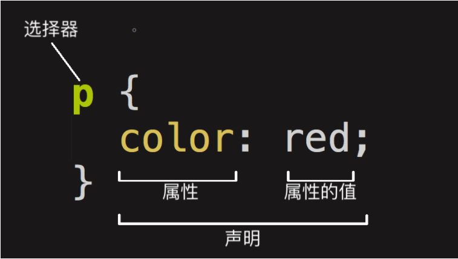

# 什么是 CSS

原文链接：[什么是CSS? - 学习 Web 开发 | MDN (mozilla.org)](https://developer.mozilla.org/zh-CN/docs/Learn/CSS/First_steps/What_is_CSS)

CSS（层叠样式表）让你可以创建好看的网页。

在 [HTML概述](https://developer.mozilla.org/zh-CN/docs/learn/HTML/Introduction_to_HTML) 模块我们学习了HTML是什么，以及如何使用它来组成页面。 浏览器能够解析这些页面。标题部分看起来会比正常文本更大，段落则会另起一行，并且相互之间会有一定间隔。链接通过下划线和不同的颜色与其他文本区分开来。这些都是浏览器的默认样式——当开发者没有指定样式时，浏览器通过这些最简单的样式使页面具有基本可读性。

如果所有网站都像上图那样，互联网就会非常枯燥。但是使用 CSS 就可以完全控制浏览器如何显示 HTML 元素，从而充分展示你喜欢的设计样式。

## CSS 用来干什么？

CSS 是用来指定文档如何展示给用户的一门语言——如网页的样式、布局、等等。

一份**文档**是由标记语言组织起来的文本文件 —— [HTML](https://developer.mozilla.org/zh-CN/docs/Glossary/HTML) 是最常见的标记语言, 但你可能也听说过其他可标记语言，如 [SVG](https://developer.mozilla.org/zh-CN/docs/Glossary/SVG) 或 [XML](https://developer.mozilla.org/zh-CN/docs/Glossary/XML)。

**展示**一份文档给用户实际上是将文档变成用户可用的文件。[Browsers](https://developer.mozilla.org/zh-CN/docs/Glossary/Browser)：如 [Firefox (en-US)](https://developer.mozilla.org/en-US/docs/Glossary/Mozilla_Firefox)，[Chrome](https://developer.mozilla.org/zh-CN/docs/Glossary/Google_Chrome), 或 [Edge (en-US)](https://developer.mozilla.org/en-US/docs/Glossary/Microsoft_Edge)，都可以将文档在电脑屏幕、投影仪或打印机等设备上进行可视化。

> **注意**: 浏览器有时候也被称为 [user agent](https://developer.mozilla.org/zh-CN/docs/Glossary/User_agent)，大致可以当这个程序是一个存在于计算机系统中的人。 当我们讨论 CSS 时，浏览器是 User agent 的主要形式， 然而它并不是唯一的一个。还有其他可用的 user agents — 像是那些可以把 HTML 和 CSS文档转换为可以打印的 PDF 文档的软件。

CSS 可以用于给文档添加样式 —— 比如改变标题和链接的[颜色](https://developer.mozilla.org/zh-CN/docs/Web/CSS/color_value)及[大小](https://developer.mozilla.org/zh-CN/docs/Web/CSS/font-size)。它也可用于创建布局 —— 比如将一个单列文本变成包含主要内容区域和存放相关信息的侧边栏区域的[布局](https://developer.mozilla.org/zh-CN/docs/Web/CSS/Layout_cookbook/Column_layouts)。它甚至还可以用来做一些特效，比如[动画](https://developer.mozilla.org/zh-CN/docs/Web/CSS/CSS_Animations)。查看本段内容中所给出的特定案例。

## CSS 语法

CSS是一门基于规则的语言 —— 你能定义用于你的网页中特定元素样式的一组规则。

 比如“我希望页面中的主标题是红色的大字”：

```css
h1 {
    color: red;
    font-size: 5em;
}
```




- 语法由一个选择器（selector）起头，它选择了我们将要用来添加样式的 HTML 元素，选择器由不同的类型，上述选择器有不同的类型，上述选择器为元素选择器，表示选择所有的 `<p>` 元素。

- 接着输入一对大括号`{}`， 在大括号内部定义一个或多个形式为 `property:value` 形式的声明，每个声明都指定了我们所选择元素的一个属性，之后跟一个我们想赋给这个属性的值。冒号之前是属性，冒号之后是值，不同的 CSS [属性(properties) (en-US)](https://developer.mozilla.org/en-US/docs/Glossary/property/CSS) 对应不同的合法值。

一个 CSS 样式可以包含多个规则集：

```css
h1 {
    color: red;
    font-size: 5em;
}

p {
    color: black;
}
```

## CSS 模块

你可以通过 CSS 为许多东西添加样式，CSS 由许多*模块（modules）* 构成。

### CSS 规范

所有的标准 Web 技术（HTML, CSS, JavaScript等）都被定义在一个巨大的文档中，称作规范 specifications（或者简称为 "specs"）。它是由像是 [W3C (en-US)](https://developer.mozilla.org/en-US/docs/Glossary/W3C), [WHATWG](https://developer.mozilla.org/zh-CN/docs/Glossary/WHATWG), [ECMA](https://developer.mozilla.org/zh-CN/docs/Glossary/ECMA) 或 [Khronos (en-US)](https://developer.mozilla.org/en-US/docs/Glossary/Khronos) 这些规范化组织所发布的，其中还定义了各种技术是如何工作的。

CSS 也不例外 — 它是由W3C(万维网联盟)中的一个名叫 [CSS Working Group](https://www.w3.org/Style/CSS/) 团体发展起来的。这个团体是由浏览器厂商和其他公司中对 CSS 感兴趣的人作为代表组成的。