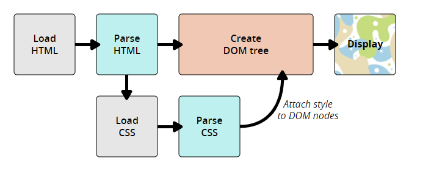

# CSS 如何运行

原文链接：[CSS如何运行 - 学习 Web 开发 | MDN (mozilla.org)](https://developer.mozilla.org/zh-CN/docs/Learn/CSS/First_steps/How_CSS_works)

## CSS 是怎么工作的？

当浏览器展示一个文件的时候，它必须兼顾文件的内容和文件的样式信息，下面我们会了解到它处理文件的标准的流程。需要知道的是，下面的步骤是浏览加载网页的简化版本，而且不同的浏览器在处理文件的时候会有不同的方式，但是下面的步骤基本都会出现。

1. 浏览器载入 HTML 文件（比如从网络上获取）。
2. 将 HTML 文件转化成一个DOM（Document Object Model），**DOM 是文件在计算机内存中的表现形式**，下一节将更加详细的解释 DOM。
3. 接下来，浏览器会拉取该 HTML 相关的大部分资源，比如嵌入到页面的图片、视频和 CSS 样式。JavaScript 则会稍后进行处理。
4. 浏览器拉取到 CSS 之后会进行解析，根据选择器的不同类型（比如 element、class、id 等等）把他们分到不同的“桶”中。浏览器基于它找到的不同的选择器，将不同的规则（基于选择器的规则，如元素选择器、类选择器、id 选择器等）应用在对应的 DOM 的节点中，并添加节点依赖的样式（这个中间步骤称为渲染树）。
5. 上述的规则应用于渲染树之后，渲染树会依照应该出现的结构进行布局。
6. 网页展示在屏幕上（这一步被称为着色）。



## DOM

**DOM（Document Object Model），DOM 是文件在计算机内存中的表现形式**。

一个 DOM 有一个树形结构，标记语言中的每一个元素、属性以及每一段文字都对应着结构树中的一个节点（Node/DOM 或 DOM node）。节点由节点本身和其他 DOM 节点的关系定义，有些节点有父节点，有些节点有兄弟节点（同级节点）。

对于 DOM 的理解会很大程度上帮助你设计、调试和维护你的 CSS，因为 DOM 是你的 CSS 样式和文件内容的结合。当你使用浏览器 F12 调试的时候你需要操作DOM 以查看使用了哪些规则。

### 一个 DOM 案例

不同于很长且枯燥的案例，这里我们通过一个 HTML 片段来了解 HTML 怎么转化成 DOM。HTML 文档内容如下所示：

```html
<p>
  Let's use:
  <span>Cascading</span>
  <span>Style</span>
  <span>Sheets</span>
</p>
```

在这个 DOM 中，`<p>`元素对应了父节点，它的子节点是一个 text 节点和三个对应了`<span>`元素的节点，`SPAN`节点同时也是他们中的 Text 节点的父节点，它的 DOM 结构如下所示：

```
P
├─ "Let's use:"
├─ SPAN
|  └─ "Cascading"
├─ SPAN
|  └─ "Style"
└─ SPAN
   └─ "Sheets"
```

### 应用 CSS 到 DOM

同样的HTML代码：

```html
<p>
  Let's use:
  <span>Cascading</span>
  <span>Style</span>
  <span>Sheets</span>
</p>
```

添加 CSS 代码：

```css
span {
  border: 1px solid black;
  background-color: lime;
}
```

浏览器会解析HTML并创造一个DOM，然后解析CSS。可以看到唯一的选择器就是`span`元素选择器，浏览器处理规则会非常快！把同样的规则直接使用在三个`<span> `标签上，然后渲染出图像到屏幕。

### 无法解析的 CSS

我们提到了浏览器并不会同时实现所有的新 CSS，此外很多人也不会使用最新版本的浏览器。鉴于 CSS 一直不断的开发，因此领先于浏览器可以识别的范围，那么你也许会好奇当浏览器遇到无法解析的 CSS 选择器或声明的时候会发生什么呢？

答案就是浏览器什么也不会做，继续解析下一个 CSS 样式！

如果一个浏览器在解析你所书写的 CSS 规则的过程中遇到了无法理解的属性或者值，它会忽略这些并继续解析下面的 CSS 声明。在你书写了错误的 CSS 代码（或者误拼写），又或者当浏览器遇到对于它来说很新的还没有支持的 CSS 代码的时候上述的情况同样会发生（直接忽略）。

相似的，当浏览器遇到无法解析的选择器的时候，他会直接忽略整个选择器规则，然后解析下一个 CSS 选择器。


这样做好处多多，代表着你使用最新的 CSS 优化的过程中浏览器遇到无法解析的规则也不会报错。当你为一个元素指定多个 CSS 样式的时候，浏览器会加载样式表中的最后的 CSS 代码进行渲染（样式表，优先级等请读者自行了解），也正因为如此，你可以为同一个元素指定多个 CSS 样式来解决有些浏览器不兼容新特性的问题（比如指定两个`width`）。

这一特点在你想使用一个很新的 CSS 特性但是不是所有浏览器都支持的时候（浏览器兼容）非常有用，举例来说，一些老的浏览器不接收 `calc()`(calculate 的缩写，CSS3 新增，为元素指定动态宽度、长度等，注意此处的动态是计算之后得一个值)作为一个值。我可能使用它结合像素为一个元素设置了动态宽度，老式的浏览器由于无法解析忽略这一行；新式的浏览器则会把这一行解析成像素值，并且覆盖第一行指定的宽度。

```css
.box {
  width: 500px;
  width: calc(100% - 50px);
}
```

