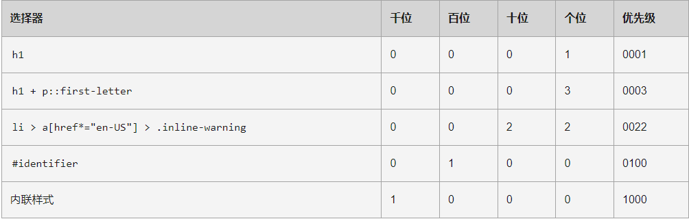

# 层叠与继承

原文链接：[层叠与继承 - 学习 Web 开发 | MDN (mozilla.org)](https://developer.mozilla.org/zh-CN/docs/Learn/CSS/Building_blocks/Cascade_and_inheritance)

本文旨在让你理解CSS的一些最基本的概念——层叠、优先级和继承——这些概念决定着如何将CSS应用到HTML中，以及如何解决冲突。

## 冲突规则

CSS 代表**层叠样式表（Cascading Style Sheets）**，理解第一个词 *cascading* 很重要——cascade 的表现方式是理解 CSS 的关键。

在某些时候，在做一个项目过程中你会发现一些应该产生效果的样式没有生效。通常的原因是你创建了两个应用于同一个元素的规则。**cascade** 和它密切相关的概念是 **specificity**，决定在发生冲突的时候应该使用哪条规则。设计元素样式的规则可能不是期望的规则，因此需要了解这些机制是如何工作的。

这里也有**继承**的概念，也就是在默认情况下，一些 CSS 属性继承当前元素的父元素上设置的值，有些则不继承，这也可能导致一些和期望不同的结果。

### 层叠

stylesheets **cascade（样式表层叠）** — 简单的说，CSS 规则的顺序很重要；**当应用两条同级别的规则到一个元素的时候，写在后面的就是实际使用的规则**。

比如，我们有两个关于 `h1` 的规则。`h1` 最后显示蓝色——这些规则有相同的优先级，所以顺序在最后的生效。

```css
h1 { 
    color: red; 
}
h1 { 
    color: blue; 
}
```

```html
<h1>This is my heading.</h1>
```

### 优先级

浏览器是根据优先级来决定当多个规则（不同的选择器）对应相同的元素的时候需要使用哪个规则：

- 一个**元素选择器**不是很具体——会选择页面上该类型的所有元素，所以它的优先级就会低一些。
- 一个**类选择器**稍微具体点——它会选择该页面中有特定 `class` 属性值的元素，所以它的优先级就要高一点。

```css
.main-heading { 
    color: red; 
}
        
h1 { 
    color: blue; 
}
```

```html
<h1 class="main-heading">This is my heading.</h1>
```

### 继承

继承也需要在上下文中去理解 —— 一些设置在父元素上的 CSS 属性是可以被子元素继承的，有些则不能。

举一个例子，如果你设置一个元素的 `color` 和 `font-family` ，每个在里面的元素也都会有相同的属性，除非你直接在元素上设置属性。

```html
body {
    color: blue;
}

span {
    color: black;
}
```

```css
<p>As the body has been set to have a color of blue this is inherited through the descendants.</p>
<p>We can change the color by targetting the element with a selector, such as this <span>span</span>.</p>
```

一些属性是不能继承的 — 举个例子如果你在一个元素上设置 width 50% ，所有的后代不会是父元素的宽度的 50% 。如果这个也可以继承的话，CSS 就会很难使用了!

**层叠**、**优先级**和**继承**这三个概念一起来控制 CSS 规则应用于哪个元素；在下面的内容中，我们将看到它们是如何协同工作的。

## 理解继承

一些设置在父元素上的 CSS 属性是可以被子元素继承的，有些则不能。

如下所示：

```html
<ul class="main">
    <li>Item One</li>
    <li>Item Two
        <ul>
            <li>2.1</li>
            <li>2.2</li>
        </ul>
    </li>
    <li>Item Three
        <ul class="special">
            <li>3.1
                <ul>
                    <li>3.1.1</li>
                    <li>3.1.2</li>
                </ul>
            </li>
            <li>3.2</li>
        </ul>
    </li>
</ul>
```

### 控制继承

CSS 为控制继承提供了四个特殊的通用属性值。每个 CSS 属性都接收这些值。

- inherit
  设置该属性会使子元素属性和父元素相同。实际上，就是 "开启继承"。
- initial
  设置属性值和浏览器默认样式相同。如果浏览器默认样式中未设置且该属性是自然继承的，那么会设置为 inherit 。
- unset
  将属性重置为自然值，也就是如果属性是自然继承那么就是 inherit，否则和 initial一样

> **注**: 还有一个新的属性, [`revert` (en-US)](https://developer.mozilla.org/en-US/docs/Web/CSS/revert)， 只有很少的浏览器支持。

```html
<ul>
    <li>Default <a href="#">link</a> color</li>
    <li class="my-class-1">Inherit the <a href="#">link</a> color</li>
    <li class="my-class-2">Reset the <a href="#">link</a> color</li>
    <li class="my-class-3">Unset the <a href="#">link</a> color</li>
</ul>
```

```css
body {
    color: green;
}
          
.my-class-1 a {
    color: inherit;
}
          
.my-class-2 a {
    color: initial;
}
          
.my-class-3 a {
    color: unset;
}
```

## 理解层叠

### 资源顺序

我们已经看到了顺序对于层叠的重要性。如果你有超过一条规则，而且都是相同的权重，那么最后面的规则会应用。可以理解为后面的规则覆盖前面的规则，直到最后一个开始设置样式。

### 优先级

在你了解了顺序的重要性后，会发现在一些情况下，有些规则在最后出现，但是却应用了前面的规则。这是因为前面的有更高的**优先级**——**它范围更小，选择器表达的语义更加具体**，因此浏览器就把它选择为元素的样式。

就像前面看到的，类选择器的权重大于元素选择器，因此类上定义的属性将覆盖应用于元素上的属性。

需要注意的是，规则冲突是会只有相同的属性会被覆盖。

这样可以避免重复的 CSS。一种常见的做法是给基本元素定义通用样式，然后给不同的元素创建对应的类。举个例子，在下面的样式中我给 2 级标题定义了通用样式，然后创建了一些类只修改部分属性的值。最初定义的值应用于所有标题，然后更具体的值通过对应类来实现。

```html
<h2>Heading with no class</h2>
<h2 class="small">Heading with class of small</h2>
<h2 class="bright">Heading with class of bright</h2>
```

```css
h2 {
    font-size: 2em;
    color: #000;
    font-family: Georgia, 'Times New Roman', Times, serif;
}
        
.small {
    font-size: 1em;
}
        
.bright {
    color: rebeccapurple;
}   
```

现在让我们来看看浏览器如何计算优先级。我们已经知道一个元素选择器比类选择器的优先级更低会被其覆盖。本质上，不同类型的选择器有不同的分数值，把这些分数相加就得到特定选择器的权重，然后就可以进行匹配。

一个选择器的优先级可以说是由四个部分相加 (分量)，可以认为是个十百千——四位数的四个位数：

1. **千位**： 如果声明在 [`style`](https://developer.mozilla.org/zh-CN/docs/Web/HTML/Global_attributes#attr-style) 的属性（内联样式）则该位得一分。这样的声明没有选择器，所以它得分总是1000。
2. **百位**： 选择器中包含 ID 选择器则该位得一分。
3. **十位**： 选择器中包含类选择器、属性选择器或者伪类则该位得一分。
4. **个位**：选择器中包含元素、伪元素选择器则该位得一分。

> **警告:** 在进行计算时不允许进行进位，例如，20 个类选择器仅仅意味着 20 个十位，而不能视为两个百位，也就是说，无论多少个类选择器的权重叠加，都不会超过一个 ID 选择器。



如：

```html
<div id="outer" class="container">
    <div id="inner" class="container">
        <ul>
            <li class="nav"><a href="#">One</a></li>
            <li class="nav"><a href="#">Two</a></li>
        </ul>
    </div>
</div>
```

```css
/* specificity: 0101 */
#outer a {
    background-color: red;
}
        
/* specificity: 0201 */
#outer #inner a {
    background-color: blue;
}

/* specificity: 0104 */
#outer div ul li a {
    color: yellow;
}

/* specificity: 0113 */
#outer div ul .nav a {
    color: white;
}

/* specificity: 0024 */
div div li:nth-child(2) a:hover {
    border: 10px solid black;
}

/* specificity: 0023 */
div li:nth-child(2) a:hover {
    border: 10px dashed black;
}

/* specificity: 0033 */
div div .nav:nth-child(2) a:hover {
    border: 10px double black;
}

a {
    display: inline-block;
    line-height: 40px;
    font-size: 20px;
    text-decoration: none;
    text-align: center;
    width: 200px;
    margin-bottom: 10px;
}

ul {
    padding: 0;
}

li {
    list-style-type: none;
}  
```

有一个特殊的 CSS 可以用来覆盖所有上面所有优先级计算，不过需要很小心的使用 — `!important`。用于修改特定属性的值， 能够覆盖普通规则的层叠。

```css
<p class="better">This is a paragraph.</p>
<p class="better" id="winning">One selector to rule them all!</p>
```


```css
#winning {
    background-color: red;
    border: 1px solid black;
}
  
/** !important **/
.better {
    background-color: gray;
    border: none !important;
}
    
p {
    background-color: blue;
    color: white;
    padding: 5px;
}           
```

## CSS 位置的影响

CSS 声明的重要性取决于——它让用户可以设置自定义样式表来覆盖开发人员定义的样式。

相互冲突的声明将按以下顺序适用，后一种声明将覆盖前一种声明：

1. 用户代理样式表中的声明（例如，浏览器的默认样式，在没有设置其他样式时使用）。
2. 用户样式表中的常规声明（由用户设置的自定义样式）。
3. 作者样式表中的常规声明（这些是我们 web 开发人员设置的样式）。
4. 作者样式表中的`!important`声明
5. 用户样式表中的`!important` 声明