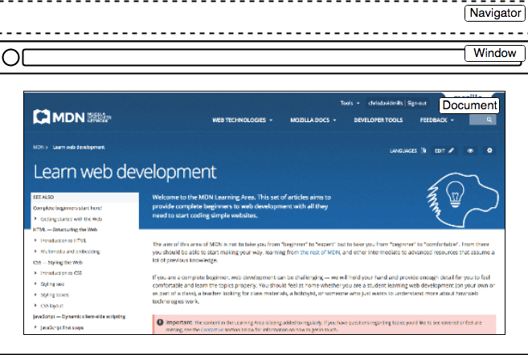
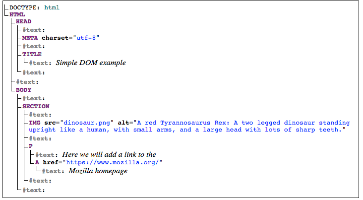

# 客户端 API

原文链接：[Web API简介 - 学习 Web 开发 | MDN (mozilla.org)](https://developer.mozilla.org/zh-CN/docs/Learn/JavaScript/Client-side_web_APIs/Introduction)

​       			[操作文档 - 学习 Web 开发 | MDN (mozilla.org)](https://developer.mozilla.org/zh-CN/docs/Learn/JavaScript/Client-side_web_APIs/Manipulating_documents)

​	 		  	[从服务器获取数据 - 学习 Web 开发 | MDN (mozilla.org)](https://developer.mozilla.org/zh-CN/docs/Learn/JavaScript/Client-side_web_APIs/Fetching_data)

​		  		 [绘图 - 学习 Web 开发 | MDN (mozilla.org)](https://developer.mozilla.org/zh-CN/docs/Learn/JavaScript/Client-side_web_APIs/Drawing_graphics)

​		 	  	[客户端存储 - 学习 Web 开发 | MDN (mozilla.org)](https://developer.mozilla.org/zh-CN/docs/Learn/JavaScript/Client-side_web_APIs/Client-side_storage)

应用程序接口（API）是基于编程语言构建的结构，使开发人员更容易地创建复杂的功能。它们抽象了复杂的代码，并提供一些简单的接口规则直接使用。


客户端 JavaScript 中有很多可用的 API —— 他们本身并不是 JavaScript 语言的一部分，却建立在 JavaScript 语言核心的顶部，为使用 JavaScript 代码提供额外的超强能力。他们通常分为两类：

- **浏览器 API **内置于Web浏览器中，能从浏览器和电脑周边环境中提取数据，并用来做有用的复杂的事情 。

- **第三方 API **缺省情况下不会内置于浏览器中，通常必须在 Web 中的某个地方获取代码和信息。


JavaScript，API 和其他 JavaScript 工具之间的关系

- JavaScript：一种内置于浏览器的高级脚本语言，您可以用来实现 Web 页面/应用中的功能。注意 JavaScript 也可用于其他象[Node](https://developer.mozilla.org/en-US/docs/Learn/Server-side/Express_Nodejs/Introduction)这样的的编程环境。
- 客户端  API：内置于浏览器的结构程序，位于 JavaScript 语言顶部，使您可以更容易的实现功能。
- 第三方 API：置于第三方普通的结构程序（例如Twitter，Facebook），使您可以在自己的 Web 页面中使用那些平台的某些功能。
- JavaScript 库：通常是包含具有[特定功能](https://developer.mozilla.org/en-US/docs/Learn/JavaScript/Building_blocks/Functions#custom_functions)的一个或多个 JavaScript 文件，把这些文件关联到您的 Web 页以快速或授权编写常见的功能。例如包含 jQuery 和Mootools。
- JavaScript 框架：从库开始的下一步，JavaScript 框架视图把 HTML、CSS、JavaScript 和其他安装的技术打包在一起，然后用来从头编写一个完整的 Web 应用。

##  常见浏览器 API

- **操作文档的 API **内置于浏览器中。最明显的例子是 [DOM（文档对象模型）](https://developer.mozilla.org/zh-CN/docs/Web/API/Document_Object_Model)API，它允许您操作 HTML 和 CSS，你可以创建、移除以及修改 HTML，动态地将新样式应用到您的页面，等等。每当您看到一个弹出窗口出现在一个页面上，或者显示一些新的内容时，这都是 DOM 的行为。 

  您可以在在 [Manipulating documents ](https://developer.mozilla.org/zh-CN/docs/Learn/JavaScript/Client-side_web_APIs/Manipulating_documents)中找到关于这些类型的API的更多信息。

- **从服务器获取数据的 API** ，用于更新网页的一小部分是相当好用的。这个看似很小的细节能对网站的性能和行为产生巨大的影响，如果您只是更新一个股票列表或者一些可用的新故事而不需要从服务器重新加载整个页面。使这成为可能的 API 包括 [`XMLHttpRequest `](https://developer.mozilla.org/zh-CN/docs/Web/API/XMLHttpRequest)和 [Fetch API](https://developer.mozilla.org/zh-CN/docs/Web/API/Fetch_API)。您也可能会遇到描述这种技术的术语 **Ajax**。

  您可以在 [Fetching data from the server](https://developer.mozilla.org/zh-CN/docs/Learn/JavaScript/Client-side_web_APIs/Fetching_data) 找到关于类似的API的更多信息。

- **用于绘制和操作图形的 API**，目前已被浏览器广泛支持，最流行的是允许您以编程方式更新包含在HTML [`<canvas>`](https://developer.mozilla.org/zh-CN/docs/Web/HTML/Element/canvas) 元素中的像素数据以创建 2D 和 3D 场景的 [Canvas](https://developer.mozilla.org/en-US/docs/Web/API/Canvas_API) 和 [WebGL](https://developer.mozilla.org/en-US/docs/Web/API/WebGL_API)。

  例如，您可以绘制矩形或圆形等形状，将图像导入到画布上，然后使用 Canvas API 对其应用滤镜（如棕褐色滤镜或灰度滤镜），或使用 WebGL 创建具有光照和纹理的复杂 3D 场景。

  这些 API 经常与用于创建动画循环的 API（例如[`window.requestAnimationFrame()`](https://developer.mozilla.org/zh-CN/docs/Web/API/Window/requestAnimationFrame)）和其他 API 一起不断更新诸如动画和游戏之类的场景。

- **音频和视频 API**，例如 [`HTMLMediaElement`](https://developer.mozilla.org/zh-CN/docs/Web/API/HTMLMediaElement)，[Web Audio API ](https://developer.mozilla.org/zh-CN/docs/Web/API/Web_Audio_API)和 [WebRTC ](https://developer.mozilla.org/zh-CN/docs/MDN/Doc_status/API/WebRTC)允许您使用多媒体来做一些非常有趣的事情，比如创建用于播放音频和视频的自定义UI控件，显示字幕字幕和您的视频，从网络摄像机抓取视频，通过画布操纵，或在网络会议中显示在别人的电脑上，或者添加效果到音轨（如增益，失真，平移等） 。

- **设备 API **，基本上是以对网络应用程序有用的方式操作和检索现代设备硬件中的数据的 API。我们已经讨论过访问设备位置数据的地理定位 API，因此您可以在地图上标注您的位置。

- **客户端存储 API **，在 Web 浏览器中的使用变得越来越普遍，如果您想创建一个应用程序来保存页面加载之间的状态，甚至让设备在处于脱机状态时可用，那么在客户端存储数据将会是非常有用的。例如使用 [Web Storage API ](https://developer.mozilla.org/zh-CN/docs/Web/API/Web_Storage_API)的简单的键 - 值存储以及使用 [IndexedDB API](https://developer.mozilla.org/zh-CN/docs/Web/API/IndexedDB_API) 的更复杂的表格数据存储。

## API 是如何工作的？

不同的 JavaScript API 以稍微不同的方式工作，但通常它们具有共同的特征和相似的主题。

- 它们是基于对象的。 API 使用一个或多个 [JavaScript objects](https://developer.mozilla.org/en-US/docs/Learn/JavaScript/Objects) 在您的代码中进行交互，这些对象用作 API 使用的数据（包含在对象属性中）的容器以及 API 提供的功能（包含在对象方法中）。

- 它们有可识别的入口点。使用 API 时，应确保知道 API 入口点的位置。

  文档对象模型（DOM）API 有一个更简单的入口点 —它的功能往往被发现挂在 [`Document`](https://developer.mozilla.org/zh-CN/docs/Web/API/Document) 对象, 或任何你想影响的 HTML 元素的实例，例如：

  ```js
  var em = document.createElement('em'); // create a new em element
  var para = document.querySelector('p'); // reference an existing p element
  em.textContent = 'Hello there!'; // give em some text content
  para.appendChild(em); // embed em inside para
  ```

- 它们使用事件来处理状态的变化。

  一些 Web API 不包含事件，但有些包含一些事件。当事件触发时，允许我们运行函数的处理程序（Event Handlers）。

  比如 XMLHttpRequest 对象的实例（每一个实例都代表一个到服务器的 HTTP 请求来取得某种新的资源）都有很多事件可用，例如  onload 事件在成功返回时就触发包含请求的资源：

  ```js
  var requestURL = 'https://mdn.github.io/learning-area/javascript/oojs/json/superheroes.json';
  var request = new XMLHttpRequest();
  request.open('GET', requestURL);
  request.responseType = 'json';
  request.send();
  
  request.onload = function() {
    var superHeroes = request.response;
    populateHeader(superHeroes);
    showHeroes(superHeroes);
  }
  ```

- 它们在适当的地方有额外的安全机制。


## DOM API

在编写 Web 页面或应用时，你最想做的事情之一就是以某种方式操作文档结构。这通常大量使用 [`Document`](https://developer.mozilla.org/zh-CN/docs/Web/API/Document)对象来控制 HTML 和样式信息的文档对象模型。

Web 浏览器的软件中有很多活动的程序片段，而许多片段 Web 开发人员无法使用 JavaScript 来控制或操作，尽管有局限性，Web API 仍然允许我们访问许多的功能，使我们用 Web 页做很多事情。

下面一张图展示了浏览器界面的主要组成部分：



- window 是载入浏览器的标签，在 JavaScript 中用 [`Window `](https://developer.mozilla.org/zh-CN/docs/Web/API/Window)对象来表示，使用这个对象的可用方法，你可以返回窗口的大小（参见[`Window.innerWidth`](https://developer.mozilla.org/zh-CN/docs/Web/API/Window/innerWidth)和[`Window.innerHeight`](https://developer.mozilla.org/zh-CN/docs/Web/API/Window/innerHeight)），操作载入窗口的文档，存储客户端上文档的特殊数据（例如使用本地数据库或其他存储设备），为当前窗口绑定 [event handler](https://developer.mozilla.org/en-US/docs/Learn/JavaScript/Building_blocks/Events#a_series_of_fortunate_events)，等等。
- navigator 表示浏览器存在于 web 上的状态和标识（即用户代理）。在 JavaScript 中，用 [`Navigator`](https://developer.mozilla.org/zh-CN/docs/Web/API/Navigator)来表示。你可以用这个对象获取一些信息，比如来自用户摄像头的地理信息、用户偏爱的语言、多媒体流等等。
- document（在浏览器中用 DOM 表示）是载入窗口的实际页面，在 JavaScript 中用 [`Document`](https://developer.mozilla.org/zh-CN/docs/Web/API/Document) 对象表示，你可以用这个对象来返回和操作文档中 HTML 和CSS 上的信息。例如获取 DOM 中一个元素的引用，修改其文本内容，并应用新的样式，创建新的元素并添加为当前元素的子元素，甚至把他们一起删除。


### 文档对象模型

在浏览器标签中当前载入的文档用文档对象模型来表示。这是一个由浏览器生成的“**树结构**”，使编程语言可以更加容易的访问 HTML 结构 — 例如浏览器自己在呈现页面时，使用它将样式和其他信息应用于正确的元素，而页面呈现完成以后，开发人员可以用 JavaScript 操作 DOM。

下面创建了一个简单的页面，包含了一个 `<section>` 元素，里面有一个图像和有链接的段落。HTML 源码如下：

```html
<!DOCTYPE html>
<html>
  <head>
    <meta charset="utf-8">
    <title>Simple DOM example</title>
  </head>
  <body>
      <section>
        
        <p>Here we will add a link to the <a href="https://www.mozilla.org/">Mozilla homepage</a></p>
      </section>
  </body>
</html>
```

另一方面，DOM 树如下所示：



> **注**：这个 DOM 树状图是用 Ian Hickson 的 [Live DOM viewer](https://software.hixie.ch/utilities/js/live-dom-viewer/) 生成的。

这里你可以看到，文档中每个元素和文本在树中都有它们自己的入口——称之为**节点**。你将用不同的术语来描述节点的类型和它们相对于其他节点的位置：

- **元素节点**：一个元素，存在于 DOM 中。
- **根节点**：树中顶层节点，在 HTML 的情况下，总是一个`HTML`节点（其他标记词汇，如 SVG 和定制 XML 将有不同的根元素）。
- **子节点**：直接位于另一个节点内的节点。例如上面例子中，`IMG`是`SECTION`的子节点。
- **后代节点**：位于另一个节点内*任意位置*的节点。例如上面例子中，`IMG `是 `SECTION` 的子节点，也是一个后代节点。`IMG `不是 `BODY` 的子节点，因为它在树中低了`BODY`两级，但它是 `BODY`的后代节点。
- **父节点**：里面有另一个节点的节点。例如上面的例子中 `BODY` 是 `SECTION` 的父节点。
- **兄弟节点**：DOM 树中位于同一等级的节点。例如上面例子中，`IMG `和 `P` 是兄弟节点。
- **文本节点**: 包含文字串的节点。


### 基本的 DOM 操作

#### 选择元素

首先需要选择它，并将它的引用存储在一个变量中。

```js
var link = document.querySelector('a');
```

有很多方法可以选择一个元素，[`Document.querySelector() `](https://developer.mozilla.org/zh-CN/docs/Web/API/Document/querySelector)是推荐的主流方法，它允许你使用CSS选择器选择元素，使用很方便。

如果想对多个元素进行匹配和操作，你可以使用[`Document.querySelectorAll()`](https://developer.mozilla.org/zh-CN/docs/Web/API/Document/querySelectorAll)，这个方法匹配文档中每个匹配选择器的元素，并把它们的引用存储在一个一个数组中。

对于获取元素引用，还有一些更旧的方法，如：

- [`Document.getElementById()`](https://developer.mozilla.org/zh-CN/docs/Web/API/Document/getElementById)，选择一个`id`属性值已知的元素。

  ```html
  <p id="myId">My paragraph</p>
  ```

  ```js
  var elementRef = document.getElementById('myId');
  ```

- [`Document.getElementsByTagName()`](https://developer.mozilla.org/zh-CN/docs/Web/API/Document/getElementsByTagName)，返回页面中包含的所有已知类型元素的数组，元素类型作为参数传递给函数。

  ```js
  var elementRefArray = document.getElementsByTagName('p');
  ```

- 现在你有了一个存储在变量中的元素引用，你可以使用它的可用属性和方法来操作它。比如，更新 Node.textContent 属性的值来修改链接中的文字。

  ```js
  link.textContent = 'Mozilla Developer Network';
  ```

  我们也能修改链接指向的 URL，使得它被点击时不会走向错误的位置。

  ```js
  link.href = 'https://developer.mozilla.org';
  ```

#### 创建元素

创建并放置新的节点。

1. 我们先获取到 `<section>` 元素的引用；

   ```js
   var sect = document.querySelector('section');
   ```

2. 现在用 [`Document.createElement() `](https://developer.mozilla.org/zh-CN/docs/Web/API/Document/createElement)创建一个新的段落，用与之前相同的方法赋予相同的文本；

   ```js
   var para = document.createElement('p');
   para.textContent = 'We hope you enjoyed the ride.';
   ```

3. 现在可以用 [`Node.appendChild()`](https://developer.mozilla.org/zh-CN/docs/Web/API/Node/appendChild)方法在 `<section>` 内追加新的段落；

   ```js
   sect.appendChild(para);
   ```

4. 最后，在内部链接的段落中添加文本节点；

   ```js
   var text = document.createTextNode(' — the premier source for web development knowledge.');
   ```

5. 现在获取内部连接的段落的引用，并把文本节点绑定到这个节点。

   ```js
   var linkPara = document.querySelector('p');
   linkPara.appendChild(text);
   ```

#### 移动和删除元素

如果你想把具有内部链接的段落移到 sectioin 的底部，简单的做法是：

```js
sect.appendChild(linkPara);
```

删除节点也非常的简单，至少，你拥有要删除的节点和其父节点的引用。在当前情况下，我们只要使用[`Node.removeChild()`](https://developer.mozilla.org/zh-CN/docs/Web/API/Node/removeChild)即可，如下：

```js
sect.removeChild(linkPara);
```

要删除一个仅基于自身引用的节点可能稍微有点复杂，这也是很常见的。没有方法会告诉节点删除自己，所以你必须像下面这样操作。

```js
linkPara.parentNode.removeChild(linkPara);
```

#### 操作样式

通过 JavaScript 以不同的方式来操作 CSS 样式是可能的。

首先，使用 [`Document.stylesheets`](https://developer.mozilla.org/zh-CN/docs/Web/API/Document/styleSheets)返回[`CSSStyleSheet`](https://developer.mozilla.org/zh-CN/docs/Web/API/CSSStyleSheet)数组，获取绑定到文档的所有样式表的序列。然后添加/删除想要的样式。然而，我们并不想扩展这些特性，因此它们在操作样式方面有点陈旧和困难，而现在有了更容易的方法。

第一种方法是直接在想要动态设置样式的元素内部添加内联样式。。这是用[`HTMLElement.style` (en-US)](https://developer.mozilla.org/en-US/docs/Web/API/HTMLElement/style) 属性来实现。这个属性包含了文档中每个元素的内联样式信息。你可以设置这个对象的属性直接修改元素样式。

```js
para.style.color = 'white';
para.style.backgroundColor = 'black';
para.style.padding = '10px';
para.style.width = '250px';
para.style.textAlign = 'center';
```

> **注意**: CSS 样式的 JavaSript 属性版本以小驼峰式命名法书写，而 CSS 版本带连接符号（`backgroundColor` 对 `background-color`）。


现在我们来看看另一个操作文档样式的常用方法。

在 HTML 的 `<head>` 中添加下列代码：

```html
<style>
.highlight {
  color: white;
  background-color: black;
  padding: 10px;
  width: 250px;
  text-align: center;
}
</style>
```

现在我们改为使用HTML操作的常用方法 — [`Element.setAttribute()`](https://developer.mozilla.org/zh-CN/docs/Web/API/Element/setAttribute) 。 这里有两个参数，你想在元素上设置的属性，你要为它设置的值。在这种情况下，我们在段落中设置类名为 highlight：

```js
para.setAttribute('class', 'highlight');
```

## 从服务器上获取数据

最初加载页面很简单——你为网站发送一个请求到服务器， 只要没有出错你将会获取资源并显示网页到你的电脑上。这个模型的问题是当你想更新网页的任何部分，例如显示一套新的产品或者加载一个新的页面，你需要再一次加载整个页面。这是非常浪费的并且导致了差的用户体验尤其是现在的页面越来越大且越来越复杂。

所以 Web 需要一种可以允许请求小块数据例如（ [HTML](https://developer.mozilla.org/en-US/docs/Web/HTML)、[XML](https://developer.mozilla.org/zh-CN/docs/Glossary/XML)、[JSON](https://developer.mozilla.org/en-US/docs/Learn/JavaScript/Objects/JSON) 或纯文本)）和 仅在需要时显示它们的技术，从而帮助解决上述问题。

### Ajax

在早期，这种通用技术被称为 Asynchronous JavaScript and XML(Ajax)， 因为它倾向于使用 XMLHttpRequest 来请求 XML 数据。

Ajax 模型包括使用 Web API 作为代理来更智能地请求数据，而不仅仅是让浏览器重新加载整个页面。让我们来思考这个意义：

- 页面更新速度更快，您不必等待页面刷新，这意味着该网站体验感觉更快，响应更快。
- 每次更新都会下载更少的数据，这意味着更少地浪费带宽。在宽带连接的桌面上这可能不是一个大问题，但是在移动设备和发展中国家没有无处不在的快速互联网服务是一个大问题。

为了进一步提高速度，有些网站还会在首次请求时将资产和数据存储在用户的计算机上，这意味着在后续访问中，他们将使用本地版本，而不是在首次加载页面时下载新副本。 内容仅在更新后从服务器重新加载。

### XMLHttpRequest

```js
const verseChoose = document.querySelector('select');
const poemDisplay = document.querySelector('pre');

verseChoose.onchange = function() {
  const verse = verseChoose.value;
  updateDisplay(verse);
};


let request = new XMLHttpRequest();
request.open('GET', url);
request.responseType = 'text';
request.onload = function() {
  poemDisplay.textContent = request.response;
};
request.send();
```


### Fetch

```js
fetch(url).then(function(response) {
  response.text().then(function(text) {
    poemDisplay.textContent = text;
  });
});
```


## 绘图

浏览器包含一些非常强大的图形编程工具，从可缩放矢量图形（Scalable Vector Graphics，简称 [SVG](https://developer.mozilla.org/zh-CN/docs/Web/SVG)）语言到用于在 HTML [`<SVG>`](https://developer.mozilla.org/zh-CN/docs/Web/HTML/Element/canvas) 元素上绘制图形的API（参阅 [Canvas API](https://developer.mozilla.org/zh-CN/docs/Web/API/Canvas_API) 和 [WebGL](https://developer.mozilla.org/zh-CN/docs/Web/API/WebGL_API)）。


### `<canvas>`

在 HTML 文件中插入一个 [`<canvas>`](https://developer.mozilla.org/zh-CN/docs/Web/HTML/Element/canvas) 元素，以界定网页中的绘图区域。这很简单，如下所示：

```html
<canvas width="320" height="240"></canvas>
```

网页中会生成一块 320 × 240 像素的画布。

在 canvas 标签内，你可以放置一些反馈信息，如果用户的浏览器不支持画布功能，这些内容就会显示出来。

```html
<canvas width="320" height="240">
  <p>卧槽你的浏览器竟然不支持 canvas！</p>
</canvas>
```


一个例子

1. 在 HTML 页面里添加 `<canvas>` 元素。

   ```html
   <canvas class="myCanvas">
     <p>添加恰当的反馈信息。</p>
   </canvas>
   ```

2. 获取 `<canvas>` 元素。

   ```js
   var canvas = document.querySelector('.myCanvas');
   var width = canvas.width = window.innerWidth;
   var height = canvas.height = window.innerHeight;
   ```

3. 获取画布上下文（canvas context）并完成设置。

   ```js
   var ctx = canvas.getContext('2d');
   ```

   开始前我们先初尝一下 canvas API。在 JS 代码中添加以下两行，将画布背景涂成黑色：

   ```js
   ctx.fillStyle = 'rgb(0, 0, 0)';
   ctx.fillRect(0, 0, width, height);
   ```
   

#### 2D 画布基础

画布左上角的坐标是(0, 0)，横坐标（x）轴向右延伸，纵坐标（y）轴向下延伸。	

#### 绘制矩形

```js
ctx.fillStyle = 'rgb(255, 0, 0)';
ctx.fillRect(50, 50, 100, 150);
```

保存并刷新，画布上将出现一个红色的矩形。其左边和顶边与画布边缘距离均为 50 像素（由前两个参数指定），宽 100 像素、高 150 像素（由后两个参数指定）。

#### 描边（stroke）和线条宽度

```js
ctx.strokeStyle = 'rgb(255, 255, 255)';
ctx.strokeRect(25, 25, 175, 200);
```

```js
ctx.lineWidth = 5;
```

#### 绘制路径

一些通用的方法和属性将贯穿以下全部内容：

- [`beginPath()`](https://developer.mozilla.org/zh-CN/docs/Web/API/CanvasRenderingContext2D/beginPath)：在钢笔当前所在位置开始绘制一条路径。在新的画布中，钢笔起始位置为 (0, 0)。
- [`moveTo()`](https://developer.mozilla.org/zh-CN/docs/Web/API/CanvasRenderingContext2D/moveTo)：将钢笔移动至另一个坐标点，不记录、不留痕迹，只将钢笔“跳”至新位置。
- [`fill()`](https://developer.mozilla.org/zh-CN/docs/Web/API/CanvasRenderingContext2D/fill)：通过为当前所绘制路径的区域填充颜色来绘制一个新的填充形状。
- [`stroke()`](https://developer.mozilla.org/zh-CN/docs/Web/API/CanvasRenderingContext2D/stroke)：通过为当前绘制路径的区域描边，来绘制一个只有边框的形状。
- 路径也可和矩形一样使用 `lineWidth` 和 `fillStyle` / `strokeStyle` 等功能。

```js
ctx.fillStyle = 'rgb(255, 0, 0)';
ctx.beginPath();
ctx.moveTo(50, 50);
// 绘制路径
ctx.fill();
```

#### 画线

```js
function degToRad(degrees) {
  return degrees * Math.PI / 180;
};

ctx.fillStyle = 'rgb(255, 0, 0)';
ctx.beginPath();
ctx.moveTo(50, 50);

ctx.lineTo(150, 50);
var triHeight = 50 * Math.tan(degToRad(60));
ctx.lineTo(100, 50+triHeight);
ctx.lineTo(50, 50);
ctx.fill();
```

#### 画圆

````js
ctx.fillStyle = 'rgb(0, 0, 255)';
ctx.beginPath();
ctx.arc(150, 106, 50, degToRad(0), degToRad(360), false);
ctx.fill();
````

#### 画弧

```js
ctx.fillStyle = 'yellow';
ctx.beginPath();
ctx.arc(200, 106, 50, degToRad(-45), degToRad(45), true);
ctx.lineTo(200, 106);
ctx.fill();
```

#### 文本

以下两个函数用于绘制文本：

- [`fillText()`](https://developer.mozilla.org/zh-CN/docs/Web/API/CanvasRenderingContext2D/fillText) ：绘制有填充色的文本。
- [`strokeText()`](https://developer.mozilla.org/zh-CN/docs/Web/API/CanvasRenderingContext2D/strokeText)：绘制文本外边框（描边）。

````js
ctx.strokeStyle = 'white';
ctx.lineWidth = 1;
ctx.font = '36px arial';
ctx.strokeText('Canvas text', 50, 50);

ctx.fillStyle = 'red';
ctx.font = '48px georgia';
ctx.fillText('Canvas text', 50, 150);
````

#### 绘制图片

```js
var image = new Image();
image.src = 'firefox.png';

image.onload = function() {
  ctx.drawImage(image, 50, 50);
}
```

#### 循环和动画

```js
function loop() {
  ctx.fillStyle = 'rgba(0, 0, 0, 0.25)';
  ctx.fillRect(0, 0, width, height);

  while(balls.length < 25) {
    var ball = new Ball();
    balls.push(ball);
  }

  for(i = 0; i < balls.length; i++) {
    balls[i].draw();
    balls[i].update();
    balls[i].collisionDetect();
  }

  requestAnimationFrame(loop);
}

loop();
```

我们在代码底部运行了一次 `loop()` 函数，它启动了整个循环，绘制了第一帧动画。接着 `loop()` 函数接管了`requestAnimationFrame(loop)` 的调用工作，即运行下一帧、再下一帧……的动画。

### WebGL


## 客端存储

现代 Web 浏览器提供了很多在用户电脑 Web 客户端存放数据的方法——只要用户的允许，可以在它需要的时候被重新获得。这样能让你存留的数据长时间保存, 保存站点和文档在离线情况下使用，保留你对其站点的个性化配置等等。


在其他的 MDN 学习中我们已经讨论过 静态网站（[static sites](https://developer.mozilla.org/en-US/docs/Learn/Server-side/First_steps/Client-Server_overview#static_sites)） 和动态网站（ [dynamic sites](https://developer.mozilla.org/en-US/docs/Learn/Server-side/First_steps/Client-Server_overview#dynamic_sites)）的区别。 

大多数现代的 Web 站点是动态的，它们在服务端使用各种类型的数据库来存储数据（服务端存储）， 之后通过运行服务端（ [server-side](https://developer.mozilla.org/en-US/docs/Learn/Server-side)） 代码来重新获取需要的数据，把其数据插入到静态页面的模板中，并且生成出 HTML 渲染到用户浏览上。

客户端存储以相同的原理工作，但是在使用上有一些不同。它是由 JavaScript APIs 组成的因此允许你在客户端存储数据（比如在用户的机器上），而且可以在需要的时候重新取得需要的数据。这有很多明显的用处，比如：

- 个性化网站偏好（比如显示一个用户选择的窗口小部件，颜色主题，或者字体）。

- 保存之前的站点行为（比如从先前的 session 中获取购物车中的内容， 记住用户是否之前已经登陆过）。

- 本地化保存数据和静态资源可以使一个站点更快（至少让资源变少）的下载， 甚至可以在网络失去链接的时候变得暂时可用。

- 保存 web 已经生产的文档可以在离线状态下访问。

  

传统方法：cookies

客户端存储的概念已经存在很长一段时间了。从早期的网络时代开始，网站就使用 [cookies](https://developer.mozilla.org/zh-CN/docs/Web/HTTP/Cookies) 来存储信息，以在网站上提供个性化的用户体验。它们是网络上最早最常用的客户端存储形式。

由于这些原因，我们不会在本文中教你如何使用 cookie。毕竟它过时、存在各种[安全问题](https://developer.mozilla.org/zh-CN/docs/Web/HTTP/Cookies#安全)，而且无法存储复杂数据，而且有更好的、更现代的方法可以在用户的计算机上存储种类更广泛的数据。


Web Storage 和 IndexedDB

现代浏览器有比使用 cookies 更简单、更有效的存储客户端数据的 API。

- [Web Storage API](https://developer.mozilla.org/en-US/docs/Web/API/Web_Storage_API) 提供了一种非常简单的语法，用于存储和检索较小的、由名称和相应值组成的数据项。当您只需要存储一些简单的数据时，比如用户的名字，用户是否登录，屏幕背景使用了什么颜色等等，这是非常有用的。
- [IndexedDB API](https://developer.mozilla.org/en-US/docs/Web/API/IndexedDB_API) 为浏览器提供了一个完整的数据库系统来存储复杂的数据。这可以用于存储从完整的用户记录到甚至是复杂的数据类型，如音频或视频文件。


未来：Cache API

一些现代浏览器支持新的 [`Cache`](https://developer.mozilla.org/zh-CN/docs/Web/API/Cache) API。这个API是为存储特定HTTP请求的响应文件而设计的，它对于像存储离线网站文件这样的事情非常有用，这样网站就可以在没有网络连接的情况下使用。

### Web Storage

#### 基本语法

你所有的 web storage 数据都包含在浏览器内两个类似于对象的结构中： [`sessionStorage`](https://developer.mozilla.org/zh-CN/docs/Web/API/Window/sessionStorage) 和 [`localStorage`](https://developer.mozilla.org/zh-CN/docs/Web/API/Window/localStorage)。 第一种方法，只要浏览器开着，数据就会一直保存 (关闭浏览器时数据会丢失) ，而第二种会一直保存数据，甚至到浏览器关闭又开启后也是这样。我们将在本文中使用第二种方法，因为它通常更有用。

[`Storage.setItem()`](https://developer.mozilla.org/zh-CN/docs/Web/API/Storage/setItem) 方法允许您在存储中保存一个数据项——它接受两个参数：数据项的名字及其值。试着把它输入到你的 JavaScript 控制台。

```js
localStorage.setItem('name','Chris');
```

[`Storage.getItem()`](https://developer.mozilla.org/zh-CN/docs/Web/API/Storage/getItem) 方法接受一个参数——你想要检索的数据项的名称——并返回数据项的值。现在将这些代码输入到你的 JavaScript 控制台：

```js
var myName = localStorage.getItem('name');
myName
```

[`Storage.removeItem()`](https://developer.mozilla.org/zh-CN/docs/Web/API/Storage/removeItem) 方法接受一个参数——你想要删除的数据项的名称——并从 web storage 中删除该数据项。在您的JavaScript控制台中输入以下几行：

```js
localStorage.removeItem('name');
var myName = localStorage.getItem('name');
myName
```

每个域都有一个单独的数据存储区(每个单独的网址都在浏览器中加载). 你 会看到，如果你加载两个网站（例如 google.com 和 amazon.com）并尝试将某个项目存储在一个网站上，该数据项将无法从另一个网站获取。

这是有道理的，你可以想象如果网站能够查看彼此的数据，就会出现安全问题！	

### IndexedDB

[IndexedDB API](https://developer.mozilla.org/en-US/docs/Web/API/IndexedDB_API)（有时简称 IDB ）是可以在浏览器中访问的一个完整的数据库系统，在这里，你可以存储复杂的关系数据。其种类不限于像字符串和数字这样的简单值。你可以在一个 IndexedDB 中存储视频，图像和许多其他的内容。