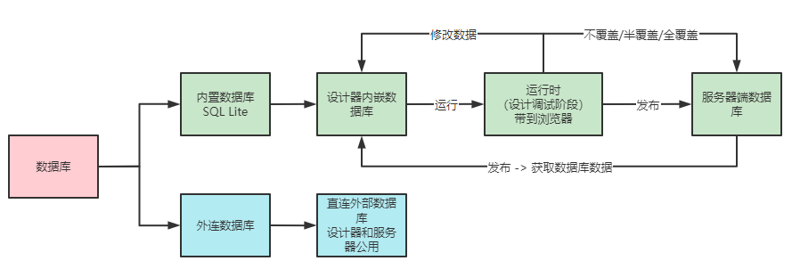

# 活字格平台对数据库的集成与使用

活字格平台对数据库的集成与使用。

## 数据库集成架构

活字格平台对数据库的集成架构如下图所示：

活字格平台对数据库对象抽象和统一管理抹平了对不同关系型数据库的操作，这时候活字格平台承担了数据库图形化客户端的角色，比如 Navicat、DataGrip。

> 更多可查看：[2021-稀土开发者大会-揭秘活字格最受程序员喜爱的三大功能 - 葡萄城技术博客 (grapecity.com.cn)](https://www.grapecity.com.cn/blogs/huozige-the-three-most-popular-features-for-programmers)

## 数据库组成

> 更多可查看：[活字格-新手课堂一 - 葡萄城公开课 - 葡萄城产品技术社区 (grapecity.com.cn)](https://gcdn.grapecity.com.cn/forum.php?mod=viewthread&tid=59226)

### 内建数据库数据流转

TODO ... 待确认

内建数据库根据应用开发的阶段，可分为三类：

- 设计器内置数据库：

  开发设计时使用

  内置数据库使用的是 SQLite。

  当使用活字格设计器创建数据对象时，会在内置数据库生成相关的数据表对象。

- 浏览器时数据库：

  测试调试时使用

  在设计器调试运行某个应用，会将设计器中的数据库带到浏览器，浏览器位置的数据库相当于设计器的一个副本。

  在浏览器中操作的数据可以选择是否回填到设计器中的数据库。

- 发布后服务端数据库：

  发布用户访问时使用

  应用发布后，在服务端也有对应的数据库，这时候服务端的数据库和设计器内置数据库会产生关联，具体体现在：

  首次发布应用后会将设计器端的数据带到服务端，包括表结构和数据。

  后续再发布应用时，根据实际情况用客户端的数据覆盖服务端的数据。在发布应用时可以选择不覆盖、半覆盖和全覆盖。

  > 关于覆盖数据这块内容更多可查看：[什么时候应该使用覆盖服务器数据库发布? - 活字格专区 - 专题教程 - 葡萄城产品技术社区 (grapecity.com.cn)](https://gcdn.grapecity.com.cn/showtopic-96312-1-9.html)

  也可以选择将服务端已有的数据导入到设计器，在活字格设计器的发布界面，选择获取数据库数据，就可以将服务端数据的数据导入到设计器。

外连数据库

需要注意的是，如果使用外连数据库，默认情况下设计器和服务器使用的是同一个数据库。

可以配置应用发布后的连接的数据库，让设计器和服务端应用使用同的数据库。

内置数据库和外连数据库在设计器中并不冲突，可以同时使用。

### SQLite

内置数据库 SQLite。

[SQLite 你用对了吗-山楂大卷_InfoQ写作社区](https://xie.infoq.cn/article/4afaafb0c5f43c0f11d693011)

[如何打开活字格内置数据库（SQLite）- 活字格专区 - 专题教程 - 葡萄城产品技术社区 (grapecity.com.cn)](https://gcdn.grapecity.com.cn/forum.php?mod=viewthread&tid=53061&extra=page%3D3)

[如何打开活字格内置数据库（SQLite）- 活字格专区 - 求助中心 - 葡萄城产品技术社区 (grapecity.com.cn)](https://gcdn.grapecity.com.cn/showtopic-53046-1-1.html)

