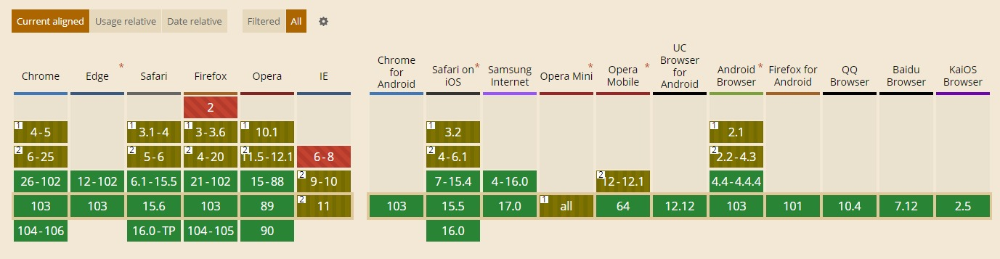

# 活字格初步了解

活字格初步了解。

## 活字格官方支持的浏览器

如果是指活字格设计器的调试支持。

目前活字格设计器支持在Internet Explorer、Microsoft Edge、Google Chrome、手机模拟器里实时查看效果。

如果是指活字格发布应用支持访问的客户端。

活字格以 HTML 5 Web 的形式构建客户端应用，因此只要支持 HTML 5 的浏览器都可以正常访问使用活字格低代码平台交付的应用。

如果是指活字格设计器的调试支持，目前活字格设计器支持在Internet Explorer、Microsoft Edge、Google Chrome、手机模拟器里实时查看效果。

现在市面上浏览器对 HTML 5 的支持情况：

上述图片查看链接：["HTML 5" | Can I use... Support tables for HTML5, CSS3, etc](https://caniuse.com/?search=HTML 5)

HTML 5 浏览器支持参考链接：

- [Wyn 支持的浏览器及版本说明 - Wyn V6.0 帮助文档 - 葡萄城产品文档中心 (grapecity.com.cn)](https://help.grapecity.com.cn/pages/viewpage.action?pageId=71012740)

- [活字格都支持什么浏览器 - 活字格专区 - 求助中心 - 葡萄城产品技术社区 (grapecity.com.cn)](https://gcdn.grapecity.com.cn/showtopic-24490-1-1.html)
-  [现在有哪些浏览器的哪些版本支持 HTML5 ？ - 知乎 (zhihu.com)](https://www.zhihu.com/question/19613759)
-  [HTML5 - 各大浏览器对html5的支持情况 (hangge.com)](https://www.hangge.com/blog/cache/detail_819.html)
-  [Can I use... Support tables for HTML5, CSS3, etc](https://caniuse.com/)