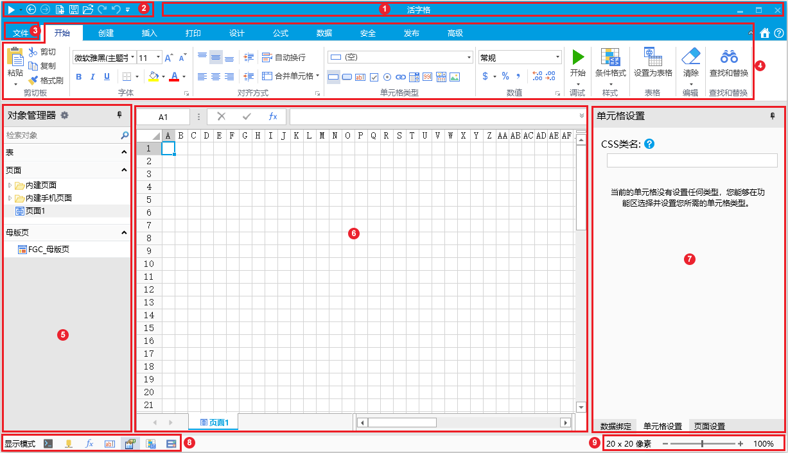

# 活字格初步使用

活字格初步使用。

## 安装

[安装与卸载 - 活字格帮助手册 - 葡萄城产品文档中心 (grapecity.com.cn)](https://help.grapecity.com.cn/pages/viewpage.action?pageId=71040979)

## 活字格设计器

设计器界面组成：

1. 标题栏区域
2. 快速访问工具栏区域
3. 文件按钮
4. 功能区
5. 对象管理器
6. 工作区
7. 属性设置区
8. 单元格显示模式
9. 像素大小

## 数据表

## 表与视图

[第三章 建立业务数据 - 活字格V8帮助手册 - 葡萄城产品文档中心 (grapecity.com.cn)](https://help.grapecity.com.cn/pages/viewpage.action?pageId=72351784)

**理解什么是表，在活字格中创建一张表，并添加 5 个最基本的字段类型，包括文本，整数，小数，日期，是否。**

什么是表？

[关系数据库是什么 - 华为云 (huaweicloud.com)](https://www.huaweicloud.com/zhishi/db7.html)

企业的大部分数据都存放在关系型数据库中，它以行和列的形式存放数据，这一系列行和列就称为表，行一般称为记录，列一般称为字段。
活字格设计器以 Excel 的方式操作数据，和关系数据库中的表直观地对应起来。

### 创建表

- 手动创建

  - 在功能区的创建里面选择创建表；

  - 在对象管理器里表标签右键创建表。

- 从 Excel 文件创建
- 从文本文件创建
- 从 Access 创建

### 创建视图

视图是由 SELECT 语句组成的查询定义的虚拟表。从数据库系统内部来看，视图是由一张或多张表中的数据组成的；从数据库系统外部来看，视图就如同一张表一样。

### 审计日志

审计日志记录了最终用户对于数据的访问操作。通过日志可以了解是否有未授权的用户访问或操作了数据。

[审计日志 - 活字格V8帮助手册 - 葡萄城产品文档中心 (grapecity.com.cn)](https://help.grapecity.com.cn/pages/viewpage.action?pageId=72352057)

### 内置数据库并发控制

[内置数据库并发控制 - 活字格V8帮助手册 - 葡萄城产品文档中心 (grapecity.com.cn)](https://help.grapecity.com.cn/pages/viewpage.action?pageId=72352067)

## 字段类型

[第四章 字段类型 - 活字格V8帮助手册 - 葡萄城产品文档中心 (grapecity.com.cn)](https://help.grapecity.com.cn/pages/viewpage.action?pageId=72352109)

## 数据库

[SQLite Home Page](https://www.sqlite.org/index.html)

// TODO ...

内置数据库（SQL Lite）：

- 设计器内置；
- 运行调试到浏览器；
- 发布后服务端内置。

外联数据库：

多种关系型数据库。

## 单元格

[活字格-新手课堂一 - 葡萄城公开课 - 葡萄城产品技术社区 (grapecity.com.cn)](https://gcdn.grapecity.com.cn/forum.php?mod=viewthread&tid=59226)

数据库

## 背景色和前景色

**在设计器新建一个工程，创建一个页面，在页面上的单元格添加一些文字，背景，前景，并能运行起来，在浏览器里面查看。**

[前景色与背景色 - 简书 (jianshu.com)](https://www.jianshu.com/p/d32d073785d1)

背景色就是你要做的图片或者文档的底色，一般默认是白色。

前景色就是你当前构图、线条、填充的颜色。

简单说背景色就是纸张的颜色，前景色就是画笔的烟色 。

## 表格

[第三章 建立业务数据 - 活字格V8帮助手册 - 葡萄城产品文档中心 (grapecity.com.cn)](https://help.grapecity.com.cn/pages/viewpage.action?pageId=72351784)

**理解什么是表，在活字格中创建一张表，并添加 5 个最基本的字段类型，包括文本，整数，小数，日期，是否。**

什么是表？

[关系数据库是什么 - 华为云 (huaweicloud.com)](https://www.huaweicloud.com/zhishi/db7.html)

企业的大部分数据都存放在关系型数据库中，它以行和列的形式存放数据，这一系列行和列就称为表，行一般称为记录，列一般称为字段。
活字格设计器以 Excel 的方式操作数据，和关系数据库中的表直观地对应起来。

### 手动创建数据表

两种方式：

- 在功能区的创建里面选择创建表；
- 在对象管理器里表标签右键创建表。

### 表字段类型

| 文本  | 存储文本信息。                                               |
| ----- | ------------------------------------------------------------ |
| 整数  | 存储整数信息。                                               |
| 小数  | 存储带小数的数字信息。                                       |
| 日期  | 存储日期信息。有年、季度、月、日四个子字段。                 |
| 时间  | 存储时间信息。                                               |
| 是/否 | 存储是/否信息，在数据库中实际存储的值为“1”或“0”，其中“1”代表“是”，“0”代表“否”。 |
| 用户  | 存储用户信息 (SQL Server 和 Oracle 中可由文本列类型转换)。有全名、邮件、角色、自定义属性、组织上级等子字段。说明对于角色子字段，如果用户属于多个角色，则各角色会以逗号分隔。每一个自定义属性都会生成一个子字段，用户对应自定义属性的值也就是子字段的值。如果在用户系统中配置了组织架构，可以通过组织上级子字段获取用户在组织架构里的所有上级领导，方便查询或条件命令中使用。 |
| 图片  | 将图片存储为“GUID_文件名”(SQL Server 和 Oracle 中可由文本列类型转换)。 |
| 附件  | 将附件存储为“GUID_文件名”(SQL Server 和 Oracle 中可由文本列类型转换)。 |

## 页面

在活字格中，页面包括普通页面、手机页面、母版页、内建页面。

普通页面

一个普通页面对应一个网页页面。您可以对普通页面进行设置与管理。

页面管理：您可以创建一个文件夹，将一组有联系的页面放在文件夹中。

手机页面

手机页面指用于手机浏览器访问的页面。

母版页

母版页用来设计共享部分的页面，可以给多个普通页面共享使用，例如可将导航栏设计在母版页中。

母版页分为两部分：普通的单元格区域和页面占位区。您可以在普通单元格区域设计导航栏等共享部分，页面占位区则用来切换显示普通页面。

内建页面

在活字格中，任何一个活字格模板或者新建一个空白工程，都可以看到有默认的一些页面，包括内建页面及内建手机页面。

内建页面在活字格中具体特殊功能，在特殊时候显示。如系统出现401情况时，会自动跳转显示401页面；当需要用户登录时候，会自动跳转到登录页面。

您可以修改内建页面的界面和外观，但不可以删除有特殊功能的文本框、按钮或超链接，如登录页面中的用户名、密码及登录按钮，只可修改其外观样式。

### 普通页面

[创建普通页面 - 活字格V8帮助手册 - 葡萄城产品文档中心 (grapecity.com.cn)](https://help.grapecity.com.cn/pages/viewpage.action?pageId=72352315)

从 excel 到普通页面。

## 命令

## 网站发布

