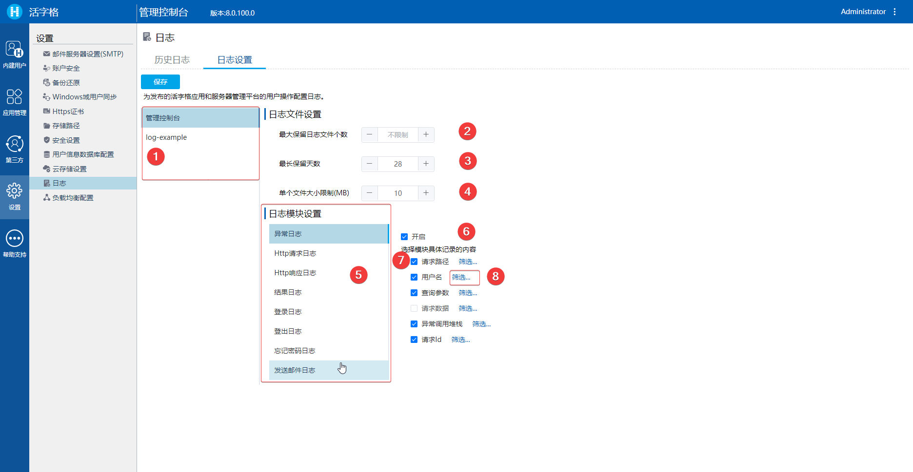

# 活字格服务器日志管理

活字格服务器日志管理增强。

## 功能总览

1. 添加更多的日志来帮助用户的 DevOps 工作；
2. 根据日期和大小限制，将日志文件分成多个文件；
3. 可配置最大保留日志文件数和天数；
4. 可以在管理门户（活字格服务器管理控制台）中查看和查询日志；
5. 可以通过更改 logConfig 文件来配置/过滤日志内容；
6. 可以在管理门户中通过网页更改 logConfig。

## 如何使用

活字格服务器上应用或者服务器管理控制台在运行时，就会生成日志文件。

### 日志文件

用户可以活字格服务器的运行的本地环境在查看日志文件。

#### 日志文件位置

如果是 Windows 操作系统：

- 如果以系统账户使用 Windows，日志文件位于：

  `C:\Windows\Temp\ForguncyWebServerLogs`

- 如果以用户账户使用 Windows，日志文件位于：

  `C:\Users\[USERNAME]\AppData\Local\Temp\ForguncyWebServerLogs`

如果是 Linux 操作系统：

日志文件位于：`/var/log/ForguncyServer/ForguncyWebServerLogs` 目录下。

#### 日志内容格式

日志文件以 [JSON](https://www.json.org/json-zh.html) 的格式进行存储，如下：


可以看到文件中的一行表示一条日志记录，并用 JSON 格式持久化，方便对日志内容进行解析和程序化的统计和分析。

> 日志的时间为标准格林尼治时间（GMT），加上 8 小时就是北京时间（GMT+8）。

#### 日志文件管理策略

在 `ForguncyWebServerLogs` 这层目录下面，应用的日志位于和应用同名的文件夹下（活字格的服务器管理控制台在 `Forguncy.UserService2` 目录下）。

比如 Windows 下如下图所示：


每天都会生成新的日志文件，并以 `[应用名称][日期].log` 的格式进行命名。

如果单个日志文件大小超过了*单个文件大小限制*（`FileSizeLimitMBytes`），会滚动生成多个日志文件，文件命名如下：

```
[APPLICATION NAME][YYYYMMDD]_001.log
[APPLICATION NAME][YYYYMMDD]_002.log
…
```

如果总的日志文件数量超过了*最大保留日志文件个数限制*（`RetainedFileCountLimit`），会删除最旧的日志文件。

如果日志文件的创建时间超过了*最长保留天数限制*（`RetainedFileDaysLimit`），其也会被删除。

单个文件大小限制（`FileSizeLimitMBytes`）、最大保留日志文件个数限制（`RetainedFileCountLimit`）、最长保留天数限制（`RetainedFileDaysLimit`） 这三个日志管理策略参数都可以通过日志配置文件或在服务器管理控制台进行设置。

### 日志配置文件

对于上述提到的日志策略可以在日志配置文件中进行配置。

应用的配置文件在：`C:\Users\Public\Documents\ForguncyServer\[ApplicationName]\logConfig.json`

活字格服务器管理控制台的配置文件在：`[活字格服务器安装根目录]\Forguncy.UserService2\logConfig.json`

配置文件部分内容如下所示：

```json
{
    "RetainedFileCountLimit": null,           // 最大保留日志文件个数限制                        
    "RetainedFileDaysLimit": 28,              // 最长保留天数限制
    "FileSizeLimitMBytes": 10,                // 单个文件大小限制
    "LogModuleSettings": {           
        "LogoutLog": {                        // 日志模块名称
            "Enabled": true,                  // 是否启用改日志模块
            "LogPropertySettings": {        
                "SuccessMessage": {           // 日志模块属性名称
                    "Enabled": true,		  // 是否启用改日志模块属性	
                    "IncludeKeyWords": null,  // 包含的关键字（日志属性内容包含该关键字时记录）	
                    "ExcludeKeyWords": null   // 排除的关键字（日志属性内容包含该关键字时不记录）
                },
                "ErrorMessage": {
                    "Enabled": true,
                    "IncludeKeyWords": null,
                    "ExcludeKeyWords": null,
                },
                "RequestId": {
                    "Enabled": true,
                    "IncludeKeyWords": null,
                    "ExcludeKeyWords": ["Do not have enough concurrency license"]
                },
                "Success": {
                    "Enabled": true,
                    "IncludeKeyWords": null,
                    "ExcludeKeyWords": null
                },
                "UserName": {
                    "Enabled": true,
                    "IncludeKeyWords": ["Administrator", "User1"],
                    "ExcludeKeyWords": null
                }
            }
        },
        "ResultDataLog": {
            "Enabled": true,
            "LogPropertySettings": {
                "Result": {
                    "Enabled": true,
                    "IncludeKeyWords": null,
                    "ExcludeKeyWords": null
                },
                "Message": {
                    "Enabled": true,
                    "IncludeKeyWords": null,
                    "ExcludeKeyWords": null
                },
                "RequestId": {
                    "Enabled": true,
                    "IncludeKeyWords": null,
                    "ExcludeKeyWords": null
                }
            }
        }
    }
}
```

服务端日志的配置配置除了在配置文件上修改外，还可以登录服务器管理控制台通过图形界面修改。

### 日志在线查看和配置

用户可以在活字格服务器用户管理控制台上对应用和管理控制台的日志进行配置和查看，也推荐在控制台对日志策略进行配置。

#### 日志在线查看


1. 选择要查看日志的日期；
2. 选择要查看日志在选择日期当天的时间段；
3. 选择查看日志的应用（可多选）；
4. 可以按照日志生成时间进行排序；
5. 过滤要查看的日志模块；
6. 过滤要查看的日志级别；
7. 查看日志详情。

#### 日志在线配置

用户可以通过活字格服务器管理控制台对日志在线配置。

在管理控制台的**设置/日志/日志设置**模块进行日志配置，如下图所示：



1. 选择要进行日志配置的应用；
2. 修改最大保留日志文件个数；
3. 修改最长保留天数；
4. 修改单个日志文件大小限制；
5. 选择要配置的日志模块，不同的模块会有不同的配置项；
6. 可以选择开启或者关闭某个模块日志；
7. 可以开启或关闭模块日志的属性；
8. 配置要排除或包含的关键字；

修改完配置后记得点击保存按钮，保存日志配置，单击保存后，新配置将立即生效，无需重新启动应用程序或服务器。

> 日志模块目前有：异常日志、HTTP 请求日志、HTTP 响应日志、登录日志、登出日志、审计日志、SQL 执行日志、计划任务执行日志、服务端命令执行日志、忘记密码操作日志、发送邮件日志、结果日志。
>
> 其中审计日志、 SQL 执行日志、计划任务执行日志、服务端命令执行日志者四个日志模块仅支持活字格应用，活字格管理控制台则没有这四个模块的配置。
>
> 关于每个日志模块和模块属性会在下一篇帖子介绍。
