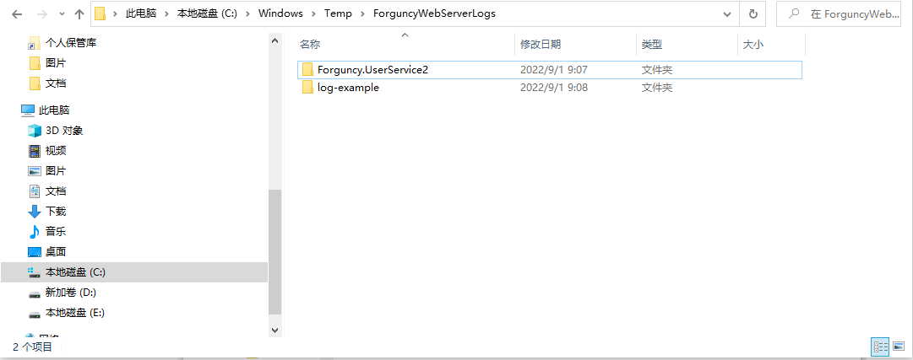
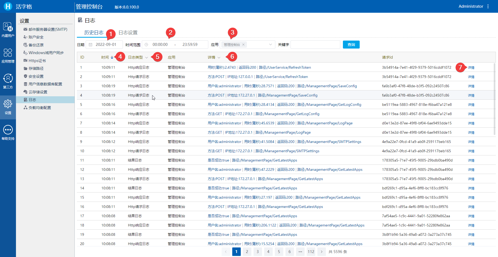

# 活字格服务器日志管理


## 用户故事

1. Add more log to help user's DevOps work.
2. Enhance log file separate to multiple file based on day and size limit.
3. Can configurated maximum retain file count and days.
4. Can view and query in admin portal.
5. Can config/filter the log content by change logConfig file.
6. Can change logConfig by web page in admin portal

## 如何使用

活字格服务器上应用或者服务器管理控制台运行时，都会生成日志文件。

### 日志文件

用户可以在本地文件查看日志文件。

#### 日志内容格式

本地的日志文件以 [JSON](https://www.json.org/json-zh.html) 的格式进行存储，如下所示：


如上图所示：

文件中的一行表示一条日志记录。

使用 JSON 格式来存放日志记录便于程序分析日志内容。

#### 日志文件位置

如果是 Windows 操作系统：

- 如果以系统账户使用 Windows，日志文件位于：

  `C:\Windows\Temp\ForguncyWebServerLogs`

- 如果以用户账户使用 Windows，日志文件位于：

  `C:\Users\[USERNAME]\AppData\Local\Temp\ForguncyWebServerLogs`

如果是 Linux 操作系统：

日志文件位于：

`/var/log/ForguncyServer/ForguncyWebServerLogs`

#### 日志文件管理策略

在 `ForguncyWebServerLogs` 这层目录下面，应用的日志位于和应用同名的文件夹下（活字格的服务器管理控制台在 `User Service` 目录下）。




每天都会生成新的日志文件，文件名称会以 `[应用名称][日期].log` 的格式进行命名。

如果单个日志文件大小超过了*单个文件大小限制*（`FileSizeLimitMBytes`），会滚动生成多个日志文件，比如：

```
[APPLICATION NAME][YYYYMMDD]_001.log
[APPLICATION NAME][YYYYMMDD]_002.log
…
```

如果总的日志文件数量超过了*最大保留日志文件个数限制*（`RetainedFileCountLimit`），会删除最旧的日志文件。

如果日志文件的创建时间超过了*最长保留天数限制*（`RetainedFileDaysLimit`），其也会被删除。

单个文件大小限制（`FileSizeLimitMBytes`）、最大保留日志文件个数限制（`RetainedFileCountLimit`）、最长保留天数限制（`RetainedFileDaysLimit`） 这三个参数都可以通过服务器管理控制台进行设置（详细说明见）。


### 日志配置文件

除了上述提到了在活字格服务器管理控制台中对日志文件进行配置外，还可以在日志配置文件中进行配置。

// TODO ... 位置待确认：

应用的配置文件在：`C:\Users\Public\Documents\ForguncyServer\[ApplicationName]\logConfig.json`

管理控制台的配置文件在：`C:\Program Files\ForguncyServer 8\Forguncy.UserService2\logConfig.json`

> 服务器安装目录


配置如下所示：

```json
{
    "RetainedFileCountLimit": null,
    "RetainedFileDaysLimit": 28,
    "FileSizeLimitMBytes": 10,
    "LogModuleSettings": {
        "LogoutLog": {
            "Enabled": true,
            "LogPropertySettings": {
                "SuccessMessage": {
                    "Enabled": true,
                    "IncludeKeyWords": null,
                    "ExcludeKeyWords": null
                },
                "ErrorMessage": {
                    "Enabled": true,
                    "IncludeKeyWords": null,
                    "ExcludeKeyWords": null,
                },
                "RequestId": {
                    "Enabled": true,
                    "IncludeKeyWords": null,
                    "ExcludeKeyWords": ["Do not have enough concurrency license"]
                },
                "Success": {
                    "Enabled": true,
                    "IncludeKeyWords": null,
                    "ExcludeKeyWords": null
                },
                "UserName": {
                    "Enabled": true,
                    "IncludeKeyWords": ["Administrator", "User1"],
                    "ExcludeKeyWords": null
                }
            }
        },
        "ResultDataLog": {
            "Enabled": true,
            "LogPropertySettings": {
                "Result": {
                    "Enabled": true,
                    "IncludeKeyWords": null,
                    "ExcludeKeyWords": null
                },
                "Message": {
                    "Enabled": true,
                    "IncludeKeyWords": null,
                    "ExcludeKeyWords": null
                },
                "RequestId": {
                    "Enabled": true,
                    "IncludeKeyWords": null,
                    "ExcludeKeyWords": null
                }
            }
        }
    }
}
```


配置项说明：

基本配置：


配置项说明


### 日志在线查看和配置

用户可以在活字格服务器用户管理控制台上对应用和管理控制台的日志进行配置和查看。

#### 日志在线查看




1. 选择要查看日志的日期；
2. 选择要查看日志的时间段；
3. 选择查看日志的应用（可多选）；
4. 可以按照日志生成时间进行排序；
5. 过滤要查看的日志模块；
6. 过滤要查看的日志级别；
7. 查看日志详情。


> Module name and property name are localized


#### 日志在线配置

用户可以通过活字格服务器管理控制台对日志在线配置。

在管理控制台的**设置/日志/日志设置**模块进行日志配置，如下图所示：


1. 选择要进行日志配置的应用；
2. 修改最大保留日志文件个数；
3. 修改最长保留天数；
4. 修改单个日志文件大小限制；
5. 选择要配置的日志模块，不同的模块会有不同的配置项；
6. 可以选择开启或者关闭某个模块日志；
7. 可以开启或关闭模块日志的属性；
8. 配置要排除或包含的关键字；
9. 点击保存保存日志配置，单击保存后，新配置将立即生效，无需重新启动应用程序或服务器。

## 策略

1. Both old auditing log file and new auditing log are supported. Maybe, in future, we will recommend user use new auditing log instead of old one. 
2. New log will include in PSI file to help grapecity analysis customer's problem.

