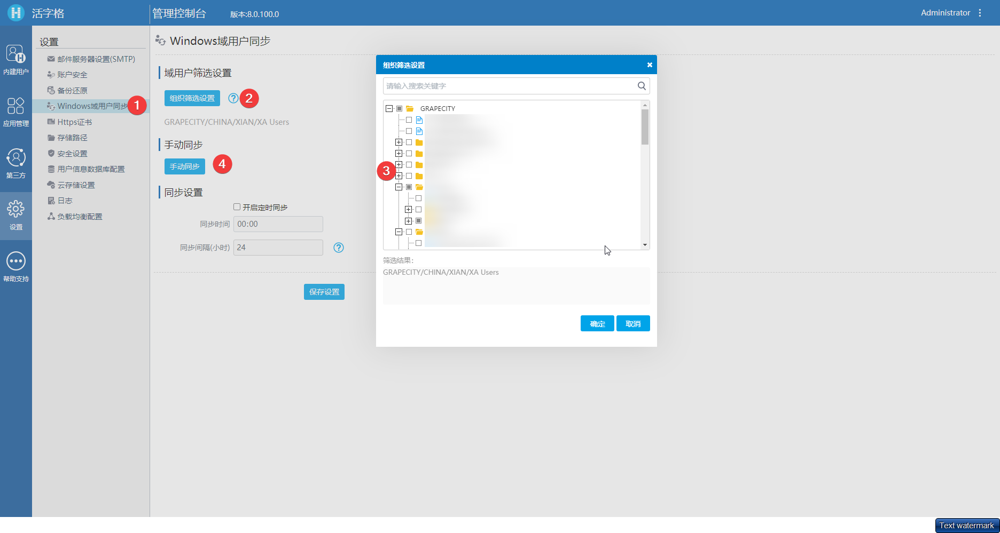
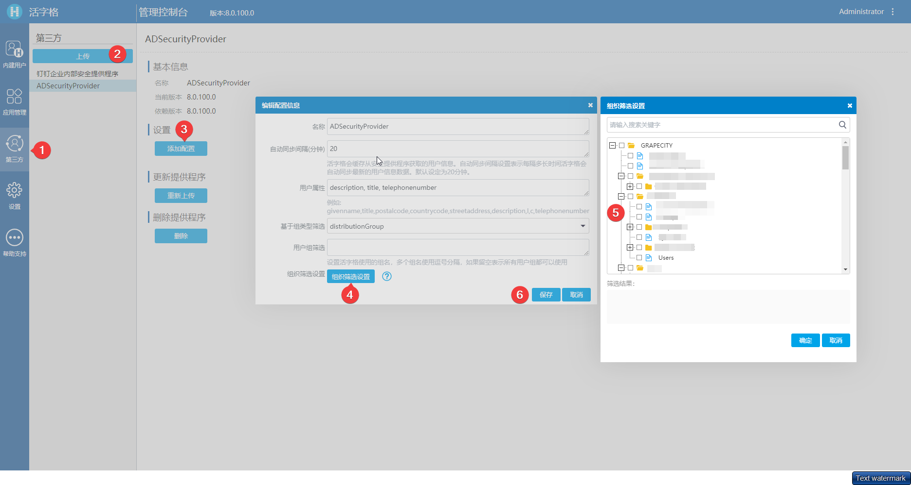

# 导入部分 AD 域用户

在使用 ADSecurityProvider 插件同步了 AD 域用户，如果用户很多，同步全部用户会花费很长时间，但并不是全部的都是需要同步的。目前并不支持在添加用户时添加筛选条件，在活字格 8.0 update1 版本在同步 AD 域用户时添加了组织结构筛选器，同步时可以根据组织结构来进行筛选。

导入用户支持设置过滤条件，以缩短导入和同步用户的时间。

在 8.0 update1 版本添加了组织筛选器来支持上面两个功能。

ADSecurityProvider 和内置的 Windows 域用户同步中都这样做了。

## 如何使用

如果是内置 Windows 域用户同步，如下所示：

1. 登录管理门户，导航到**设置/Windows 域用户同步**；
2. 点击组织筛选按钮；
3. 在弹出的对话框中勾选要同步其用户的组织；
4. 然后手动同步用户，这样就可以只同步勾选了组织下的用户。

如果是 ADSecurityProvider 同步用户，操作如下所示：

1. 登录管理门户，导航到第三方；
2. 上传 ADSecurityProvider 安全程序；
3. 选项上传的 ADSecurityProvider 的安全程序，点击添加配置；
4. 在弹出的编辑配置信息页面中点击组织筛选设置；
5. 然后勾选要同步的组织；
6. 点击保存，然后等待同步，验证是否成功。

## 策略

ADSecurityProvider 和内置的 windows 域用户同步共享相同的同步和检查策略。

### 同步策略

同步时会检查在树上勾选的组织机构节点，**如果没有选中的项，则意味着同步所有用户**，如果有选中的节点，则只同步选中组织下的用户。

一旦一个新的组织节点在服务器运行时添加到域中，只有在树上勾选了其父组织时，它的用户才会在下次同步。

一旦在服务器运行时将组织从域中删除，如果存在该组织，我们将从组织筛选器中删除该组织。

### 检查策略

检查树上的父节点，它的所有子节点都将被检查。

取消选中父节点，它的所有子节点都将取消选中。

检查或取消检查子节点，它不会影响父节点的状态。

只要父节点的任何子节点与父节点的检查状态相冲突，那么父节点的背景颜色就是灰色，但是转为灰色并不意味着被检查。

### 保存策略

在内置 Windows 域用户同步的情况下，我们将组织过滤器保存在 globalConfig.xml 中。

我们将组织过滤器保存在 ADSecurityProvider 的 config.json 中。