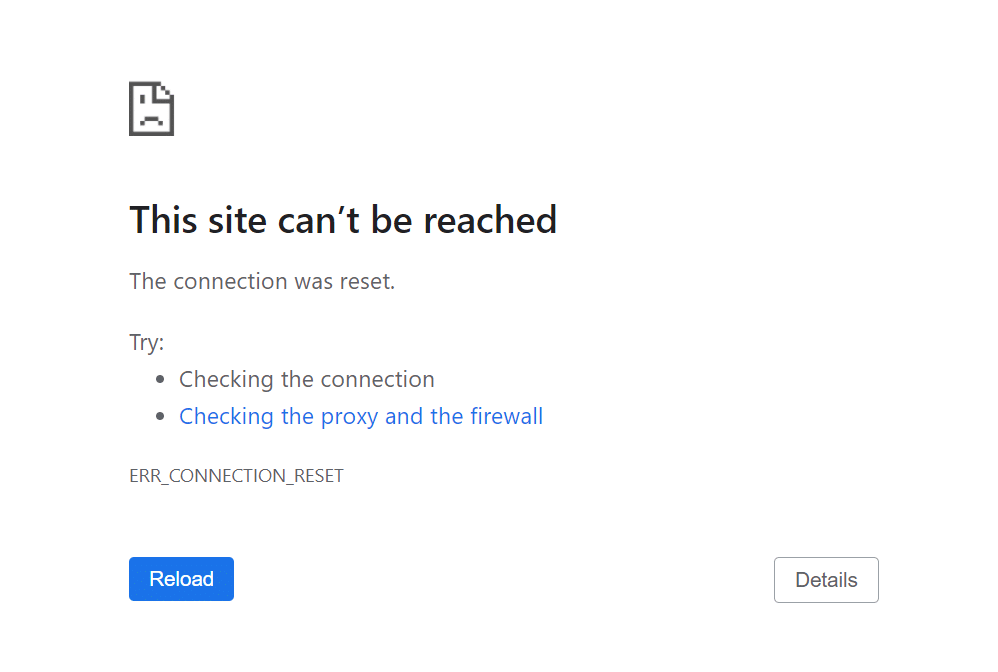
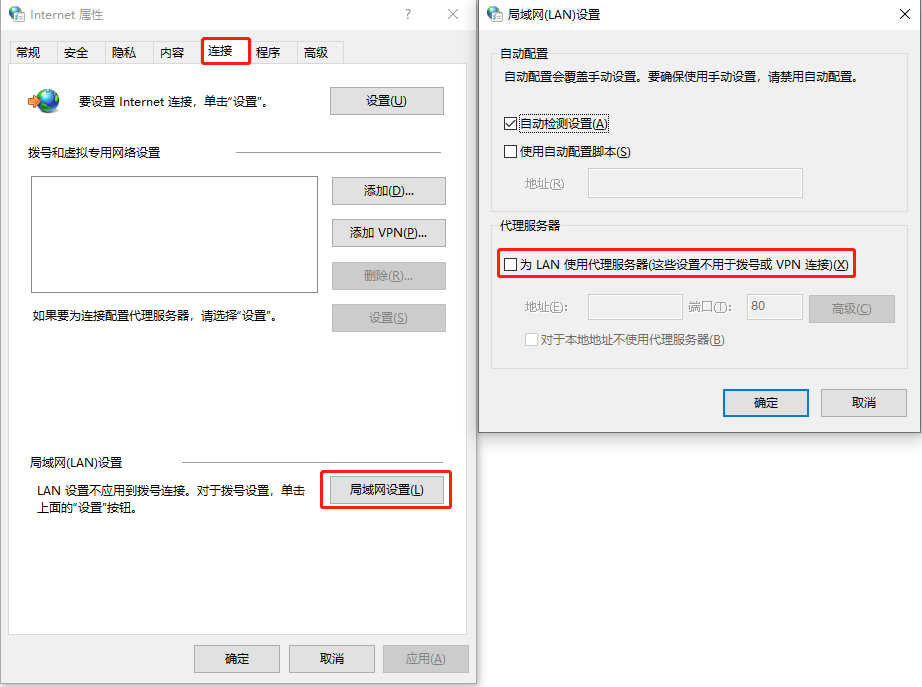

# 如何修复 ERR_CONNECTION_RESET 错误（5 中方法）

> 翻译，原文链接：[How to Fix the "ERR_CONNECTION_RESET" Error (5 Ways) (kinsta.com)](https://kinsta.com/knowledgebase/err_connection_reset/)

要访问一个网站，你的浏览器需要与它建立一个连接。浏览器发送一个请求，如果得到响应，它就开始接收和发送信息。这些信息变成了一个网页，就像你现在看到的一样。但是，在某些情况下，可能无法建立该连接，并且会遇到 ERR_CONNECTIO _RESET 错误。

可能出现这个问题的原因有几个。幸运的是，如果您了解了错误的潜在原因，那么您应该能够在几分钟内对其进行故障排除。在本文中，我们将讨论导致 ERR_CONNECTION_RESET 错误出现的原因。然后我们会告诉你如何迅速解决这个问题。开始工作吧！

## 什么原因导致 ERR_CONNECTION_RESET

ERR_CONNECTION_RESET 错误代码是 Google Chrome 特有的。但是，您可能会在其他浏览器中遇到类似的消息。例如，Firefox 返回一个“连接被重置”错误代码。访问网站时会出现连接重置错误，浏览器无法建立连接。当这种情况发生时，连接被“重置”，这意味着服务器无法将数据传输到您的浏览器。

下面是 Chrome 中的 ERR_CONNECTION_RESET 消息示例：



在大多数情况下，此错误指向您的 Internet 连接出现问题，例如：

- 虚拟专用网络（VPN）的问题；
- 防火墙或防病毒程序阻塞到远程服务器的连接；
- 代理设置有问题；
- 浏览器缓存出现问题。

好消息是，解决这些问题非常容易。我们将在以下几个部分中按顺序展示如何对它们进行故障排除。

### 如何修复 ERR_CONNECTION_REST

如果遇到 ERR_CONNECTION_RESET 错误，首先要确定 Internet 连接是否正常工作。比如你可以访问一些其他常用的网站，看看他们是否正确加载。

如果这些网站确实可以正常加载，这时候，我们建议您继续并重置您的路由器断开电源线，等待一分钟，并重新连接它。您的连接应该在几分钟内再次可用。如果这还不能解决问题，那么现在就可以开始执行以下故障排除步骤了。

#### 1. 检查你的 VPN

如果你因为工作或隐私的原因使用 VPN，你必须知道你的连接可能会中断。当这种情况发生时，您可能无法与某些网站建立连接，直到它被恢复。

根据您使用的 VPN 软件，它可能会尝试自动重新连接，或者您可能必须手动重新连接。有些软件还允许你在试图重新连接网络时屏蔽导航。

如果您使用 VPN 工作，您试图访问的网站可能会阻塞或重置连接，如果您使用的 IP 地址不能识别。如果是这种情况，重新连接到 VPN 应该可以解决这个问题。

#### 2. 重置 TCP/IP 设置

如果手动重置浏览器不起作用，可以强制操作系统更新 TCP 和 IP 协议设置。这将返回您的 Internet 连接到其默认设置，并在此过程中，它可以修复 ERR_CONNECTION_RESET 错误。

那么如何重置操作系统的 TCP/IP 设置呢？


**如果使用 Windows，可以通过命令行重置和更新 TCP/IP 设置**。

使用 CMD 输入下面内容：

```powershell
Netsh winsock reset
Netsh int ip reset
ipconfig /release
ip/config /renew
ipconfig /flushdns
```

除了重置 Internet 连接之外，最后一个命令还将刷新本地域名系统（DNS）缓存。过时的缓存可能导致连接错误，因此这个附加命令可以派上用场。

一旦您的互联网连接再次上线，尝试访问返回 ERR_CONNECTION_RESET 错误的网站。如果它仍然存在，那么继续进行下一个修复。


**如果使用的是 macOS，重置 TCP/IP 过程如下**：

1. 转到“系统首选项”并选择“网络”选项；
2. 选择您的活动互联网连接并打开其高级设置；
3. 转到 TCP/IP 选项卡；
4. 点击续签 DHCP 租约；


重置 TCP/IP 设置后，尝试访问之前显示 ERR_CONNECTION_RESET 错误的网站。如果你的互联网连接是问题，错误应该消失。

#### 3. 关闭杀毒软件和防火墙

当涉及到在网络上保护你的时候，杀毒软件和防火墙可能是非常具有攻击性的。在某些情况下，您的防病毒软件可能会阻止您下载和打开文件，或阻止您访问网站。这同样适用于您的防火墙，当您试图访问特定站点时，它可能会重置您的连接。

排除防火墙的最佳方法是暂时禁用它，然后检查 ERR_CONNECTION_RESET 错误是否仍然存在。下面是在两个操作系统中的操作方法:

- [打开或关闭 Microsoft Defender 防火墙](https://support.microsoft.com/zh-cn/windows/打开或关闭-microsoft-defender-防火墙-ec0844f7-aebd-0583-67fe-601ecf5d774f)

- [在 Mac 上更改“防火墙”偏好设置 - 官方 Apple 支持 (中国)](https://support.apple.com/zh-cn/guide/mac-help/mh11783/mac)

如果您的防病毒软件阻塞了到远程服务器的连接，那么您也必须手动禁用它。这个过程将根据您使用的程序而有所不同，因此您需要检查它的文档。

根据我们的经验，防火墙或防病毒软件重置连接的情况相对较少。如果你试图访问一个不安全的网站，你的浏览器很可能会给你一个警告。但是，如果您已经尝试了其他所有修复程序，那么禁用这两套软件来排除它们是值得的。

#### 4. 清除浏览器缓存

你的浏览器存储了你访问过的大多数网站的数据，所以当你返回的时候它不需要重新载入这些数据。在某些情况下，过时的缓存文件在加载网站时可能导致错误，比如 ERR_CONNECTION_RESET。

如果是这样的话，您可以通过清空浏览器缓存来解决这个问题。不管你使用什么浏览器，这个过程都是一样的。例如，如果你使用 Chrome，你可以进入设置 > 隐私和安全 > 清除浏览数据，然后勾选缓存图片和文件选项。

这个过程不会花费很长时间，一旦完成，您可以尝试重新加载出现 ERR_CONNECTION_RESET 错误的页面。

这个过程也适用于非 Chrome 浏览器。在其他浏览器中清除缓存的步骤非常相似。

#### 5. 禁用代理服务器

如果您通过代理服务器路由您的连接，它可能会导致错误，如 ERR_CONNECTION_RESET 当您试图加载网站。这可能是因为代理服务器未能建立到网站的连接，或者是因为您首先无法连接到代理服务器。

在任何情况下，除非出于特定原因使用代理服务器，否则都可以禁用它。

如果你在使用 Windows，你可以打开开始菜单，输入“Internet 选项”（不带引号），然后选择出现的选项。

打开一个名为 “Internet 属性”的窗口。进入“连接”选项卡并选择“局域网设置”选项。

在下一个窗口中，寻找选项：为局域网使用代理服务器。如果启用了该设置，请关闭该设置并检查“自动检测设置。入下图所示：



点击 OK，就这样。您可以继续尝试访问返回 ERR_CONNECTION_RESET 错误的网站。如果您已经尝试了所有其他方法，那么这应该可以解决问题。

## 总结

如果您遇到 ERR_CONNECTION_RESET 错误，这意味着您的浏览器无法建立到远程服务器的连接。在大多数情况下，这是由于错误的配置在您的互联网设置或其他东西阻塞连接。根据导致 ERR_CONNECTION_RESE 错误的原因，有五种方法可以修复它：

- 检查你的 VPN；
- 重置 TCP/IP 设置；
- 禁用你的杀毒软件和防火墙；
- 清除浏览器缓存；
- 禁用代理服务器。

