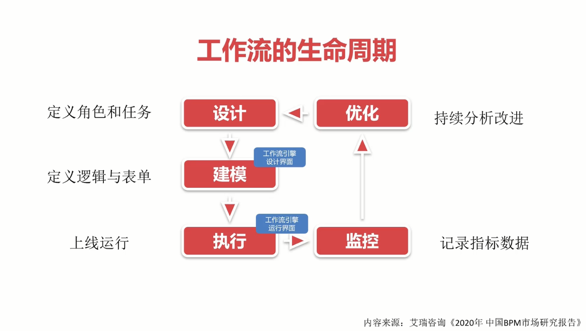
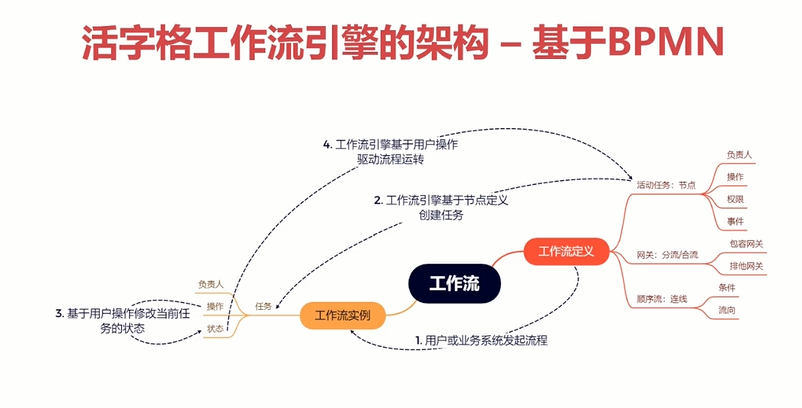
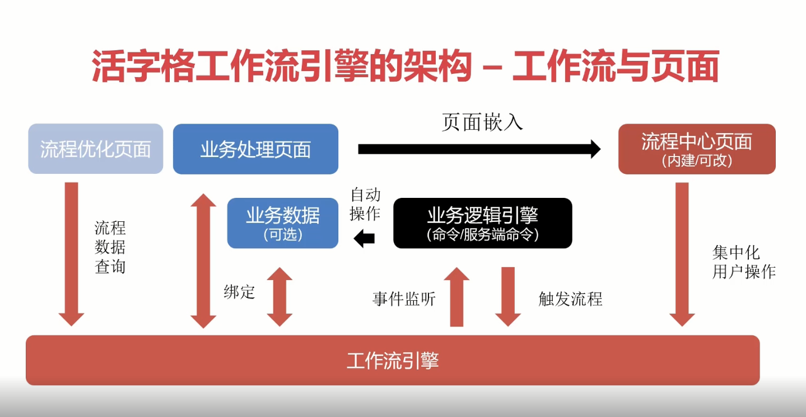
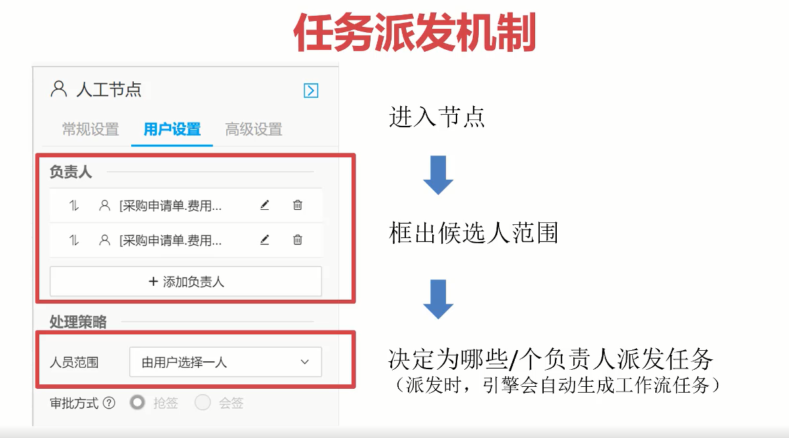

# 活字格工作流

[高级课程：2 小时玩转活字格工作流 - 活字格专区 - 专题教程 - 葡萄城产品技术社区 (grapecity.com.cn)](https://gcdn.grapecity.com.cn/forum.php?mod=viewthread&tid=151216)

业务过程中的部分或整体在计算机应用环境下的自动化。

工作流是概念（机制），工作流引擎是实现，BPMN 是框架标准。

基于 BPMN 构建的工作流引擎可以有效地加速工作流的开发与交付。

工作流生命周期

工作流适用场景：

- 流程中多个人为审批操作
- 开发者需要调整工作交付给系统管理员
- 对流程中的操作进行记录分析的需求

工作流概念

工作流定义与实例

工作流相当于一个模板，基于模板的定义运行起来的就是工作流实例。

事件与节点、

节点：用来描述人工或自动操作。

- 负责人/权限：候选的操作人
- 操作：控制节点流向
- 事件：**触发业务操作**

分流/合流 + 连线：预设节点流向，完成分支判断。

工作流、数据与页面

工作流常见的开发方式

绘制流程图

定制和绑定业务数据表和页面

定义和绑定事件（服务端命令）

工作流相关的用户、角色、组织机构的管理

工作流的维护方式

开发阶段在设计器上维护

系统管理员在线维护工作流

## 绘制流程图

工作流设计器

节点与连线配置

流程相关权限控制

工作流连接外联库创建工作流相关的表。

会创建 25 张表，5 个视图。

到达流程某个节点后用户的**操作**决定了节点的跳转规则：

- 提交/同意：完成，并按照连线跳转到下一个节点，如果涉及分流/合流，按照连线条件选择对应的连线；
- 回退：取消，按照设定的规则，回溯到特定的节点；
- 调度：取消，并跳转到特定节点（按照节点名称进行跳转）；
- 暂存/自定义：保持当前节点，不进行跳转；
- 结束：取消，直接跳转到结束节点。

交互页面：关联页面、数据权限、流程命令条；

负责人：圈定负责人的范围，人员选择和处理策略。

通知：任务创建通知，超时通知；

## 流程权限设置

流程定义级别：发起流程、编辑流程定义（仅在控制台配置）；

节点级：数据权限（通常用于相关页面的开发）；

通过数据权限控制页面交互体验，通常用于要求较低的简单业务。

## 自定义负责人

设置人工节点谁来处理任务节点。

任务派发机制

自定义找人策略

内置找人策略，与活字格的角色与组织结构。

3 + 1 种模式。

按用户

按角色

按组织机构（可选：组织机构 + 角色）

自定义找人，2 种实现：

通过关联的业务数据指定

在“节点进入事件”中，通过服务端命令 + 参数指定。

处理策略

根据找到人负责人的情况设置处理策略。

会签与抢签

会签：找到的符合条件的负责人都同意才算通过

抢签：找到符合条件的人只要有一个同意才算通过

自动通过：没找到有负责人/其他条件

人员范围：有多个负责人时该如何处理？

- 由用户选择：上一步节点的用户选择（人工节点上有三条杠表示系统判断这个节点会有多个负责人）

