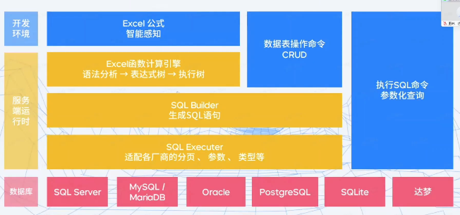
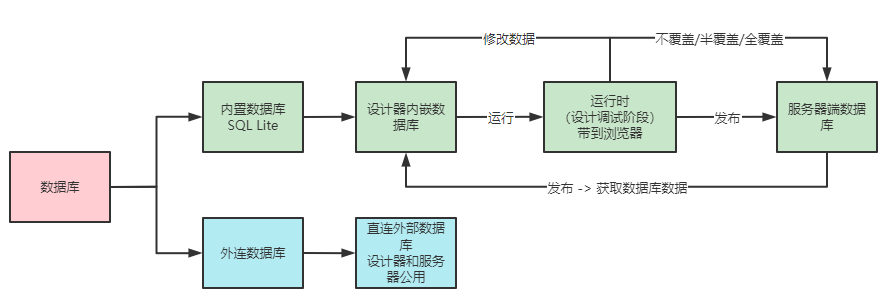

# 活字格平台对数据库的集成与使用

活字格平台对数据库的集成与使用。

## 数据库集成架构

活字格平台对数据库的集成架构如下图所示：

活字格平台对数据库对象抽象和统一管理抹平了对不同关系型数据库的操作，这时候活字格平台承担了数据库图形化客户端的角色，比如 Navicat、DataGrip。

> 更多可查看：[2021-稀土开发者大会-揭秘活字格最受程序员喜爱的三大功能 - 葡萄城技术博客 (grapecity.com.cn)](https://www.grapecity.com.cn/blogs/huozige-the-three-most-popular-features-for-programmers)

## 数据库组成

> 更多可查看：[活字格-新手课堂一 - 葡萄城公开课 - 葡萄城产品技术社区 (grapecity.com.cn)](https://gcdn.grapecity.com.cn/forum.php?mod=viewthread&tid=59226)

### 内建数据库数据流转

TODO ... 待确认

内建数据库根据应用开发的阶段，可分为三类：

- 设计器内置数据库：

  开发设计时使用

  内置数据库使用的是 SQLite。

  当使用活字格设计器创建数据对象时，会在内置数据库生成相关的数据表对象。

- 浏览器时数据库：

  测试调试时使用

  在设计器调试运行某个应用，会将设计器中的数据库带到浏览器，浏览器位置的数据库相当于设计器的一个副本。

  在浏览器中操作的数据可以选择是否回填到设计器中的数据库。

- 发布后服务端数据库：

  发布用户访问时使用

  应用发布后，在服务端也有对应的数据库，这时候服务端的数据库和设计器内置数据库会产生关联，具体体现在：

  首次发布应用后会将设计器端的数据带到服务端，包括表结构和数据。

  后续再发布应用时，根据实际情况用客户端的数据覆盖服务端的数据。在发布应用时可以选择不覆盖、半覆盖和全覆盖。

  > 关于覆盖数据这块内容更多可查看：[什么时候应该使用覆盖服务器数据库发布? - 活字格专区 - 专题教程 - 葡萄城产品技术社区 (grapecity.com.cn)](https://gcdn.grapecity.com.cn/showtopic-96312-1-9.html)

  也可以选择将服务端已有的数据导入到设计器，在活字格设计器的发布界面，选择获取数据库数据，就可以将服务端数据的数据导入到设计器。

外连数据库

需要注意的是，如果使用外连数据库，默认情况下设计器和服务器使用的是同一个数据库。

可以配置应用发布后的连接的数据库，让设计器和服务端应用使用同的数据库。

内置数据库和外连数据库在设计器中并不冲突，可以同时使用。

### SQLite

内置数据库 SQLite。

[SQLite 你用对了吗-山楂大卷_InfoQ 写作社区](https://xie.infoq.cn/article/4afaafb0c5f43c0f11d693011)

[如何打开活字格内置数据库（SQLite）- 活字格专区 - 专题教程 - 葡萄城产品技术社区 (grapecity.com.cn)](https://gcdn.grapecity.com.cn/forum.php?mod=viewthread&tid=53061&extra=page%3D3)

[如何打开活字格内置数据库（SQLite）- 活字格专区 - 求助中心 - 葡萄城产品技术社区 (grapecity.com.cn)](https://gcdn.grapecity.com.cn/showtopic-53046-1-1.html)

[SQLite 背后的故事 (liyafu.com)](https://liyafu.com/2022-07-31-sqlite-untold-story/)

## 表字段

### 统计字段

[统计字段 - 活字格V8帮助手册 - 葡萄城产品文档中心 (grapecity.com.cn)](https://help.grapecity.com.cn/pages/viewpage.action?pageId=72352291)

可以给数据表创建统计字段，在设置统计字段操作界面，可供选择的统计函数为 AVG、COUNT、MAX、MIN、SUM。

其中 AVG 和 SUM 只能够选择整数和小数类型字段、COUNT 所有类型字段都可以选择，MAX、MIN 不能选择是否字段。COUNT 还支持选择不忽略空值，不忽略空值表示空值列也作为计数的一部分，类比与 SQL 可以将不忽略空值理解为 `COUNT(*)` 或 `COUNT(1)`，忽略空值就是 `COUNT(列名称)`，列对应记录为空时不会纳入统计数量。

选择完统计函数后还需要勾选字段，指定聚合的列。那么聚合的分组条件怎么体现呢？这个体现在页面表格，**页面表格绑定的非统计字段会作为自动作为分组条件**。如果表格只绑定了统计字段，会将数据表中的所有数据作为一组进行统计。

视图也可以添加统计字段。

统计字段也可以引用公式字段。

## 主从表

[建立主从表 - 活字格V8帮助手册 - 葡萄城产品文档中心 (grapecity.com.cn)](https://help.grapecity.com.cn/pages/viewpage.action?pageId=72354978)

在活字格中，当有多个有关系的数据表时，可以将两张表设置为主从表，一个表为主表，另一个表为从表（子表）。主从表是一对父子表的关系，关系为一对多，即主表一条记录对应从表多条或一条记录。

### 主从表特征

主从表有以下特征：

- 一对多：主表一条记录，对应从表多条记录。
- 资源共享：**从表的一个引用字段可对应主表中的所有信息**。
- 易于维护：如果主表中内容有变化，只须改动主表内容即可，从表不需要做任何修改。

### 创建从表

[创建主从表 - 活字格V8帮助手册 - 葡萄城产品文档中心 (grapecity.com.cn)](https://help.grapecity.com.cn/pages/viewpage.action?pageId=72354987)

方法一：从主表创建，默认和主表的 ID 进行关联。

方法二：先创建，再选择关联字段进行关联。

> 一个表可以和本身建立关联关系，比如组织机构表，上级 ID 关联 ID。
>
> 表的字段不是所有类型都可以建立关联关系，日期、用户、图片、附件字段就不可以设置关联字段。

### 页面从表

[设置子表格 - 活字格V8帮助手册 - 葡萄城产品文档中心 (grapecity.com.cn)](https://help.grapecity.com.cn/pages/viewpage.action?pageId=72355036)

在页面上讲表格设置为从表，实现数据松绑定。当点击主表某行时，自动根据关联字段在从表中展示对应信息。

方法一：自动设置；

方法二：手动设置。

### 从表更新模式

主表中被从表关联的字段更新时，控制从表的数据行为，默认是没有约束行为，即单纯只修改主表字段，没有约束，不会影响到子表。

在对象管理器，给表设置关联字段时，在“高级设置”中可开启外键约束，设置子表的更新模式。

- 约束更新：更新主表中的记录时，如果更新的为关联字段的值，且有对应的从表记录，则不允许更新，更新将失败。
- 置空更新：更新主表中的记录时，如果更新的为关联字段的值，且有对应的从表记录，则主表中的记录被更新，对应的从表不更新，但关联主表的字段的值将变为空。
- 级联更新：更新主表中的记录时，如果更新的为关联字段的值，且有对应的从表记录，则主表中的记录和对应的从表记录都将被更新。

### 从表删除模式

主表数据删除时，控制从表的数据行为，默认是没有约束行为，即单纯只修改主表字段，没有约束，不会影响到子表。

设置关联字段时，在“高级设置”中可开启外键约束，设置子表的删除模式。

- 约束删除：删除主表中的记录时，如果有对应的从表记录，则不允许删除，删除将失败。
- 置空删除：删除主表中的记录时，如果有对应的从表记录，则主表中的记录被删除，从表中的对应记录不删除，但关联主表的字段的值将变成空。
- 级联删除：删除主表中的记录时，如果有对应的从表记录，则主表中的记录被删除，从表中对应的记录也将被删除。

> **关联和主子表的区别**？
>
> [设置关联和主从表的关系 - 活字格专区 - 专题教程 - 葡萄城产品技术社区 (grapecity.com.cn)](https://gcdn.grapecity.com.cn/forum.php?mod=viewthread&tid=43260&fromuid=52377)
>
> **逻辑关系上，**
> 设置关联的两个表是一条数据对一条数据的关系，
> 主子表的两个表是一条主表数据对多条子表数据；
> **从设置方式上，**
> 设置关联是在自己表上设置与别的表关联的，
> 主子表是在自己的子表上设置与父表的关联关系的，并且需要勾选是否有子表管理，子表中关联字段可以展开外，父表中也会出现子表图标。

## 外联库

